

# Universidad Peruana de Ciencias Aplicadas

## Facultad de Ingeniería

## Programa Académico de Ingeniería de Software

**Ciclo:** 2026-10

**Curso:** Desarrollo de aplicaciones Open Source

**NRC:** 11881

**Docente del curso:** Efraín Ricardo Bautista Ubillús

# Informe de Trabajo Final

**Nombre de la Startup:** Dermacare

**Nombre del producto:** Bloomie

## Integrantes

u202416272 - Asmat Alminco, Martin Alejandro 
u202414802 - Contreras Torres, Arturo Valentino 
u202414970 - Gallardo Morales, Carla Alejandra 
u20241b843 - Mechan Montenegro, Luciana Carolina 
u202415551 - Ramirez Ruiz, Nickolas

*Abril, 2026*

---

# Registro de Versiones del Informe

<table>
  <tr>
    <th>Versión</th>
    <th>Fecha</th>
    <th>Autor</th>
    <th>Descripción de modificación</th>
  </tr>

  <tr>
    <td><b>Primera Entrega (AV1)</b></td>
    <td>12/04/2026</td>
    <td>
      Asmat Alminco, Martin Alejandro  
       
      

      Contreras Torres, Arturo Valentino  
       
      

      Gallardo Morales, Carla Alejandra  
       
      

      Mechan Montenegro, Luciana Carolina  
       
      

      Ramirez Ruiz, Nickolas  
    </td>
    <td>
      Capítulo I: Introducción  
      Capítulo II: Requirements Elicitation & Analysis  
      Capítulo III: Requirements Specification  
      Capítulo IV: Product Design  
      Capítulo V: Product Implementation, Validation & Deployment (5.1. & 5.2. Sprint 1)  
      Codificación Landing Page
    </td>
  </tr>

  <tr>
    <td><b>Segunda Entrega (TB1)</b></td>
    <td>4/05/2026</td>
    <td>
      Asmat Alminco, Martin Alejandro  
       
      

      Contreras Torres, Arturo Valentino  
       
      

      Gallardo Morales, Carla Alejandra  
       
      

      Mechan Montenegro, Luciana Carolina  
       
      

      Ramirez Ruiz, Nickolas  
    </td>
    <td>
      Corrección del reporte  
      Mejora de artefactos  
      Nueva versión desplegada de Landing Page  
      Primera versión desplegada de Frontend Web Applications  
      Capítulo V: Product Implementation, Validation & Deployment (Sprint 2)  
    </td>
  </tr>

</table>

---

# Project Report Collaboration Insights

El informe del proyecto fue desarrollado de manera colaborativa por el equipo mediante un repositorio de GitHub creado dentro de la organización del equipo. Este repositorio contiene los archivos del informe, imágenes, diagramas, evidencias y el historial de versiones correspondiente a cada entrega.

URL del repositorio (Report): https://github.com/Bloomie-app/Bloomie-Report  
URL del repositorio (Backend): https://github.com/Bloomie-app/Bloomie-Backend  
URL del repositorio (Frontend): https://github.com/Bloomie-app/Bloomie-Frontend  
URL del repositorio (Landing Page): https://github.com/Bloomie-app/Bloomie-Landing-Page  

**Primera Entrega (AV1)**

El equipo desarrolló el Project Report de manera colaborativa, asignando diferentes secciones del documento a cada integrante. Cada miembro contribuyó al informe mediante la redacción de contenido, actualización de diagramas, carga de evidencias, corrección de formato y revisión de la versión final antes de cada entrega.

Además, como parte del avance del proyecto, el equipo también trabajó en el desarrollo de la landing page de Bloomie. Esta actividad fue documentada dentro del informe y alojada en su repositorio correspondiente, incluyendo evidencias relacionadas con su implementación, despliegue y relación con la propuesta de valor del producto.

GitHub fue utilizado como la herramienta principal de colaboración, ya que permitió registrar los cambios realizados a través de commits, organizar el trabajo del equipo y mantener evidencia del avance del informe y de la landing page. Asimismo, las capturas de los analíticos de colaboración y del historial de commits permiten comprobar la participación de los miembros del equipo.

La evidencia presentada en esta sección se encuentra alineada con el Registro de Versiones del Informe, debido a que cada entrega incluye actualizaciones que corresponden con los cambios documentados en dicho registro.

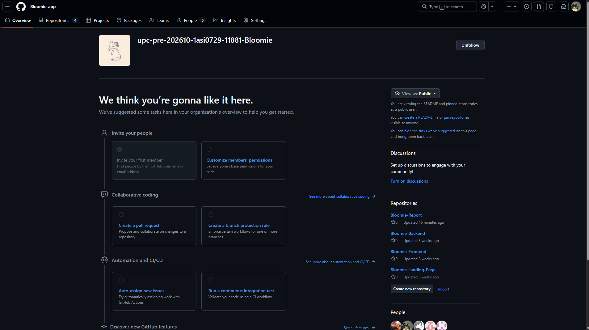

---

# Contenido

## Tabla de Contenidos

- [Universidad Peruana de Ciencias Aplicadas](#universidad-peruana-de-ciencias-aplicadas)
  - [Facultad de Ingeniería](#facultad-de-ingeniería)
  - [Programa Académico de Ingeniería de Software](#programa-académico-de-ingeniería-de-software)
- [Informe de Trabajo Final](#informe-de-trabajo-final)
  - [Integrantes](#integrantes)
- [Registro de Versiones del Informe](#registro-de-versiones-del-informe)
- [Project Report Collaboration Insights](#project-report-collaboration-insights)
- [Contenido](#contenido)
  - [Tabla de Contenidos](#tabla-de-contenidos)
- [Student Outcome](#student-outcome)
  - 
- [Capítulo I: Introducción](#capítulo-i-introducción)
  - [1.1. Startup Profile](#11-startup-profile)
    - [1.1.1. Descripción de la Startup](#111-descripción-de-la-startup)
    - [Misión](#misión)
    - [Visión](#visión)
    - [Valores](#valores)
    - [1.1.2. Perfiles de integrantes del equipo](#112-perfiles-de-integrantes-del-equipo)
    - [Perfil del Integrante](#perfil-del-integrante)
  - [1.2. Solution Profile](#12-solution-profile)
    - [Descripción de la Solución](#descripción-de-la-solución)
    - [1.2.1. Antecedentes y problemática](#121-antecedentes-y-problemática)
        - [Metodología 5W+2H](#metodología-5w2h)
          - [What (Qué)](#what-qué)
          - [When (Cuándo)](#when-cuándo)
          - [Where (Dónde)](#where-dónde)
          - [Who (Quién)](#who-quién)
          - [Why (Por qué)](#why-por-qué)
          - [How (Cómo)](#how-cómo)
        - [How much (Cuánto)](#how-much-cuánto)
    - [1.2.2. Lean UX Process](#122-lean-ux-process)
      - [1.2.2.1. Lean UX Problem Statements](#1221-lean-ux-problem-statements)
      - [1.2.2.2. Lean UX Assumptions](#1222-lean-ux-assumptions)
      - [1.2.2.3. Lean UX Hypothesis Statements](#1223-lean-ux-hypothesis-statements)
      - [1.2.2.4. Lean UX Canvas](#1224-lean-ux-canvas)
  - [1.3. Segmentos objetivo](#13-segmentos-objetivo)
      - [Segmento 1: Jóvenes adultos de 21 a 30 años interesados en el cuidado de la piel](#segmento-1-jóvenes-adultos-de-21-a-30-años-interesados-en-el-cuidado-de-la-piel)
      - [Segmento 2: Dermatólogos certificados](#segmento-2-dermatólogos-certificados)
- [Capítulo II: Requirements Elicitation \& Analysis](#capítulo-ii-requirements-elicitation--analysis)
  - [2.1. Competidores](#21-competidores)
      - [Skin Bliss](#skin-bliss)
      - [Miiskin Skin Tracker](#miiskin-skin-tracker)
      - [First Derm](#first-derm)
    - [2.1.1. Análisis competitivo](#211-análisis-competitivo)
  - [Competitive Analysis Landscape](#competitive-analysis-landscape)
    - [2.1.2. Estrategias y tácticas frente a competidores](#212-estrategias-y-tácticas-frente-a-competidores)
  - [2.2. Entrevistas](#22-entrevistas)
    - [2.2.1. Diseño de entrevistas](#221-diseño-de-entrevistas)
      - [Segmento 1: Jóvenes adultos interesados en skincare](#segmento-1-jóvenes-adultos-interesados-en-skincare)
      - [Segmento 2: Dermatólogos certificados](#segmento-2-dermatólogos-certificados-1)
    - [2.2.2. Registro de entrevistas](#222-registro-de-entrevistas)
    - [2.2.3. Análisis de entrevistas](#223-análisis-de-entrevistas)
      - [Segmento 1:  Jóvenes adultos interesados en el skin care](#segmento-1--jóvenes-adultos-interesados-en-el-skin-care)
          - [Proceso de atención](#proceso-de-atención)
          - [Información esencial del paciente](#información-esencial-del-paciente)
          - [Dificultades antes de la consulta presencial](#dificultades-antes-de-la-consulta-presencial)
          - [Seguimiento de pacientes](#seguimiento-de-pacientes)
          - [Limitaciones de herramientas digitales](#limitaciones-de-herramientas-digitales)
          - [Problemas en pacientes con skincare propio](#problemas-en-pacientes-con-skincare-propio)
          - [Nivel de información del paciente](#nivel-de-información-del-paciente)
          - [Uso de IA en diagnósticos preliminares](#uso-de-ia-en-diagnósticos-preliminares)
          - [Historial visual estructurado](#historial-visual-estructurado)
          - [Funcionalidades indispensables](#funcionalidades-indispensables)
          - [Casos de uso recomendados](#casos-de-uso-recomendados)
      - [Segmento 2:  Dermatólogos certificados](#segmento-2--dermatólogos-certificados)
          - [Rutina de cuidado de la piel](#rutina-de-cuidado-de-la-piel)
          - [Fuentes de información para decisiones](#fuentes-de-información-para-decisiones)
          - [Proceso de elección de productos](#proceso-de-elección-de-productos)
          - [Problemas con productos de skincare](#problemas-con-productos-de-skincare)
          - [Relación con dermatólogos y expertos](#relación-con-dermatólogos-y-expertos)
          - [Nivel de confianza en la información presente en internet](#nivel-de-confianza-en-la-información-presente-en-internet)
          - [Interés en aplicaciones de skincare](#interés-en-aplicaciones-de-skincare)
          - [Expectativas de la solución](#expectativas-de-la-solución)
          - [Barreras o preocupaciones](#barreras-o-preocupaciones)
  - [2.3. Needfinding](#23-needfinding)
    - [2.3.1. User Personas](#231-user-personas)
    - [2.3.2. User Task Matrix](#232-user-task-matrix)
    - [2.3.3. User Journey Mapping](#233-user-journey-mapping)
      - [2.3.3.1 Segmento 1: Jóvenes adultos](#2331-segmento-1-jóvenes-adultos)
      - [2.3.3.2 Segmento 2: Dermatólogos certificados](#2332-segmento-2-dermatólogos-certificados)
    - [2.3.4. Empathy Mapping](#234-empathy-mapping)
      - [2.3.4.1 Segmento 1: Jóvenes adultos](#2341-segmento-1-jóvenes-adultos)
      - [2.3.4.2 Segmento 2: Dermatólogos certificados](#2342-segmento-2-dermatólogos-certificados)
  - [2.4. Big Picture Event Storming](#24-big-picture-event-storming)
  - [2.5. Ubiquitous Language](#25-ubiquitous-language)
- [Capítulo III: Requirements Specification](#capítulo-iii-requirements-specification)
  - [3.1. User Stories](#31-user-stories)
  - [3.2. Impact Mapping](#32-impact-mapping)
      - [3.2.1. Business Goal 1:](#321-business-goal-1)
      - [3.2.2. Business Goal 2:](#322-business-goal-2)
      - [3.2.3. Business Goal 3:](#323-business-goal-3)
  - [3.3. Product Backlog](#33-product-backlog)
- [Capítulo IV: Product Design](#capítulo-iv-product-design)
  - [4.1. Style Guidelines](#41-style-guidelines)
    - [4.1.1. General Style Guidelines](#411-general-style-guidelines)
      - [4.1.1.1. Branding](#4111-branding)
      - [Logo de la marca](#logo-de-la-marca)
      - [4.1.1.2. Spacing](#4112-spacing)
      - [Sistema modular](#sistema-modular)
      - [4.1.1.3. Typography](#4113-typography)
      - [4.1.1.4. Tono de comunicación y lenguaje aplicado](#4114-tono-de-comunicación-y-lenguaje-aplicado)
      - [4.1.1.5. Colores](#4115-colores)
      - [Botones](#botones)
      - [Cabecera](#cabecera)
      - [Iconografía](#iconografía)
    - [4.1.2. Web Style Guidelines](#412-web-style-guidelines)
  - [4.2. Information Architecture](#42-information-architecture)
    - [4.2.1. Organization Systems](#421-organization-systems)
    - [4.2.2. Labeling Systems](#422-labeling-systems)
        - [Labeling System Landing Page](#labeling-system-landing-page)
        - [Labeling System App para Jóvenes adultos](#labeling-system-app-para-jóvenes-adultos)
          - [Iconografía estándar](#iconografía-estándar)
          - [Elementos de interacción activa](#elementos-de-interacción-activa)
          - [Elementos de validación](#elementos-de-validación)
          - [Labeling System App para Dermatólogos certificados](#labeling-system-app-para-dermatólogos-certificados)
    - [4.2.3. SEO Tags and Meta Tags](#423-seo-tags-and-meta-tags)
    - [Principal](#principal)
    - [Features](#features)
    - [How it Works](#how-it-works)
    - [Pricing](#pricing)
    - [Results](#results)
    - [About Us](#about-us)
    - [4.2.4. Searching Systems](#424-searching-systems)
    - [4.2.5. Navigation Systems](#425-navigation-systems)
      - [Organización jerárquica](#organización-jerárquica)
      - [Organización secuencial](#organización-secuencial)
          - [Registro de usuario:](#registro-de-usuario)
          - [Consulta dermatológica:](#consulta-dermatológica)
      - [Uso de nodos de decisión (decisiones del usuario)](#uso-de-nodos-de-decisión-decisiones-del-usuario)
      - [Organización matricial](#organización-matricial)
      - [Categorización del contenido](#categorización-del-contenido)
          - [Por audiencia:](#por-audiencia)
          - [Cronológica:](#cronológica)
          - [Alfabética:](#alfabética)
    - [Segmento 2: Dermatólogos certificados](#segmento-2-dermatólogos-certificados-2)
        - [Organización jerárquica](#organización-jerárquica-1)
        - [Organización secuencial](#organización-secuencial-1)
        - [Uso de nodos de decisión](#uso-de-nodos-de-decisión)
        - [Organización matricial](#organización-matricial-1)
        - [Categorización del contenido](#categorización-del-contenido-1)
  - [4.3. Landing Page UI Design](#43-landing-page-ui-design)
    - [4.3.1. Landing Page Wireframe](#431-landing-page-wireframe)
    - [4.3.2. Landing Page Mock-up](#432-landing-page-mock-up)
  - [4.4. Web Applications UX/UI Design](#44-web-applications-uxui-design)
    - [4.4.1. Web Applications Wireframes](#441-web-applications-wireframes)
    - [4.4.2. Web Applications Wireflow Diagrams](#442-web-applications-wireflow-diagrams)
    - [4.4.3. Web Applications Mock-ups](#443-web-applications-mock-ups)
    - [4.4.4. Web Applications User Flow Diagrams](#444-web-applications-user-flow-diagrams)
  - [4.5. Web Applications Prototyping](#45-web-applications-prototyping)
  - [4.6. Domain-Driven Software Architecture](#46-domain-driven-software-architecture)
    - [4.6.1. Design-Level Event Storming](#461-design-level-event-storming)
    - [4.6.2. Software Architecture Context Diagram](#462-software-architecture-context-diagram)
    - [4.6.3. Software Architecture Container Diagrams](#463-software-architecture-container-diagrams)
    - [4.6.4. Software Architecture Components Diagrams](#464-software-architecture-components-diagrams)
  - [4.7. Software Object-Oriented Design](#47-software-object-oriented-design)
    - [4.7.1. Class Diagrams](#471-class-diagrams)
  - [4.8. Database Design](#48-database-design)
    - [4.8.1. Database Diagrams](#481-database-diagrams)
- [Capítulo V: Product Implementation, Validation \& Deployment](#capítulo-v-product-implementation-validation--deployment)
  - [5.1. Software Configuration Management](#51-software-configuration-management)
    - [5.1.1. Software Development Environment Configuration](#511-software-development-environment-configuration)
    - [5.1.2. Source Code Management](#512-source-code-management)
    - [5.1.3. Source Code Style Guide \& Conventions](#513-source-code-style-guide--conventions)
    - [5.1.4. Software Deployment Configuration](#514-software-deployment-configuration)
  - [5.2. Landing Page, Services \& Applications Implementation](#52-landing-page-services--applications-implementation)
    - [5.2.1. Sprint 1](#521-sprint-1)
      - [5.2.1.1. Sprint Planning 1](#5211-sprint-planning-1)
      - [5.2.1.2. Aspect Leaders and Collaborators](#5212-aspect-leaders-and-collaborators)
      - [5.2.1.3. Sprint Backlog 1](#5213-sprint-backlog-1)
      - [5.2.1.4. Development Evidence for Sprint Review](#5214-development-evidence-for-sprint-review)
      - [5.2.1.5. Execution Evidence for Sprint Review](#5215-execution-evidence-for-sprint-review)
      - [5.2.1.6. Services Documentation Evidence for Sprint Review](#5216-services-documentation-evidence-for-sprint-review)
      - [5.2.1.7. Software Deployment Evidence for Sprint Review](#5217-software-deployment-evidence-for-sprint-review)
      - [5.2.1.8. Team Collaboration Insights during Sprint](#5218-team-collaboration-insights-during-sprint)
        - [Resumen de actividad del Sprint](#resumen-de-actividad-del-sprint)
    - [5.2.2. Sprint 2](#522-sprint-2)
      - [5.2.2.1. Sprint Planning 2](#5221-sprint-planning-2)
      - [5.2.2.2. Aspect Leaders and Collaborators](#5222-aspect-leaders-and-collaborators)
      - [5.2.2.3. Sprint Backlog 2](#5223-sprint-backlog-2)
      - [5.2.2.4. Development Evidence for Sprint Review](#5224-development-evidence-for-sprint-review)
      - [5.2.2.5. Execution Evidence for Sprint Review](#5225-execution-evidence-for-sprint-review)
      - [5.2.2.6. Services Documentation Evidence for Sprint Review](#5226-services-documentation-evidence-for-sprint-review)
      - [5.2.2.7. Software Deployment Evidence for Sprint Review](#5227-software-deployment-evidence-for-sprint-review)
      - [5.2.2.8. Team Collaboration Insights during Sprint](#5228-team-collaboration-insights-during-sprint)
- [Conclusiones](#conclusiones)
  - [Conclusiones y recomendaciones](#conclusiones-y-recomendaciones)
  - [Video About-the-Team](#video-about-the-team)
- [Bibliografía](#bibliografía)
- [Anexos](#anexos)
---

# Student Outcome

El curso contribuye al cumplimiento del Student Outcome ABET:

**ABET – EAC - Student Outcome 3**

**Criterio:** *Capacidad de comunicarse efectivamente con un rango de audiencias.*

En el siguiente cuadro se describe las acciones realizadas y enunciados de conclusiones por parte del grupo, que permiten sustentar el haber alcanzado el logro del ABET – EAC - Student Outcome 3.

<table>
  <tr>
    <th>Criterio específico</th>
    <th>Acciones realizadas</th>
    <th>Conclusiones</th>
  </tr>

  <tr>
    <td><b>Comunica oralmente con efectividad a diferentes rangos de audiencia.</b></td>
    <td>
      <b>Asmat Alminco, Martin Alejandro</b>  
      <u>AV1</u>  
      Participó en la explicación de User Stories, configuración del entorno de desarrollo, evidencias de desarrollo para Sprint Review, Lean UX Assumptions, diseño de entrevistas y estrategias frente a competidores. Sus aportes permitieron comunicar la validación del problema, la definición funcional del producto y los avances técnicos iniciales del proyecto.
         
      <b>Contreras Torres, Arturo Valentino</b>  
      <u>AV1</u>  
      Participó en la exposición de Software Architecture Context Diagram, Software Architecture Container Diagrams, estrategias frente a competidores, Big Picture Event Storming, Design-Level Event Storming, Systems Diagrams, Class Diagrams, User Personas, User Task Matrix y Database Design. Su participación permitió comunicar aspectos del dominio del problema, arquitectura, diseño de software y estructura de datos del sistema.
         
      <b>Gallardo Morales, Carla Alejandra</b>  
      <u>AV1</u>  
      Sustentó User Stories, Lean UX Problem Statements, Lean UX Hypothesis Statements, estrategias frente a competidores, diseño de entrevistas, Impact Mapping, Product Backlog y SEO Tags and Meta Tags. Estas actividades permitieron explicar de forma clara las necesidades del usuario, las hipótesis del producto, la planificación funcional y los elementos de posicionamiento web.
         
      <b>Mechan Montenegro, Luciana Carolina</b>  
      <u>AV1</u>  
      Participó en la sustentación del Lean UX Canvas, segmentos objetivo, análisis de competidores, análisis competitivo, lenguaje ubicuo, Landing Page Wireframe, Software Architecture Component, Systems Diagrams y Class Diagrams. Durante estas actividades, comunicó ideas relacionadas con la propuesta de valor, el mercado, el diseño visual y la arquitectura del sistema, adecuando su explicación a una audiencia técnica y no técnica.
         
      <b>Ramirez Ruiz, Nickolas</b>  
      <u>AV1</u>  
      Sustentó Startup Profile, descripción de la startup, User Journey Mapping, Empathy Mapping, Landing Page Mock-up, General Style Guidelines, Web Style Guidelines, Sprint Planning 1, Aspect Leaders and Collaborators, Sprint Backlog 1 y estrategias frente a competidores. Sus aportes permitieron comunicar la identidad del proyecto, la experiencia del usuario, la línea visual del producto y la organización del primer sprint.
    </td>
    <td>
    <u>AV1</u>  
    Como equipo, durante el AV1 se fortaleció la comunicación oral mediante la sustentación de avances relacionados con investigación de usuarios, análisis competitivo, definición del producto, diseño visual, arquitectura, requerimientos y planificación inicial. La presentación permitió mejorar la claridad del mensaje, el uso de recursos visuales y la capacidad para justificar decisiones tomadas durante el desarrollo del proyecto.
    </td>
  </tr>

  <tr>
    <td><b>Comunica por escrito con efectividad a diferentes rangos de audiencia.</b></td>
    <td>
    <b>Asmat Alminco, Martin Alejandro</b>  
      <u>AV1</u>  
      Elaboró la documentación de User Stories, Software Development Environment Configuration, Development Evidence for Sprint Review, Lean UX Assumptions, diseño de entrevistas y estrategias frente a competidores. Sus aportes permitieron registrar de forma escrita las funcionalidades, la configuración técnica, las evidencias de desarrollo y la validación inicial del producto.
         
      <b>Contreras Torres, Arturo Valentino</b>  
      <u>AV1</u>  
      Redactó y organizó Software Architecture Context Diagram, Software Architecture Container Diagrams, estrategias frente a competidores, Big Picture Event Storming, Design-Level Event Storming, Systems Diagrams, Class Diagrams, User Personas, User Task Matrix y Database Design. Estas actividades aportaron a la documentación técnica del dominio, la arquitectura, el modelado del sistema y la base de datos.
         
      <b>Gallardo Morales, Carla Alejandra</b>  
      <u>AV1</u>  
      Documentó User Stories, Lean UX Problem Statements, Lean UX Hypothesis Statements, estrategias frente a competidores, diseño de entrevistas, Impact Mapping, Product Backlog y SEO Tags and Meta Tags. Su trabajo permitió estructurar por escrito el problema, las hipótesis, los requerimientos, el backlog y los elementos de posicionamiento web.
         
      <b>Mechan Montenegro, Luciana Carolina</b>  
      <u>AV1</u>  
      Redactó y documentó el Lean UX Canvas, segmentos objetivo, competidores, análisis competitivo, lenguaje ubicuo, Landing Page Wireframe, Software Architecture Component, Systems Diagrams y Class Diagrams. Estas secciones contribuyeron a organizar información sobre el mercado, el dominio del producto, el diseño de interfaz y la arquitectura del sistema.
         
      <b>Ramirez Ruiz, Nickolas</b>  
      <u>AV1</u>  
      Elaboró Startup Profile, descripción de la startup, User Journey Mapping, Empathy Mapping, Landing Page Mock-up, General Style Guidelines, Web Style Guidelines, Sprint Planning 1, Aspect Leaders and Collaborators, Sprint Backlog 1 y estrategias frente a competidores. Su documentación permitió presentar la identidad de la startup, la experiencia del usuario, la propuesta visual y la planificación del sprint inicial.
    </td>
    <td>
    <u>AV1</u>  
    Como equipo, durante el AV1 se desarrolló la comunicación escrita mediante la elaboración del informe técnico, integrando análisis de negocio, investigación de usuarios, requerimientos, diseño visual, arquitectura, base de datos y planificación inicial del desarrollo. La documentación permitió sintetizar ideas, mantener coherencia entre secciones y presentar información comprensible para audiencias técnicas y no técnicas. Asimismo, el uso de tablas, diagramas, mockups, backlog y evidencias contribuyó a mejorar la calidad y claridad del informe.
    </td>
  </tr>
</table>
---

# Capítulo I: Introducción

## 1.1. Startup Profile

### 1.1.1. Descripción de la Startup

Hoy en día, el cuidado personal ha tomado gran relevancia, lo que ha convertido al mercado del skincare en uno de los más dinámicos y en constante crecimiento. Cada vez más personas, tanto jóvenes como adultos, buscan alternativas que les permitan mantener una piel saludable y cuidar su apariencia. Sin embargo, este creciente interés ha traído consigo la necesidad de soluciones innovadoras que conecten las expectativas de los usuarios con herramientas confiables, accesibles y basadas en información objetiva.

Es en este escenario que nace Dermacare, una startup comprometida en ayudar a las personas a comprender y gestionar su rutina de cuidado de la piel de manera informada y personalizada. Como parte de esta propuesta surge Bloomie, una aplicación web y móvil que integra servicios de Inteligencia Artificial para analizar el estado de la piel a partir de imágenes y generar recomendaciones personalizadas.

Bloomie se posiciona como el núcleo de la solución, brindando una experiencia digital intuitiva que acompaña al usuario en la toma de decisiones relacionadas con su cuidado personal. A través de la combinación de análisis automatizado, seguimiento de la evolución de la piel y acceso a servicios dermatológicos, la plataforma busca convertirse en un aliado confiable en el día a día del usuario.

---

### Misión

Brindamos una guía integral y personalizada para el cuidado de la piel mediante el uso de servicios de inteligencia artificial y análisis de datos dermatológicos. Ofrecemos rutinas adaptadas a cada tipo de piel, recomendaciones de productos ajustadas al presupuesto y objetivos del usuario, así como herramientas digitales accesibles que promueven hábitos de skincare saludables y sostenibles.

---

### Visión

Convertirnos en la plataforma líder de cuidado de la piel a nivel global, reconocida por integrar análisis inteligente y validación profesional como base para generar rutinas personalizadas y efectivas. Nuestro propósito es impactar positivamente en millones de personas, ayudándoles a prevenir y tratar problemas dermatológicos, al mismo tiempo que fortalecemos su confianza y bienestar.

---

### Valores

- **Accesibilidad:**  
  En Dermacare creemos que el cuidado de la piel debe estar al alcance de todos. Nuestra plataforma está diseñada para ser intuitiva y fácil de usar, adaptándose a distintos niveles de conocimiento y presupuestos.

- **Innovación:**  
  Integramos servicios de inteligencia artificial para transformar la experiencia del skincare, ofreciendo recomendaciones basadas en datos y en constante mejora. Apostamos por la tecnología como motor de soluciones modernas y efectivas.

- **Confianza:**  
  La salud de la piel requiere respaldo y seguridad. Por ello, combinamos análisis automatizados con la posibilidad de acceso a profesionales dermatológicos, fortaleciendo la credibilidad de la plataforma.

- **Bienestar:**  
  Más allá de la estética, buscamos mejorar la calidad de vida de nuestros usuarios. Promovemos hábitos de cuidado que fortalecen la salud de la piel y contribuyen a su bienestar integral.

### 1.1.2. Perfiles de integrantes del equipo

### Perfil del Integrante

<table>
  <tr>
    <td rowspan="4" align="center">
      
    </td>
    <td><b>Nombre:</b> Carla Alejandra Gallardo Morales</td>
  </tr>
  <tr>
    <td><b>Código:</b> u202414970 </td>
  </tr>
  <tr>
    <td>
      <b>Descripción:</b> 
      Soy <b>Carla Alejandra Gallardo Morales</b>, tengo 19 años. Desde que me incorporé en la Universidad Peruana de Ciencias Aplicadas en el periodo 2024-01, es decir que ahora mismo estoy cursando el quinto ciclo de la carrera de Ing. de Software, he adquirido y desarrollado distintos conocimientos a cerca de la programación, específicamente en el lenguaje C++ y Java, además, de forma autodidacta y extracurricular, he profundizado en el lenguaje Python, lo que ha ampliado mi perspectiva sobre la lógica y resolución de problemas.
        
        Dentro del equipo, mi contribución se basa en el apoyo continuo del desarrollo del backend y frontend de nuestro aplicativo, asimismo ayudo en la implementación del informe de nuestro proyecto.
    </td>
  </tr>
</table>

<table>
  <tr>
    <td rowspan="4" align="center">
      
    </td>
    <td><b>Nombre:</b> Arturo Valentino Contreras Torres</td>
  </tr>
  <tr>
    <td><b>Código:</b> u202414802</td>
  </tr>
  <tr>
    <td>
      <b>Descripción:</b> 
      Soy <b>Arturo Valentino Contreras Torres</b>, tengo 19 años y estudio la carrera de Ingeniería de Software en la UPC, actualmente estoy en el 5to ciclo. Me gusta aprender y aplicar tecnologías innovadoras para resolver problemas complejos y desarrollar soluciones eficientes. Me apasiona participar en concursos de programación en donde aprendo más sobre temas como programación competitiva, lenguajes como C++, Python, Java, frameworks como Flutter y habilidades como el trabajo en equipo.
        
      Dentro del equipo, contribuyo en el desarrollo frontend y backend, asegurándome de aplicar principios de Domain Driven Design, patrones de diseño y buenas prácticas de desarrollo de software. Me considero una persona responsable, creativa y orientada al trabajo en equipo, con un enfoque en la mejora continua frente a nuevos desafíos.
    </td>
  </tr>
</table>

<table>
  <tr>
    <td rowspan="4" align="center">
      
    </td>
    <td><b>Nombre:</b> Luciana Carolina Mechan Montenegro</td>
  </tr>
  <tr>
    <td><b>Código:</b> u20241b843</td>
  </tr>
  <tr>
    <td>
      <b>Descripción:</b> 
      Soy <b>Luciana Carolina Mechan Montenegro</b>, estudiante del quinto ciclo de la carrera de Ingeniería de Software. Cuento con conocimientos en lenguajes de programación como C++, Python y Java, los cuales he aplicado en distintos proyectos académicos orientados a la resolución de problemas y desarrollo de sistemas.
        
      Dentro del equipo, mi contribución se enfoca tanto en el desarrollo frontend como backend, participando en la implementación de funcionalidades y en la integración de los distintos componentes del sistema. Me caracterizo por ser responsable, proactiva y con una alta capacidad de aprendizaje, además de tener facilidad para el trabajo en equipo y la adaptación a nuevos retos dentro del proyecto.
    </td>
  </tr>
</table>
<table>
  <tr>
    <td rowspan="4" align="center">
      
    </td>
    <td><b>Nombre:</b> Nickolas Ramirez Ruiz</td>
  </tr>
  <tr>
    <td><b>Código:</b> u202415551</td>
  </tr>
  <tr>
    <td>
      <b>Descripción:</b> 
      Soy <b>Nickolas Ramirez Ruiz</b>, estudiante del quinto ciclo de la carrera de Ingeniería de Software.  
       A lo largo de mi formación académica he adquirido conocimientos en programación, principalmente utilizando el lenguaje Java. Además, durante mis primeros ciclos, tuve la oportunidad de iniciarme en la programación con el lenguaje C++ a través del entorno de desarrollo Visual Studio. Me considero una persona organizada, comprometida y con un enfoque proactivo, siempre buscando cumplir con mis responsabilidades antes del tiempo previsto.
    </td>
  </tr>
</table>

<table>
  <tr>
    <td rowspan="4" align="center">
      
    </td>
    <td><b>Nombre:</b> Martin Alejandro Asmat Alminco </td>
  </tr>
  <tr>
    <td><b>Código:</b> u202416272 </td>
  </tr>
  <tr>
    <td>
      <b>Descripción:</b> 
      Soy <b>Martin Alejandro Asmat Alminco</b>, estudiante de quinto ciclo de la carrera de Ingeniería de Software. Cuento con experiencia en lenguajes de programación como Python y C++ para proyectos enfocados en el desarrollo de habilidades computacionales, las cuales apliqué en proyectos académicos enfocados en solucionar un problema a través de procesos de documentación de Ingeniería de software.
        
        Dentro del equipo, cumplo el rol de un full stack al realizar actividades de documentación y programación a un nivel medio. Considero que soy una persona responsable y adaptable a distintas situaciones con buen time-management.  
    </td>
  </tr>
</table>

## 1.2. Solution Profile
### Descripción de la Solución

Nuestra solución consiste en una aplicación web y móvil denominada Bloomie, diseñada para asistir a personas interesadas en el cuidado de la piel mediante un sistema de análisis inteligente y personalizado. La aplicación permite que los usuarios registren un perfil personal y suban fotografías de su rostro, las cuales son procesadas a través de servicios de Inteligencia Artificial para identificar características relevantes de la piel, como presencia de acné, manchas, arrugas o textura desigual.

A partir de este análisis, Bloomie genera recomendaciones personalizadas de productos y hábitos de skincare, adaptadas a las necesidades específicas de cada usuario. A diferencia de otras soluciones basadas únicamente en cuestionarios, la plataforma combina el análisis automatizado con la posibilidad de acceso a servicios dermatológicos, brindando una experiencia más confiable y completa.

Asimismo, la aplicación permite realizar un seguimiento de la evolución de la piel a lo largo del tiempo, facilitando la comparación de resultados y la mejora continua de las rutinas recomendadas. Adicionalmente, integra funcionalidades como la visualización de productos disponibles en el mercado y la localización de puntos de compra cercanos.

El modelo de negocio de Bloomie se basa en un esquema de suscripción escalonado, en el cual los usuarios pueden acceder a distintos niveles de personalización, seguimiento y soporte según el plan contratado. Este enfoque permite ofrecer una solución accesible para distintos perfiles de usuario, al mismo tiempo que garantiza la sostenibilidad del servicio.

Como parte de la evolución del producto, se contempla la integración futura de dispositivos IoT orientados al monitoreo de condiciones de la piel, lo que permitirá complementar el análisis y mejorar la precisión de las recomendaciones, sin que ello represente una dependencia en la versión actual del sistema.
 confu
Para el sistema de análisis inteligente, se considerará el uso de Inteligencia Artificial (IA) para aplicación de algoritmos que logren Aprendizaje automático para aprender comportamiento o patrones con previo criterio programado. Dicho criterio constará de estudios sobre el cuidado de la piel para luego poder realizar comparaciones y diferenciar tipos de piel. Para ello, nos apoyaremos de la subdisciplina de IA: Visión de Computadora para que esta pueda interpretar información significativa a través de imágenes o videos.

### 1.2.1. Antecedentes y problemática

El interés por el cuidado de la piel ha incrementado de manera significativa en jóvenes y adultos que buscan prevenir o tratar afecciones cutáneas comunes. Según el Fortune Business Insight (2024), el mercado de skincare fue valorado en 115.6 mil millones de dólares y se estima que crezca a 194 mil millones en el año 2032. Sin embargo, dicha relevancia adquirida generó una sobreoferta de productos y desinformación sobre el cuidado de piel. Diariamente, los usuarios se enfrentan a cientos de marcas, auspiciadores y catálogos de cosméticos extenuantes, lo que genera confusión en la correcta adquisición de dichos productos y dificulta la elección de una rutina apta para el usuario.

En adición, existe una brecha en la atención dermatológica para los ciudadanos. Esto se debe las largas colas de espera por aseguradoras, como EsSalud, que se estima un tiempo de espera entre un par de semanas hasta 5 meses (INFOBAE, 2024). 

##### Metodología 5W+2H
   
###### What (Qué)   
Cantidades exorbitantes de desinformación sobre el skincare y su correcto uso, lo que genera que las personas realicen rutinas y utilicen productos que no son apropiados para su tipo de piel. Ello implica pérdidas de dinero y causar efectos adversos en la piel.

###### When (Cuándo)
Cuando el usuario desea continuar o empezar una rutina de skincare, comprar productos o buscar información en línea. 

Luego, nuestra aplicación será utilizada cuando nuestro usuario decida investigar o evaluar el tipo de rutina que necesita, que necesita la búsqueda de productos por geolocalización así como también desee consultar con un profesional de forma rápida y segura.

###### Where (Dónde)
Se encuentra a nivel nacional peruano por desinformación en redes de fácil accesibilidad así como también personas que recurren a algún tipo de seguro, que son más del 90% de los peruanos (INEI, 2024).

Nuestra aplicación puede ser utilizada en contextos cotidianos por parte de los usuarios, como el hogar o el trabajo, donde puedan dedicar un tiempo a la visualización de la rutina y notificaciones en el transcurso del día con respecto a su tratamiento. 

###### Who (Quién)
La aplicación será utilizada por cualquier persona que esté interesada en el cuidado de la piel y busquen prevenir o tratar afecciones cutáneas, pero no tiene acceso fácil a un dermatólogo.

###### Why (Por qué)
El problema surge porque los usuarios tienden a seguir recomendaciones no aprobadas por un profesional por ahorro de costos o desconfianza. Luego, existe el caso donde no son capaces de poder directamente acceder a un tratamiento profesional por factores económicos, demográficos, etc. 

###### How (Cómo)

La razón por la cual el problema no se encuentra en su estado óptimo, es porque no hay una regulación clara con penalizaciones severas por compartir información errónea. También, las personas tienden a intentar solucionar sus problemas independientemente antes de consultar con un profesional, ya que, según el INEI (2025), solo 1 de cada 3 cuidadanos acude a atención médica pese a presentar algún malestar. 
Luego, existe que mucha de la información que pese a que provenga de un  estudio científico, no es garantizado el satisfacer las necesidades particulares de cada tipo de piel. 

Con nuestra propuesta, se disminuye los intentos de autocuidado por muchas personas al integrar posibles soluciones personalizables y brindar la posibilidad de conectar con profesionales que cubran con sus necesidades específicas. 

##### How much (Cuánto)

El problema es amplio y afecta a una gran cantidad de personas. En relación con los efectos adversos causados por una mala elección de dermocosméticos, Nayak et al. (2023) realizó una encuesta con 400 participantes y los resultados fueron claros: el 44 % experimentó efectos negativos, de los cuales el 25,5 % correspondió al rostro. Además, el estudio reveló que solo el 15 % de las mujeres consultó a un dermatólogo, mientras que un 22,25 % optó por la automedicación, lo que refleja la ausencia de orientación profesional en la mayoría de casos.

A continucación, el gráfico de la técnica 5W+2H: 

 

      
    

### 1.2.2. Lean UX Process

#### 1.2.2.1. Lean UX Problem Statements

 En el dominio de la salud y bienestar enfocado en el cuidado de la piel, los jóvenes adultos de 21 a 30 años, especialmente estudiantes universitarios y jóvenes profesionales familiarizados con aplicaciones móviles, enfrentan múltiples dificultades al momento de cuidar su piel. La sobrecarga de información contradictoria en redes sociales, la falta de personalización en las recomendaciones, y la tendencia a la automedicación, lo cual muchas veces produce un efecto adverso, generan frustración, gastos innecesarios y resultados poco efectivos, además de no contar con herramientas que les permitan hacer un seguimiento real de su progreso.

Asimismo, las soluciones actuales no logran cubrir estas necesidades de manera integral, ya que se basan en métodos genéricos y carecen de análisis más precisos y personalizados. Esto evidencia la oportunidad de ofrecer una solución accesible y confiable que permita a los usuarios tomar decisiones informadas, mejorar continuamente el cuidado de su piel y evitar los riesgos asociados a la desinformación.

¿Cómo podríamos ayudar a los jóvenes adultos a acceder a una experiencia personalizada, confiable y efectiva que optimice el cuidado de su piel y reduzca los efectos secundarios?

#### 1.2.2.2. Lean UX Assumptions

- Assumptions Worksheet:
  - Creemos que nuestros usuarios necesitan identificar correctamente su tipo y estado de piel para poder elegir productos de skincare adecuados, ya que actualmente existe una gran cantidad de información contradictoria y una amplia variedad de productos en el mercado que genera confusión y malas decisiones.
  - Estas necesidades pueden resolverse mediante la aplicación Bloomie, la cual permitirá a los usuarios analizar su piel a través de imágenes utilizando inteligencia artificial, brindando recomendaciones personalizadas de productos y hábitos de cuidado.
  - Nuestros clientes iniciales serán jóvenes adultos interesados en el cuidado de la piel y con acceso a dispositivos tecnológicos, pero no cuentan con el conocimiento suficiente para elegir productos adecuados para su tipo de piel o necesidades.
  - El principal valor que los usuarios esperan de nuestro servicio es contar con una herramienta confiable, práctica, fácil de usar y personalizada que les permita mejorar el estado de su piel sin necesidad de invertir tiempo y dinero en distintos productos o consultas innecesarias.
  - Los usuarios también podrán obtener beneficios adicionales como el seguimiento continuo de la evolución de su piel, la comparación de resultados a lo largo del tiempo y el acceso a orientación profesional mediante consultas con dermatólogos.
  - Planeamos adquirir la mayoría de nuestros usuarios a través de estrategias de marketing digital, principalmente mediante redes sociales, contenido educativo sobre skincare, colaboraciones con creadores de contenido y campañas publicitarias dirigidas a nuestros segmentos objetivos.
  - Generaremos ingresos mediante un modelo de suscripción escalonado (sin planes free), que permitirá a los usuarios acceder a diferentes niveles de personalización, seguimiento y servicios adicionales de Bloomie. Asimismo, se contempla la posibilidad de generar ingresos a través de alianzas con marcas de productos dermatológicos.
  - Nuestra competencia principalmente estará conformada por aplicaciones de skincare que ofrecen recomendaciones genéricas o análisis básicos de la piel, así como contenido no especializado en redes sociales que influye en las decisiones que toman los usuarios.
  - Nos diferenciaremos al ofrecer un enfoque integral basado en inteligencia artificial, análisis de imágenes, seguimiento continuo y la posibilidad de acceso a dermatólogos, lo que permitirá brindar recomendaciones más precisas, confiables y personalizadas.
  - Nuestro mayor riesgo de producto es que los usuarios no confíen inicialmente en el análisis de imágenes para identificar el tipo de piel o no adopten el uso continuo de la aplicación.
  - Planeamos mitigar este riesgo mediante la generación de confianza a través de resultados visibles, validación con especialistas dermatológicos, experiencia de usuario intuitiva y estrategias de educación digital sobre el uso adecuado de la aplicación.

  <b>¿Quién es el usuario?</b> 
  Se trata de jóvenes adultos entre 21 y 30 años, incluyendo estudiantes universitarios y jóvenes profesionales, que muestran interés en el cuidado de la piel y consumen contenido relacionado con skincare en redes sociales.
  Estos usuarios cuentan con acceso a dispositivos móviles y están familiarizados con el uso de aplicaciones digitales. Sin embargo, enfrentan dificultades para elegir productos adecuados debido a la gran cantidad de información contradictoria que existe en internet.
  Además, suelen experimentar problemas como acné, manchas o sensibilidad en la piel, que los motiva a buscar soluciones efectivas. Esta situación los lleva a invertir en productos que muchas veces no generan los resultados esperados, provocando frustración y desconfianza en los usuarios. También consideramos a dermatólogos certificados que interactúan con la aplicación para validar diagnósticos y atender consultas virtuales de manera más eficiente.
   

   <b>¿Dónde encaja nuestro producto en su trabajo o vida?</b> 
   Para los jóvenes adultos, Bloomie se integra como parte de su rutina diaria de cuidado personal, permitiéndoles analizar el estado de su piel, recibir recomendaciones personalizadas y realizar seguimiento continuo de su evolución.  
   La aplicación acompaña al usuario en momentos clave, como la elección de productos, la evaluación de resultados y la mejora progresiva de su rutina de skincare.  
   Para los dermatólogos, Bloomie encaja como una herramienta de apoyo en su práctica profesional, facilitando el acceso a información previa del paciente, optimizando el tiempo de consulta y permitiendo un seguimiento más estructurado y eficiente. Además, de facilitar la conexión con clientes con problemas en el cuidado de su piel.
   

   <b>¿Qué problemas tiene nuestro producto? ¿Resolver?</b> 
   Nuestro producto debe resolver la confusión causada por la publicidad engañosa y las recomendaciones contradictorias que existen acerca de productos o rutinas de skincare, evitando que los usuarios realicen gastos innecesarios y efectos adversos. También debe responder a la dificultad de acceso a consultas dermatológicas por sus altos costos y largas esperas. En el caso de los dermatólogos, busca eliminar la dependencia de descripciones subjetivas de los pacientes y ofrecer información, además de facilitar la relación médico - paciente.
   

   <b>¿Cuándo y cómo es usado nuestro producto?</b> 
   Bloomie será utilizado principalmente en el hogar, de forma diaria o periódica, permitiendo a los usuarios analizar su piel mediante imágenes, revisar recomendaciones personalizadas y registrar su progreso.  
   También será utilizado en momentos específicos, como antes de adquirir productos de skincare, donde el usuario podrá consultar sugerencias adecuadas a sus necesidades.  
   En el caso de los dermatólogos, la aplicación será utilizada durante consultas virtuales o seguimientos, facilitando el acceso a información previa del paciente y mejorando la toma de decisiones.

   

   <b>¿Qué características son importantes?</b> 
   La precisión del análisis de imágenes mediante inteligencia artificial es fundamental para garantizar recomendaciones confiables y adaptadas a cada usuario.  
   Asimismo, la privacidad y seguridad de los datos personales, especialmente de las imágenes faciales, es un aspecto crítico para generar confianza en el usuario.  
   La interfaz debe ser intuitiva y fácil de usar, permitiendo una navegación clara y accesible para distintos niveles de experiencia digital.
   

   <b>¿Cómo debe verse nuestro producto y cómo comportarse?</b> 
   Bloomie debe presentar un diseño moderno, limpio y profesional, transmitiendo confianza y seguridad desde el primero contacto con el usuario. La interfaz debe ser intuitiva, con una estructura clara, uso de colores suaves y jerarquía visual que facilite la comprensión de la información mostrada, como diagnósticos, recomendaciones y seguimiento.  
   En cuanto a su comportamiento, la aplicación debe ser ágil y fluida, con tiempos de respuestas rápidos en el procesamiento de imágenes y navegación. Además, debe actuar de manera proactiva mediante notificaciones inteligentes, recordatorios de rutina y sugerencias personalizadas incentivando la constancia del usuario en el cuidado de su piel.

   

- Business Outcomes:
  - Posicionar a Bloomie como una solución confiable en el cuidad de la piel mediante uso de inteligencia artificial y análisis personalizado
  - Generar ingresos a través de un modelo de suscripción escalonado, reflejado en el aumento progresivo de usuarios de los diferentes planes que existen en Bloomie
  - Reducir la incertidumbre y el gasto innecesario en productos de skincare no adecuados, mejorando la satisfacción del usuario con los resultados obtenidos
  - Establecer alianzas con dermatólogos certificados, ampliando el alcance del servicio y fortaleciendo la propuesta de valor de la plataforma
  - Ser un producto tecnológico con una interfaz sencilla y fácil de entender para el cuidado de la piel de los usuarios
 

- User Outcomes:
  - <b>Mayor comprensión del estado de su piel:</b>  
  Los usuarios podrán conocer con mayor precisión las características de su piel mediante el análisis de imágenes procesadas por inteligencia artificial, lo que permitirá tomar decisiones mejor informadas.
  - <b>Obtención de recomendaciones personalizadas:</b>  
  A partir del análisis de piel realizado, los usuarios recibirán sugerencias adaptadas a necesidades específicas, incluyendo productos y hábitos adecuados para su tipo de piel.
  - <b>Reducción de gastos innecesarios:</b>  
  Gracias a la información de Bloomie, los usuarios evitarán invertir en productos ineficaces, optimizando su presupuesto destinado al cuidado personal.
  - <b>Seguimiento continuo de la evolución de la piel:</b>  
  Los usuarios podrán registrar y comparar el estado de su piel a lo largo del tiempo, facilitando la evaluación de resultados y la mejora continua de la rutina de skincare.
  - <b>Acceso a orientación profesional:</b>  
  Los usuarios podrán fortalecer su rutina de cuidado de la piel mediante la posibilidad de consultar dermatólogos, obteniendo una experiencia más confiable y completa.
 

- Features:
  - Registro de usuarios para gestionar su perfil personal y características de la piel
  - Análisis de imágenes del rostro mediante inteligencia artificial para identificar condiciones como acné, manchas o textura irregular
  - Generación de recomendaciones personalizadas de productos y rutinas de skincare
  - Historial de seguimiento con registro de imágenes para comparar la evolución de la piel
  - Visualización de productos disponibles en el mercado relacionados con las recomendaciones generales propuestas por la app
  - Integración con servicios dermatológicos para consultas y seguimiento profesional
  - Notificaciones y sugerencias inteligentes basadas en cambios detectados en la piel
  - Interfaz intuitiva y fácil de usar, adaptada a usuarios con diferentes niveles de experiencia digital
 

#### 1.2.2.3. Lean UX Hypothesis Statements

- Hipotesis de negocio: 
  - <b>Creemos que</b> ofrecer recomendaciones personalizadas basadas en análisis de la piel permitirá a los usuarios tomar mejores decisiones sobre productos de skincare. <b>Sabremos que</b> hemos tenido éxito <b>cuando</b> observemos un aumento del 10% en la retención de usuarios mensuales.
  - <b>Creemos que</b> implementar un modelo de suscripción escalonado permitirá atender a usuarios con diferentes necesidades y niveles de compromiso. <b>Sabremos que</b> hemos tenido éxito <b>cuando</b> logremos que al menos el 15% de los usuarios que visitan la plataforma se suscriban a algún plan.
  - <b>Creemos que</b> integrar el acceso a dermatólogos dentro de la plataforma incrementará la confianza en la solución. <b>Sabremos que</b> hemos tenido éxito <b>cuando</b> al menos el 20% de los usuarios premium utilicen funcionalidades relacionadas a consultas o validación profesional.
   

- Hipotesis de usuario: 
  - <b> Creemos que </b> proporcionar recomendaciones personalizadas permitirá a los usuarios elegir productos más adecuados para su tipo de piel,lo que resultará en una reducción de efectos adversos y mejores resultados en su rutina de cuidado. <b> Sabremos que </b> hemos tenido razón <b> cuando </b> al menos el 50% de los usuarios reporten mejoras en su piel o disminución de reacciones negativas.
  
  - <b> Creemos que </b> permitir a los usuarios visualizar el progreso de su piel aumentará su constancia en el cuidado personal, lo que resultará en mejores resultados a largo plazo. <b> Sabremos que </b> hemos tenido éxito <b>cuando </b> al menos el 50% de los usuarios mantengan una rutina constante durante un mes y registren mejoras progresivas.
  
  - <b>Creemos que </b>ofrecer un análisis de piel mediante imágenes ayudará a los usuarios a identificar correctamente su tipo y estado de piel, lo que resultará en decisiones más informadas y efectivas.
  <b>Sabremos que </b> hemos tenido éxito <b> cuando </b> al menos el 60% de los usuarios sigan las recomendaciones generadas y reporten resultados positivos en su cuidado.
  
#### 1.2.2.4. Lean UX Canvas

  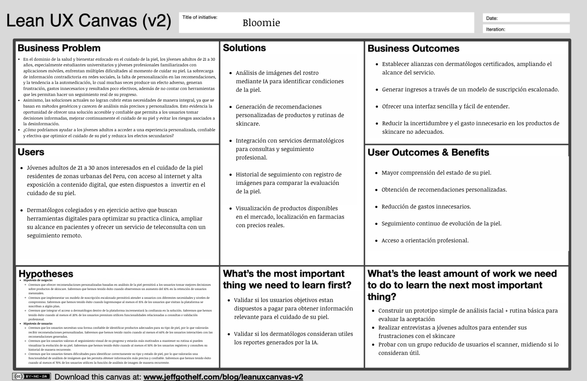

## 1.3. Segmentos objetivo
Bloomie identifica dos segmentos principales de usuarios, definidos a partir del dominio del problema y respaldados por estadísticas del contexto peruano.

#### Segmento 1: Jóvenes adultos de 21 a 30 años interesados en el cuidado de la piel

Este segmento comprende estudiantes universitarios y jóvenes profesionales residentes en zonas urbanas del Perú, con acceso a dispositivos móviles y alta exposición a contenido digital sobre skincare. Se trata de un público con capacidad de gasto en productos de cuidado personal y con hábitos de consumo digital consolidados.
En términos de capacidad económica, según el MTPE (2024), el ingreso laboral promedio mensual del grupo de 25 a 44 años ascendió a S/ 1,847 en el período abril 2023–marzo 2024, siendo el grupo de mayor ingreso promedio por edad. Esto indica que este segmento cuenta con ingresos suficientes para sostener un modelo de suscripción como el propuesto por Bloomie. Respecto al comportamiento digital, el 80% de los usuarios peruanos de redes sociales las utilizan de forma diaria (Statista, 2023), confirmando que el segmento objetivo tiene una presencia digital intensa que facilita tanto la adopción de la aplicación como el consumo de contenido de skincare.
Respecto al mercado de skincare en Perú, según COPECOH–CCL, el consumo promedio per cápita en rutinas de skincare asciende a S/ 828 al año, impulsado por el crecimiento de los dermocosméticos, que han aumentado hasta en 100% en comparación con años anteriores. Además, la categoría de tratamiento facial fue la de mayor crecimiento dentro del sector, registrando un aumento del 32% en 2023, lo que evidencia una demanda activa y creciente en el tipo de orientación que Bloomie busca brindar.

#### Segmento 2: Dermatólogos certificados
Este segmento comprende a médicos dermatólogos colegiados y en ejercicio activo que buscan herramientas digitales para optimizar su práctica clínica, ampliar su alcance a pacientes y ofrecer servicios de teleconsulta o seguimiento remoto. Bloomie les ofrece una plataforma para conectar con usuarios que ya cuentan con un análisis previo de su piel, lo que permite consultas más informadas y eficientes.
En el Perú, la distribución de especialistas dermatólogos es marcadamente desigual: la mayoría se concentra en Lima y en las principales ciudades del país, mientras que en regiones periféricas la oferta es escasa o nula. Esta concentración geográfica limita el acceso de gran parte de la población a atención especializada, generando una demanda insatisfecha que plataformas como Bloomie pueden canalizar digitalmente. Asimismo, el consumo promedio peruano en productos de higiene y cuidado personal entre los 15 y 65 años alcanza USD 225 anuales, con un crecimiento del 3% respecto al período anterior (COPECOH–CCL, 2024), lo que refleja una base de usuarios con disposición real a invertir en su salud dermatológica, representando una oportunidad concreta para que los especialistas amplíen su práctica a través de canales digitales.

# Capítulo II: Requirements Elicitation & Analysis

## 2.1. Competidores
#### Skin Bliss 
Skin Bliss es una aplicación móvil que utiliza inteligencia artificial para analizar la piel y 
recomendar rutinas personalizadas. Permite a los usuarios crear un perfil de su piel, escanear 
productos para evaluar sus ingredientes y registrar un historial visual de cambios a lo largo del 
tiempo. Su fortaleza radica en la transparencia científica y en la personalización de rutinas 
según las características y necesidades de cada usuario. Sin embargo, sus servicios están 
limitados al ámbito preventivo y estético, ya que no incorpora validación médica profesional ni 
consultas con dermatólogos, lo que reduce la credibilidad clínica de sus recomendaciones. 

#### Miiskin Skin Tracker 
Miiskin está enfocada en el seguimiento visual de la piel, especialmente para controlar lunares 
y cambios en manchas, arrugas o texturas. Fue diseñada para un uso prolongado, permite 
comparar fotos a lo largo del tiempo y está en cumplimiento con estándares como HIPAA, lo 
que refuerza su legitimidad en telemedicina. Su fortaleza radica en el tratamiento médico y 
privacidad, aunque sus servicios se limitan a seguimiento visual sin ofrecer diagnóstico o 
recomendaciones de productos, no ofrece un sistema integral de análisis automatizado orientado a recomendaciones personalizadas de skincare.

#### First Derm 
First Derm es una plataforma de teledermatología donde los usuarios envían casos, incluyendo 
imágenes, para que dermatólogos certificados los evalúen. La app está disponible en iOS, 
Android y web, y ya ha atendido gran cantidad de casos en diferentes países. Su principal 
ventaja es el acceso directo a diagnóstico profesional, pero su enfoque es más médico que 
preventivo o educativo; no incluye análisis automatizado ni rutinas personalizadas, y no integra 
seguimiento visual continuo ni recomendaciones de productos.

### 2.1.1. Análisis competitivo

## Competitive Analysis Landscape
Como se observa en la siguiente tabla se desarrolló un proceso de análisis para determinar 
nuestro FODA frente a competidores. 

<table>
  <tr>
    <th colspan="6" align="left">Competitive Analysis Landscape</th>
  </tr>

  <tr>
    <td><b>¿Por qué llevar a cabo este análisis?</b></td>
    <td colspan="5">
      Conocer a profundidad a los principales competidores en el mercado digital del skincare (Skin Bliss, Miiskin Skin Tracker y First Derm), para identificar sus fortalezas, debilidades, oportunidades y amenazas, y así definir las ventajas competitivas y estrategias de Bloomie.
    </td>
  </tr>
  <tr>
    <th>Perfil</th>
    <th>Aspecto</th>
    <th>Bloomie</th>
    <th>Skin Bliss</th>
    <th>Miski Skin Tracer</th>
    <th>First Derm</th>
  </tr>

  <!-- OVERVIEW -->
  <tr>
    <td rowspan="2"><b>Perfil</b></td>
    <td><b>Overview</b></td>
    <td>Plataforma web y móvil que analiza la piel con IA, genera rutinas personalizadas, conecta con dermatólogos y permite seguimiento visual del progreso.</td>
    <td>App que combina escaneo facial con rutinas personalizadas, evaluaciones de ingredientes y seguimiento visual con fotos comparativas.</td>
    <td>App enfocada en el monitoreo de lunares y manchas, con comparativas fotográficas y alertas de cambios.</td>
    <td>Servicio de teledermatología donde dermatólogos certificados atienden casos enviados por usuarios a través de la app.</td>
  </tr>

  <tr>
    <td><b>Ventaja competitiva</b></td>
    <td>Integración en una sola plataforma de análisis automatizado, recomendaciones personalizadas, seguimiento continuo y acceso a dermatólogos.</td>
    <td>Ofrece análisis de piel, gestión de productos, programa de rutina y historial visual con lógica de ingredientes.</td>
    <td>Cumplimiento con estándares médicos (HIPAA), alta confianza en privacidad y seguridad.</td>
    <td>Acceso directo a dermatólogos en múltiples países con diagnóstico en menos de 24h.</td>
  </tr>

  <!-- MARKETING -->
  <tr>
    <td rowspan="2"><b>Perfil de Marketing</b></td>
    <td><b>Mercado objetivo</b></td>
    <td>Jóvenes y adultos interesados en skincare confiable, accesible y personalizado, así como dermatólogos.</td>
    <td>Usuarios interesados en skincare preventivo y estético.</td>
    <td>Pacientes preocupados por salud dermatológica (lunares, cáncer de piel, manchas).</td>
    <td>Personas con problemas serios en la piel que requieren diagnóstico rápido y seguro.</td>
  </tr>

  <tr>
    <td><b>Estrategias</b></td>
    <td>Marketing digital en redes sociales, alianzas estratégicas y posicionamiento en comunidades de skincare.</td>
    <td>Comunicación centrada en ciencia y seguridad, difusión en redes sociales y app stores.</td>
    <td>Alianzas con hospitales y dermatólogos, marketing en sector salud.</td>
    <td>Estrategias basadas en confianza médica y respaldo de especialistas.</td>
  </tr>

  <!-- PRODUCTO -->
  <tr>
    <td rowspan="4"><b>Perfil de Producto</b></td>
    <td><b>Productos y Servicios</b></td>
    <td>Diagnóstico mediante servicios de IA, rutinas personalizadas, historial visual, acceso a dermatólogos, mapa de farmacias y chatbot.</td>
    <td>Escaneo facial, creación de rutinas, análisis de ingredientes, historial visual y comparativas de productos.</td>
    <td>Seguimiento visual de lunares y manchas, comparaciones fotográficas y recordatorios.</td>
    <td>Consulta médica online, envío de fotos y diagnóstico profesional.</td>
  </tr>

  <tr>
    <td><b>Precios y Costos</b></td>
    <td>Modelo de suscripción escalonado con diferentes niveles de acceso según funcionalidades.</td>
    <td>Modelo freemium con suscripción mensual para funciones avanzadas.</td>
    <td>Freemium con opciones avanzadas de almacenamiento y seguimiento.</td>
    <td>Pago por consulta entre $30–40 por caso.</td>
  </tr>

  <tr>
    <td><b>Canales de distribución</b></td>
    <td>App móvil (iOS y Android), versión web y redes sociales.</td>
    <td>App móvil disponible en iOS y Android.
    </td>
    <td>App móvil (iOS y Android).</td>
    <td>App móvil y web.</td>
  </tr>

  <!-- SWOT -->
  <tr>
    <td><b>Fortalezas</b></td>
    <td>Integralidad diagnóstica, rutinas, validación médica y multiplataforma.</td>
    <td>Rutinas personalizadas, transparencia científica e historial visual.</td>
    <td>Seguridad médica, confianza y respaldo de estándares.</td>
    <td>Respaldo profesional y rapidez en diagnóstico.</td>
  </tr>

  <tr>
    <td rowspan="3"><b>Análisis SWOT</b></td>
    <td><b>Debilidades</b></td>
    <td>Requiere confianza del usuario para compartir fotos y mayor complejidad.</td>
    <td>No integra validación médica ni consultas dermatológicas.</td>
    <td>Sin recomendaciones personalizadas ni rutinas.</td>
    <td>No ofrece seguimiento ni personalización.</td>
  </tr>

  <tr>
    <td><b>Oportunidades</b></td>
    <td>Creciente interés en skincare y adopción de soluciones digitales en salud, junto con alianzas con marcas del sector.</td>
    <td>Integrar consultas médicas para mayor credibilidad.</td>
    <td>Crecimiento del mercado preventivo de skincare.</td>
    <td>Integración con IA y rutinas personalizadas.</td>
  </tr>

  <tr>
    <td><b>Amenazas</b></td>
    <td>Competencia de grandes marcas tecnológicas y desconfianza en datos.</td>
    <td>Apps más completas con diagnóstico clínico.</td>
    <td>Apps más atractivas enfocadas en estética.</td>
    <td>Alta competencia en telemedicina y costos.</td>
  </tr>

</table>

### 2.1.2. Estrategias y tácticas frente a competidores
- <b>Personalización integral con respaldo profesional: </b>
  Como estrategia principal, Bloomie se diferencia al integrar en una sola plataforma el análisis automatizado mediante servicios de IA y el acceso a dermatólogos. Esto permite afrontar la debilidad de competidores como Skin Bliss, que se enfocan únicamente en recomendaciones estéticas sin validación profesional. La táctica consiste en posicionar la aplicación como una solución confiable que combina tecnología y respaldo médico, fortaleciendo la confianza del usuario.

- <b>Seguimiento continuo orientado a la experiencia del usuario:</b>
  Frente a soluciones como Miiskin, cuyo enfoque principal es el monitoreo visual, Bloomie incorpora seguimiento acompañado de rutinas personalizadas y recordatorios inteligentes. Esta estrategia permite aprovechar la debilidad de la competencia en cuanto a falta de acompañamiento activo, mientras que la táctica se centra en mejorar la adherencia del usuario a su rutina mediante notificaciones y visualización de progreso.

- <b> Modelo de suscripción accesible y escalable: </b>
  A diferencia de First Derm, que maneja un modelo de pago por consulta, Bloomie adopta un esquema de suscripción escalonado que permite a los usuarios acceder a distintos niveles de servicio según sus necesidades. Esta estrategia aprovecha la oportunidad de captar un mercado más amplio con diferentes capacidades de pago, mientras que la táctica consiste en ofrecer valor progresivo a través de planes diferenciados.

- <b> Integración de funcionalidades en un solo ecosistema </b>
  Mientras que los competidores se enfocan en funcionalidades específicas, Bloomie apuesta por una estrategia de integración que centraliza diagnóstico, recomendaciones, seguimiento y acceso a servicios dermatológicos. La táctica consiste en reducir la fragmentación del proceso de cuidado de la piel, respondiendo a la debilidad de soluciones parciales y posicionando la plataforma como un ecosistema completo.

## 2.2. Entrevistas

### 2.2.1. Diseño de entrevistas

En esta sección se presenta el diseño de las entrevistas dirigidas a los segmentos objetivos con el propósito de recolectar información relevante que permita comprender sus necesidades, comportamientos y problemáticas. Para ello, se formularon las siguientes preguntas divididas en iniciales y principales, permitiendo que se asegure la obtención de datos de nuestros segmentos objetivos.

#### Segmento 1: Jóvenes adultos interesados en skincare
**Preguntas iniciales**
- ¿Qué edad tienes?
- ¿A qué te dedicas actualmente?
- ¿En qué distrito o ciudad resides?
- ¿Qué dispositivo utilizas con mayor frecuencia (celular, laptop, tablet)?

**Preguntas principales**
1. Cuéntame cómo es actualmente tu rutina de cuidado de la piel.
2. ¿Cómo decides qué productos de skincare utilizar?
3. ¿Qué dificultades has tenido al intentar seguir una rutina de cuidado de la piel?
4. ¿Qué haces cuando tienes un problema en la piel o no sabes qué producto usar?
5. ¿Qué tan confiable consideras la información que encuentras en redes sociales o internet sobre skincare? ¿Por qué?
6. ¿Has tenido alguna experiencia negativa al usar productos para tu piel? Cuéntame.
7. ¿Qué te frustra más del proceso de elegir productos o armar una rutina?
8. ¿Qué esperas lograr al cuidar tu piel?

**Preguntas de validación de solución**

9. ¿Cómo te sentirías al usar una aplicación que analice tu piel a partir de fotografías?
10. ¿Qué dudas o preocupaciones tendrías al compartir imágenes o información sobre tu piel en una app?
11. ¿Qué tendría que ofrecerte una aplicación para que confíes en sus recomendaciones?
12. ¿En qué situaciones usarías una aplicación así en tu día a día?
13. ¿Qué tendría que pasar para que sigas usando una aplicación como esta a largo plazo? 

#### Segmento 2: Dermatólogos certificados
**Preguntas iniciales**

- ¿Cuántos años de experiencia tienes como dermatólogo?
- ¿Trabajas de manera independiente o en una institución?
- ¿En qué ciudad o distrito ejerces actualmente?

**Preguntas principales**

1. ¿Cómo es actualmente tu proceso de atención a pacientes desde el diagnóstico hasta el seguimiento?
2. ¿Qué tipo de información del paciente consideras esencial antes de iniciar una consulta?
3. ¿Qué dificultades encuentras al evaluar a un paciente antes de verlo presencialmente?
4. ¿Cómo realizas actualmente el seguimiento de la evolución de tus pacientes?
5. ¿Qué limitaciones has identificado en las herramientas digitales que utilizas hoy en día?
6. ¿Qué problemas observas con mayor frecuencia en pacientes que siguen rutinas de skincare por su cuenta?
7. ¿Cómo percibes el nivel de información o desinformación de los pacientes respecto al cuidado de su piel?

**Preguntas de validación de solución**

8. ¿Qué opinas sobre el uso de inteligencia artificial como apoyo en diagnósticos preliminares?
9. ¿Qué valor tendría para ti contar con un reporte previo automatizado del estado de la piel del paciente?
10. ¿Qué tan útil sería tener acceso a un historial visual estructurado antes de la consulta?
11. ¿Qué barreras o preocupaciones tendrías al utilizar una herramienta digital de este tipo?
12. ¿Qué funcionalidades considerarías indispensables para integrar una solución como esta en tu práctica?
13. ¿En qué casos recomendarías a un paciente el uso de una aplicación como esta?
### 2.2.2. Registro de entrevistas

**PRIMER SEGMENTO OBJETIVO**

<u>Entrevista 1:</u>

Entrevistador: Carla Gallardo Morales

Datos del entrevistado

- **Nombre:** Fiorella  
- **Apellidos:** Gallardo Morales
- **Edad:** 25 años
- **Distrito:** La Molina
- **Timing:** Desde 0:00 minutos a 8:39 minutos
  

**Resumen descriptivo:**

Fiorella es una joven de 25 años que está interesada en el cuidado de su piel y por consiguiente, sigue una rutina básica de cuidado de la piel: por la mañana limpia su rostro y aplica protector solar, y por la noche utiliza una crema hidratante. Sin embargo, señala que no reaplica el protector durante el día.
 Menciona que uno de sus principales problemas es la dificultad para elegir productos debido a la gran variedad en el mercado. Para tomar decisiones, recurre a reseñas y recomendaciones en redes sociales como TikTok, aunque reconoce que no siempre son confiables, ya que cada piel reacciona de manera diferente. Incluso relata una experiencia negativa reciente con un producto que le causó sequedad.
Aunque ha considerado acudir a un dermatólogo, prefiere informarse por su cuenta. Respecto a aplicaciones de análisis de piel, indica que estaría dispuesta a usarlas por la orientación que brindan, aunque tiene ciertas preocupaciones sobre la privacidad de sus datos.
  Finalmente, señala que no confiaría únicamente en una sola plataforma y que continuaría usando una aplicación solo si las recomendaciones resultan efectivas.

<u>Entrevista 2:</u>

Entrevistador:Nickolas Ramirez Ruiz

Datos del entrevistado

- **Nombre:** Yamileth Sherlyn 
- **Apellidos:** Corimaya Cuello 
- **Edad:** 23 Años 
- **Ciudad:** Arequipa
- **Timing:** Desde 8:39 minutos hasta 20:14 minutos

**Resumen descriptivo:**
Llamileth Corimaya Cuello, una estudiante de Derecho de 23 años residente en Arequipa que se dedica a la asesoría legal y comercial, mantiene una rutina de cuidado de piel minimalista y tecnológica pero enfrenta dificultades con la dosificación y el orden de los productos tras experiencias negativas con especialistas, por lo que desconfía de las redes sociales y la piratería, prefiriendo guiarse por recomendaciones de amigas y mostrando una alta disposición a utilizar una aplicación eficiente que analice su piel mediante fotografías por las noches para obtener fuentes confiables y resultados seguros.

<u>Entrevista 3:</u>

Entrevistador: Luciana Mechan Montenegro

Datos del entrevistado

- **Nombre:** Britny 
- **Apellidos:** Alarcon
- **Edad:** 20
- **Distrito:** San Martín de Porres
- **Timing:** Desde 20:14 minutos hasta 29:03 minutos

**Resumen descriptivo:**

La entrevistada, Britney, tiene 20 años, reside en San Martín de Porres y es estudiante de psicología. Utiliza principalmente el celular como su dispositivo principal y se informa sobre el cuidado de la piel a través de redes sociales, especialmente TikTok, complementándolo con búsquedas en Google. Su comportamiento refleja una alta dependencia de medios digitales y una influencia significativa de tendencias en redes, aunque mantiene una postura crítica respecto a la confiabilidad de esta información.

En cuanto a su rutina de skincare, presenta piel mixta a grasa y problemas como granitos, por lo que selecciona productos en función de estas características. Sin embargo, su proceso se basa en la prueba y error, ya que considera que cada piel reacciona de manera diferente. Su principal dificultad es la falta de constancia debido a su rutina diaria como estudiante, lo que le impide seguir adecuadamente los pasos del cuidado de la piel. Además, ha tenido experiencias negativas con productos que no cumplen lo prometido o generan reacciones adversas, lo que incrementa su frustración al momento de construir una rutina adecuada.

Finalmente, la entrevistada muestra interés en una aplicación que analice su piel y le brinde recomendaciones personalizadas, ya que facilitaría la toma de decisiones y le ofrecería una guía constante. Para confiar en este tipo de solución, considera importante que esté respaldada por dermatólogos y tecnología como inteligencia artificial. Asimismo, valora funcionalidades como recordatorios o notificaciones, que le ayudarían a mantener la constancia, aunque expresa preocupación por la privacidad de sus datos si la información no es manejada de forma personal.

 

**SEGUNDO SEGMENTO OBJETIVO**

<u>Entrevista 1:</u>

Entrevistador: Arturo Contreras Torres

Datos del entrevistado

- **Nombre:** Justo
- **Apellidos:** Valverde
- **Edad:** 48 años
- **Distrito:** San Martín de Porres
- **Timing:**  Desde 29:05 minutos hasta 48:30 minutos

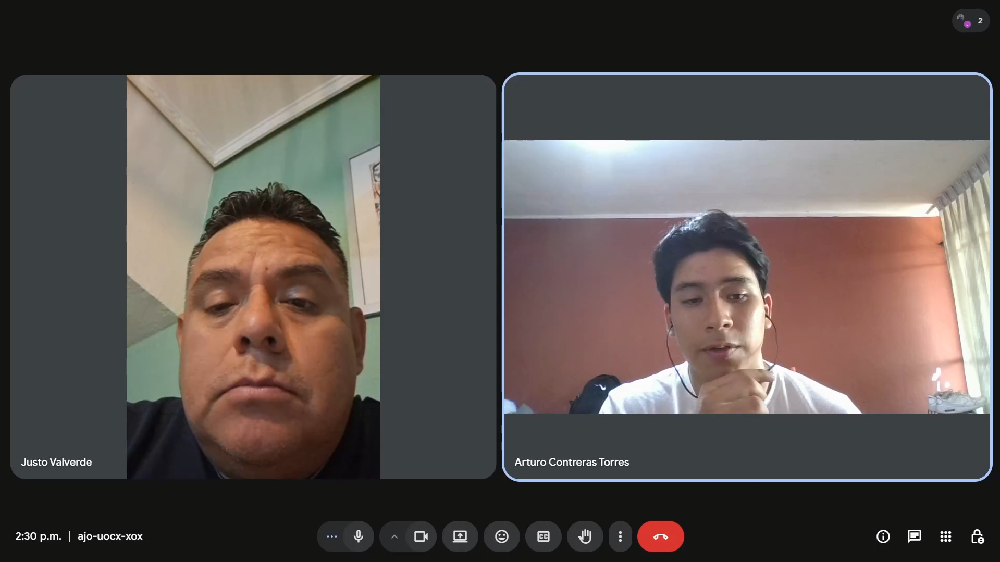

**Resumen descriptivo:**

El entrevistado fue Justo Valverde, un médico con 22 años de experiencia, actualmente trabajando en una institución pública de salud. Justo describe que la atención médica sigue un proceso de entrevista clínica, diagnóstico y tratamiento. Señala que las consultas presenciales son más efectivas debido al apoyo de exámenes clínicos, mientras que las virtuales cumplen principalmente un rol informativo, aunque el seguimiento del paciente si puede realizarse de forma remota.  
Utiliza una aplicación para gestionar historiales clínicos, la cual, pese a ciertas fallas, ha mejorado su trabajo frente al uso tradicional del papel. Advierte sobre los riesgos de que los pacientes utilicen productos sin información adecuada y valora positivamente la integración de inteligencia artifical como herramienta informativa, siempre complementada por un profesional de la salud.  
Considera que nuestro producto, Bloomie, puede agilizar la atención médica al proporcionar información previa del paciente, permitiendo al especialista optimizar el tiempo de consulta y enfocarse en decisiones clínicas más precisas.

<u>Entrevista 2:</u>

Entrevistador: Martin Alejandro Asmat Alminco

Datos del entrevistado

- **Nombre:** Antonio
- **Apellidos:** Paredes 
- **Edad:** 67 años
- **Distrito:** Jesús María
- **Timing:** Desde 48:30 minutos hasta 1:01:16  minutos

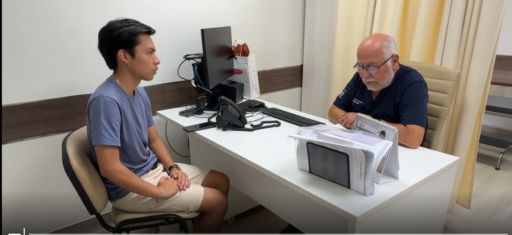

**Resumen descriptivo:** 

En entrevistado fue Antonio Paredes, un médico con 40 años de experiencia en la especialidad de dermatología, y que actualmente trabaja en una clínica privada ubicada en Jesús María. Él considera relevante para sus consultas un buen diagnóstico, para lo cual evalúa antecedentes, lesiones cutáneas o la automedicación. Sin embargo, considera que existen casos en los cuales se puede complicar el correcto tratamiento de los pacientes al casos completamente variantes, por lo que ve necesario un correcto historial clínico y uso de un sistema brindado por la clínica. Luego, se encuentra parcialmente en desacuerdo con el uso de productos relacionados con el skin care, ya que propone que en su mayoría, estos no contienen la certificación médica para poder ser utilizados de forma libre, lo que complica el tratamiento. 

Después, con respecto a una posible aplicación, menciona que se debe mantener un correcto uso de la información, no desde el lado técnico en software, sino información que en teoría está protegida por la ley y que tiene peso legal, ello por ejemplo incluye el historial clínico. Sin embargo, si ve pertinente la integración de una aplicación en formato puente, donde pueda unir a los dermatólogos y pacientes en un entorno con mayor comunicación para ahorro de tiempo yo costos a comparación del sistema de citas tradicional. 

Finalmente, el doctor está de acuerdo que las herramientas de inteligencia aertificial son beneficiosas para el uso cotidiano y de ser aplicable, para el caso de los dermatólogos especialistas como él. Sin embargo, considera que es pertinente la supervisión de profesionales debido a posibles diagnósticos erróneos generados por patrones, ya que los casos de pacientes se consideran únicos, especialmente por intentos de autocuidado. 

<u>Entrevista 3:</u>

Entrevistador: Luciana Mechan

Datos del entrevistado

- **Nombre:** Andrea 
- **Apellidos:** Rosas
- **Edad:** 45
- **Distrito:** San Isidro
- **Timing:** Desde 1:01:17 minutos hasta 1:06:26 minutos

El entrevistado no autorizo para la grabación de su rostro  

**Resumen descriptivo:**

La entrevistada, Andrea Rosas, es dermatóloga con 30 años de experiencia, trabaja de manera independiente y ejerce en el distrito de San Isidro. Su proceso de atención inicia con la evaluación visual del paciente, seguido del diagnóstico y la prescripción del tratamiento, mientras que el seguimiento depende en gran medida de que el paciente regrese a consulta, lo cual no siempre ocurre. Para realizar un diagnóstico adecuado, considera esencial contar con información previa como historial dermatológico, alergias, medicamentos actuales, rutina de productos y antecedentes familiares; sin embargo, en la práctica suele iniciar desde cero debido a la falta de información previa estructurada por parte del paciente.

En cuanto a las herramientas digitales, la entrevistada señala que el seguimiento es principalmente manual, utilizando fotos tomadas con el celular o enviadas por WhatsApp, lo que evidencia la ausencia de un sistema especializado. Además, menciona que las historias clínicas electrónicas actuales no están adaptadas a las necesidades de la dermatología, ya que no permiten una adecuada gestión ni comparación visual de imágenes. También identifica como un problema frecuente que los pacientes sigan rutinas de skincare basadas en redes sociales, lo que genera daños en la piel y dificulta el diagnóstico, debido a la falta de conocimiento sobre ingredientes y el uso incorrecto de productos.

Finalmente, la dermatóloga muestra una percepción positiva hacia el uso de inteligencia artificial como herramienta de apoyo, siempre que no reemplace el criterio profesional. Considera que un reporte previo automatizado, acompañado de un historial visual estructurado y un resumen de productos utilizados, aportaría un alto valor al proceso de consulta, ya que permitiría ahorrar tiempo y mejorar la precisión del diagnóstico. Asimismo, identifica como principales beneficios el seguimiento de la evolución del paciente y la optimización de consultas, aunque expresa preocupación por la posible mala interpretación de resultados por parte de los usuarios. Indica que recomendaría este tipo de solución especialmente en pacientes con tratamientos prolongados, como el acné, donde el monitoreo constante resulta clave.

**Enlace del video único de las entrevistas:** [*Ver grabación aquí*](https://upcedupe-my.sharepoint.com/:v:/g/personal/u202414802_upc_edu_pe/IQBNkNJeD-G7TZeChphX-tz0AXsuN0Qpx9bOQVOKp_op9rk?nav=eyJyZWZlcnJhbEluZm8iOnsicmVmZXJyYWxBcHAiOiJPbmVEcml2ZUZvckJ1c2luZXNzIiwicmVmZXJyYWxBcHBQbGF0Zm9ybSI6IldlYiIsInJlZmVycmFsTW9kZSI6InZpZXciLCJyZWZlcnJhbFZpZXciOiJNeUZpbGVzTGlua0NvcHkifX0&e=mt5kc7)

### 2.2.3. Análisis de entrevistas

#### Segmento 1:  Jóvenes adultos interesados en el skin care 

###### Proceso de atención 
100% realiza diagnóstico mediante evaluación clínica (visual + anamnesis)
66.7% incluye exámenes complementarios en casos necesarios
100% considera la consulta presencial como más efectiva
33.3% reconoce que el seguimiento puede hacerse de forma remota

###### Información esencial del paciente
100% considera esencial el historial médico (enfermedades, alergias, medicación)
100% requiere conocer productos/rutinas del paciente
66.7% incluye antecedentes familiares o contexto adicional (ocupación, enfermedades sistémicas)

###### Dificultades antes de la consulta presencial
100% reporta falta de información previa estructurada
100% indica que pacientes llegan con la condición alterada (automedicación/productos)
66.7% menciona problemas por demora en citas o evolución de la lesión

###### Seguimiento de pacientes
100% no cuenta con un sistema de seguimiento completamente estructurado y  dentro de este grupo, solo el 66,7 % cuenta con un sistema por parte de su hospital o clínica.
33.3% realiza seguimiento manual (fotos, mensajería) debido a posibles consultas virtuales.
66.7% depende de consultas presenciales porque consideran que es lo mejor en tratamiento.
33.3% reconoce viabilidad del seguimiento remoto 

###### Limitaciones de herramientas digitales
66.7% considera que las herramientas actuales son básicas o poco adaptadas
66.7% reporta dificultades en manejo/comparación de imágenes
33.3% utiliza sistemas digitales que mejoran frente al papel, pero con limitaciones
66.7% teme mala interpretación por parte del paciente
33.3% menciona riesgos generales asociados al uso de la herramienta

###### Problemas en pacientes con skincare propio
100% observa uso incorrecto de productos por intentos de autocuidado 
100% reporta efectos negativos en la piel (irritación, alteraciones)
66.7% menciona uso excesivo o múltiples productos simultáneos

###### Nivel de información del paciente
100% percibe desinformación generalizada
100% identifica influencia de redes sociales y marketing
66.7% señala falta de criterio o comprensión sobre productos

######  Uso de IA en diagnósticos preliminares
100% considera la IA útil como apoyo
100% coincide en que no reemplaza al profesional

###### Historial visual estructurado
100% lo considera útil o muy útil
66.7% destaca impacto en seguimiento y evaluación clínica

###### Funcionalidades indispensables
100% requiere acceso a información previa del paciente
66.7% considera clave el historial visual comparativo
33.3% valora gestión digital de historiales clínicos

###### Casos de uso recomendados
100% recomienda uso para optimizar consulta médica
66.7% lo enfoca en seguimiento de tratamientos
33.3% lo considera útil como apoyo informativo para pacientes 

#### Segmento 2:  Dermatólogos certificados

###### Rutina de cuidado de la piel
100% sigue alguna rutina de skincare por cuenta propia o tratada. 
33.3% presenta uso incorrecto o incompleto pese a recomendaciones de profesionales. 
33.3% reporta dificultad explícita para mantener constancia.
66.7% presenta problemas implícitos en la piel.

###### Fuentes de información para decisiones
66.7% utiliza redes sociales como fuente principal de casos verídicos y primeras referencias antes de comprar un producto.
33.3% prefiere recomendaciones cercanas de familiares o amigos. 
33.3% complementa con búsquedas en Google para averiguar mayor información. 
66.7% reconoce que la información no es confiable 
33.3% desconfía activamente de redes sociales

###### Proceso de elección de productos
100% presenta dificultad para elegir productos
66.7% basa sus decisiones en prueba y error
66.7% considera que cada piel reacciona diferente
33.3% tiene problemas específicos con el orden o dosificación

###### Problemas con productos de skincare
100% ha tenido experiencias negativas
33.3% reporta resequedad
33.3% reporta irritaciones o reacciones adversas
33.3% menciona malas experiencias con especialistas o recomendaciones.

###### Relación con dermatólogos y expertos
33.3% ha considerado acudir a un dermatólogo
33.3% ha tenido experiencias negativas con especialistas
100% no tiene acompañamiento profesional constante
66.7% prefiere autogestionar su cuidado

###### Nivel de confianza en la información presente en internet
100% muestra desconfianza hacia fuentes actuales
66.7% mantiene una postura crítica pero sigue usándolas
33.3% evita activamente fuentes digitales no confiables

###### Interés en aplicaciones de skincare
100% estaría dispuesto a usar una app de análisis de piel
66.7% busca guía constante en internet sobre los posibles productos para aplicarse. 
33.3% busca fuentes confiables y seguras de farmacias y atención al médico.

###### Expectativas de la solución
100% espera recomendaciones personalizadas sobre rutina y productos. 
33.3% valora recordatorios o notificaciones por parte de la aplicaicón.
33.3% espera análisis mediante fotografías o scanners al sentir mayor seriedad y profesioanlismo. 
33.3% busca precisión en uso (orden/dosificación) de sus productos.

###### Barreras o preocupaciones
66.7% tiene preocupación por privacidad de datos
33.3% no lo menciona explícitamente pero sí exige confiabilidad
33.3% muestra desconfianza general por experiencias previas
33.3% menciona importancia de IA confiable

## 2.3. Needfinding

### 2.3.1. User Personas

En esta sección se presentan los user personas construidos a partir del análisis de las entrevistas realizadas a usuarios y especialistas dermatológicos. Estos artefactos sintetizan patrones de comportamiento, necesidades, motivaciones y frustraciones identificadas durante la investigación, permitiendo representar de manera clara a los segmentos clave de nuestro proyecto.

**PRIMER SEGMENTO OBJETIVO**

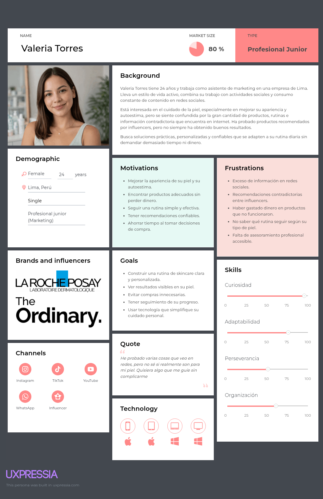

 

**SEGUNDO SEGMENTO OBJETIVO**

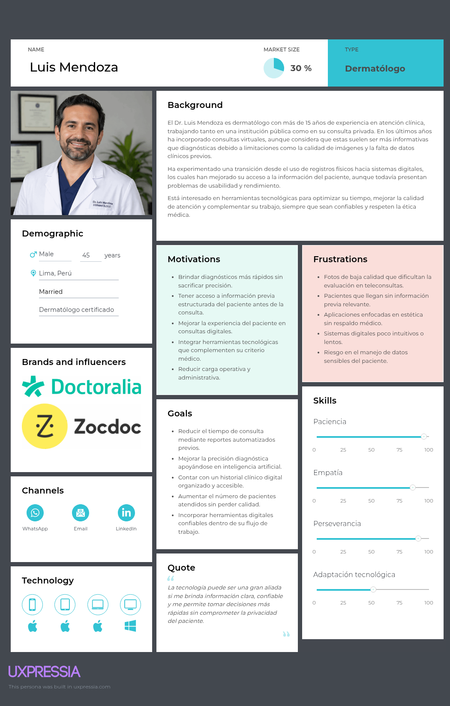

### 2.3.2. User Task Matrix

### 2.3.3. User Journey Mapping
En esta sección se detallan los User Journey Maps en su versión "As-Is", uno por cada segmento de usuario definido. El objetivo de estos mapas es ilustrar el proceso de extremo a extremo que realizan actualmente los usuarios para intentar resolver su necesidad, evidenciando los puntos de dolor, las frustraciones y las ineficiencias que experimentan antes de la implementación de nuestra solución propuesta.

A continuación, se presentan los diagramas que resumen la situación actual de los usuarios:
####  2.3.3.1 Segmento 1: Jóvenes adultos
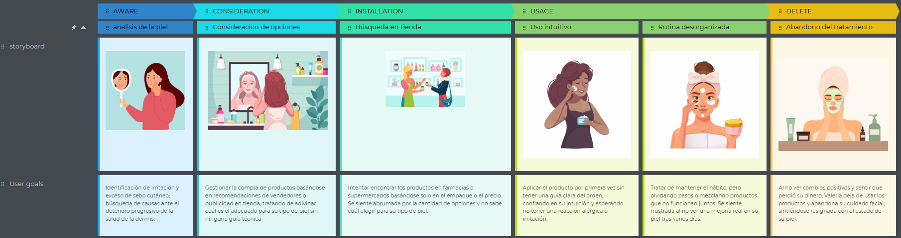
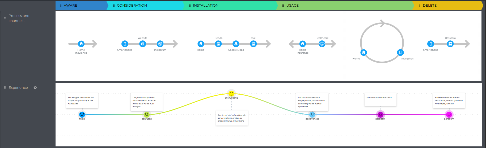
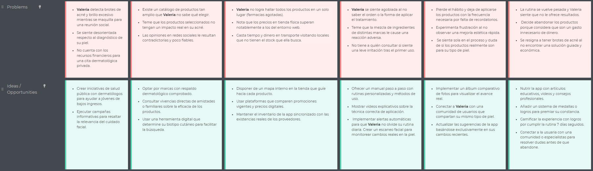

#### 2.3.3.2 Segmento 2: Dermatólogos certificados
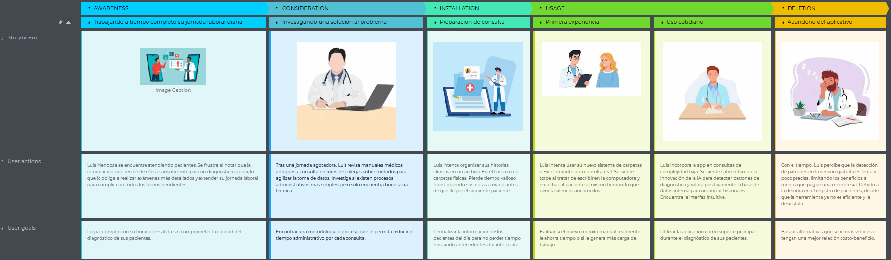

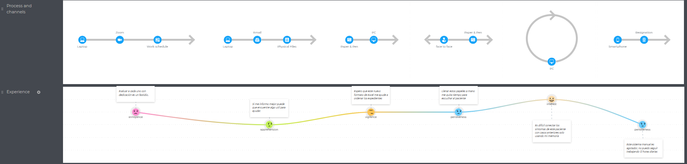

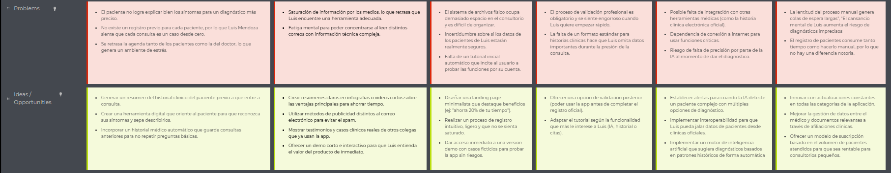

### 2.3.4. Empathy Mapping
En esta sección se presenta el Empathy Mapping elaborado para el segmento de negocio. Esta herramienta nos permite profundizar en el conocimiento de nuestro User Persona, yendo más allá de las características demográficas para comprender sus dolores, necesidades y el entorno que influye en su toma de decisiones.

A continuación, se visualizan los aspectos psicográficos, frustraciones y metas que definen la experiencia del usuario respecto a la problemática identificada:
####  2.3.4.1 Segmento 1: Jóvenes adultos
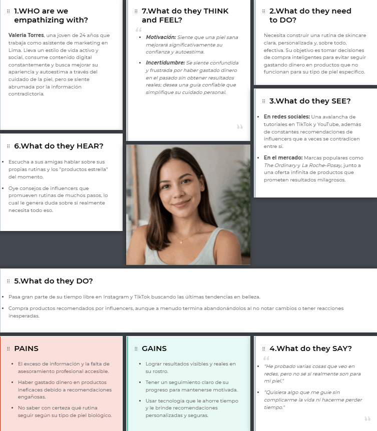

#### 2.3.4.2 Segmento 2: Dermatólogos certificados

## 2.4. Big Picture Event Storming

En esta sección se presenta el proceso de Big Picture Event Storming realizado por el equipo, con el propósito de comprender el dominio del negocio de manera general y visualizar sus procesos más relevantes. A través de una sesión colaborativa, se identificaron los principales eventos del dominio, los actores involucrados y sus relaciones, permitiendo obtener una primera visión integral del funcionamiento del sistema. Este modelado de alto nivel ayudó a reconocer flujos clave del negocio, así como posibles problemas, oportunidades y puntos de mejora dentro del contexto del proyecto.

Para realizar el Big Picture Event Storming se utilizaron 3 pasos importantes:

- **Step 1: Generating Domain Events**  
  En esta primera etapa se reconocieron los eventos más importantes del dominio del negocio, es decir, aquellos sucesos significativos que reflejan un cambio relevante dentro del sistema. Estos eventos fueron redactados en pasado, ya que representan hechos que ya ocurrieron, y sirvieron como punto de partida para entender el comportamiento general del negocio.

  

    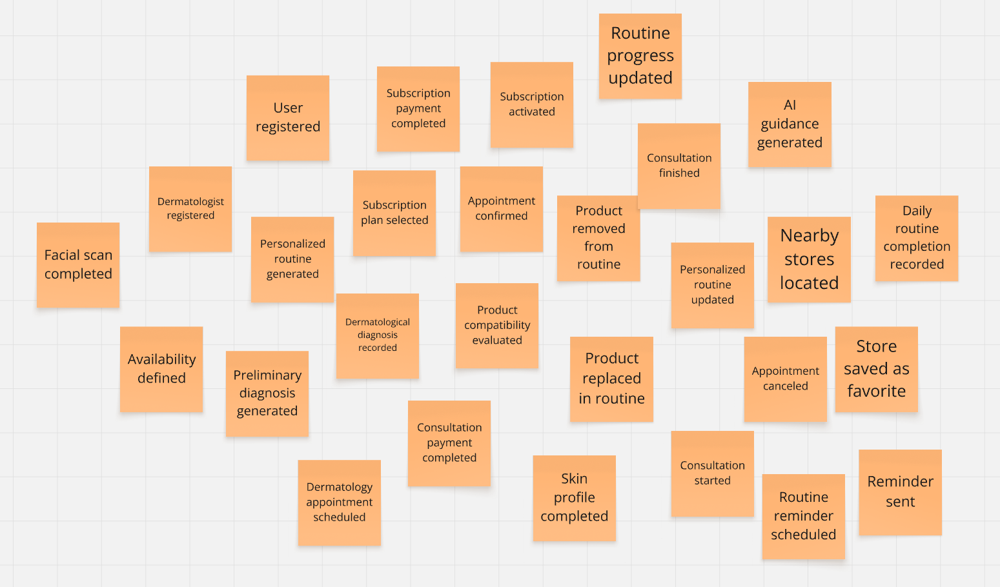
  
  

- **Step 2: Sorting Domain Events (chronologically)**  
  Luego, los eventos identificados se organizaron de manera cronológica, con el fin de representar el flujo general de las actividades del negocio. Esta secuencia permitió observar con mayor claridad cómo se conectan los distintos sucesos y cómo evolucionan los procesos dentro del dominio.

  

    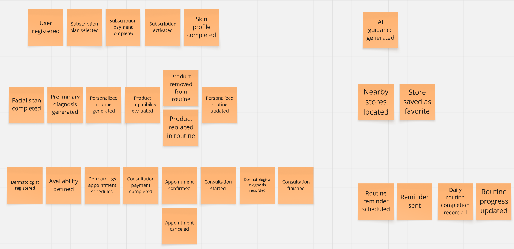
  
  

- **Step 3: Adding Actors and External systems**  
  Finalmente, se añadieron los actores y sistemas externos que intervienen en los procesos del negocio. Esto permitió identificar quiénes participan en cada interacción y qué elementos externos influyen en el desarrollo de los eventos, brindando así una visión más completa del contexto en el que opera el sistema.

  

    
  
  

## 2.5. Ubiquitous Language

En esta sección se define el lenguaje ubicuo del dominio del negocio, el cual permite establecer una comunicación clara, consistente y sin ambigüedades entre todos los stakeholders del proyecto, incluyendo desarrolladores, diseñadores y usuarios del sistema.

El Ubiquitous Language se construye a partir de términos propios del dominio del cuidado de la piel (skincare), la atención dermatológica y la personalización de rutinas, evitando el uso de conceptos técnicos de ingeniería de software.

Este lenguaje debe mantenerse consistente a lo largo de todo el proyecto, incluyendo la definición de requerimientos, User Stories, modelos de dominio y diseño del sistema.

 <u> Glosario de Términos del Dominio </u> 

- **User (Usuario)**  
  Persona que utiliza la aplicación para analizar su piel, recibir recomendaciones personalizadas y realizar seguimiento de su rutina de cuidado.

- **Dermatologist (Dermatólogo)**  
  Profesional de la salud especializado en el cuidado de la piel que brinda consultas, diagnósticos y recomendaciones a los usuarios dentro de la plataforma.

- **Skin Analysis (Análisis de piel)**  
  Proceso mediante el cual se evalúa el estado de la piel del usuario, generalmente a partir de imágenes o información proporcionada, para identificar condiciones y necesidades específicas.

- **Skin Type (Tipo de piel)**  
  Clasificación de la piel del usuario (por ejemplo: seca, grasa, mixta o sensible), utilizada como base para personalizar recomendaciones.

- **Skin Condition (Condición de la piel)**  
  Estado específico de la piel en un momento determinado, incluyendo problemas como acné, manchas, irritación o deshidratación.

- **Routine (Rutina)**  
  Conjunto estructurado de pasos y productos recomendados que el usuario debe seguir para el cuidado de su piel.

- **Routine Step (Paso de rutina)**  
  Acción específica dentro de una rutina, como limpieza, hidratación o aplicación de un producto.

- **Routine Tracking (Seguimiento de rutina)**  
  Registro del cumplimiento diario de la rutina por parte del usuario, utilizado para medir consistencia y progreso.

- **Adherence (Adherencia)**  
  Indicador que refleja qué tan consistentemente el usuario sigue su rutina a lo largo del tiempo.

- **Streak (Racha)**  
  Cantidad de días consecutivos en los que el usuario ha cumplido su rutina.

- **Product (Producto)**  
  Artículo de cuidado de la piel recomendado al usuario como parte de su rutina, con base en su análisis de piel.

- **Product Compatibility (Compatibilidad del producto)**  
  Nivel en el que un producto es adecuado para la piel del usuario según su tipo, condición y rutina actual.

- **Catalog (Catálogo)**  
  Conjunto de productos disponibles que el usuario puede explorar dentro de la aplicación.

- **Appointment (Cita)**  
  Interacción programada entre el usuario y un dermatólogo para recibir asesoría profesional.

- **Consultation (Consulta)**  
  Sesión de atención entre el usuario y el dermatólogo, en la cual se evalúa el estado de la piel y se brindan recomendaciones.

- **Diagnosis (Diagnóstico)**  
  Evaluación realizada por el dermatólogo sobre la condición de la piel del usuario, acompañada de recomendaciones.

- **Recommendation (Recomendación)**  
  Sugerencia de productos, hábitos o tratamientos basada en el análisis de piel o en la evaluación del dermatólogo.

- **Subscription Plan (Plan de suscripción)**  
  Modelo de acceso mediante el cual el usuario obtiene las funcionalidades de la aplicación a cambio de un pago.

- **Availability (Disponibilidad)**  
  Horario definido por el dermatólogo en el cual puede atender consultas.

- **Skin Progress (Progreso de la piel)**  
  Evolución del estado de la piel del usuario a lo largo del tiempo, basada en el seguimiento y análisis continuo.

# Capítulo III: Requirements Specification

## 3.1. User Stories
En esta sección se presentan los requerimientos del sistema definidos mediante un conjunto de User Stories y Epics, los cuales describen de manera clara y concisa las funcionalidades esperadas desde la perspectiva de los diferentes actores del sistema, tales como el usuario joven adulto, el dermatólogo, el visitante del sitio web y el desarrollador.

Cada User Story representa una necesidad específica del negocio y está orientada a generar valor dentro del contexto del cuidado personalizado de la piel.

Asimismo, cada User Story incluye uno o más criterios de aceptación redactados en tercera persona, en tiempo presente y siguiendo la estructura de Gherkin (Given–When–Then). Estos criterios permiten definir comportamientos verificables del sistema, asegurando que las funcionalidades puedan ser validadas de manera objetiva.

El conjunto de User Stories se encuentra organizado en Epics, los cuales agrupan funcionalidades relacionadas dentro de los distintos contextos del dominio, tales como gestión de usuarios, rutinas, atención dermatológica, experiencia web y servicios REST. Esta organización facilita la comprensión del sistema y su evolución incremental.

Finalmente, se incluyen tanto User Stories funcionales orientadas al usuario final como Technical Stories asociadas a la implementación de servicios RESTful, permitiendo cubrir tanto la perspectiva del negocio como los aspectos necesarios para la construcción del sistema.

<table border="1" cellspacing="0" cellpadding="8">
 
  <tr>
    <th>Epic / Story ID</th>
    <th>Título</th>
    <th>Descripción</th>
    <th>Criterios de Aceptación</th>
    <th>Relacionado con (Epic ID)</th>
  </tr>
 
  <!-- E1 -->
  <tr>
    <td><strong>E1</strong></td>
    <td>Onboarding de usuario</td>
    <td>Como joven adulto, quiero completar el proceso de registro e inicio para acceder a Bloomie.</td>
    <td></td>
    <td></td>
  </tr>
 
  <tr>
    <td><strong>US01</strong></td>
    <td>Registro de cuenta</td>
    <td>Como joven adulto, quiero registrarme con mis datos personales para crear una cuenta y acceder a Bloomie.</td>
    <td>
      <strong>Escenario 1: Registro exitoso</strong> 
      Dado que el usuario proporciona nombre, apellido, email y contraseña válidos
      Cuando confirma el registro
      Entonces el sistema crea la cuenta
      Y redirige al cuestionario inicial de piel
      

      <strong>Escenario 2: Datos inválidos</strong> 
      Dado que el usuario ingresa datos incompletos o con formato incorrecto
      Cuando intenta registrarse
      Entonces el sistema rechaza la solicitud
      Y muestra el mensaje de error correspondiente
    </td>
    <td>E1(Onboarding de usuario)</td>
  </tr>
 
  <tr>
    <td><strong>US02</strong></td>
    <td>Completar perfil de piel</td>
    <td>Como joven adulto, quiero completar un cuestionario inicial sobre mis condiciones de piel en mi primer ingreso para que la aplicación configure mi perfil correctamente.</td>
    <td>
      <strong>Escenario 1: Cuestionario presentado</strong> 
      Dado que el usuario accede por primera vez tras registrarse
      Cuando el sistema valida su autenticación
      Entonces solicita completar el cuestionario de tipo de piel y sensibilidad
      

      <strong>Escenario 2: Perfil completado exitosamente</strong> 
      Dado que el usuario proporciona su tipo de piel y nivel de sensibilidad
      Cuando confirma el envío
      Entonces el sistema guarda el perfil
      Y redirige al proceso de escaneo facial
    </td>
    <td>E1(Onboarding de usuario)</td>
  </tr>
 
  <!-- E2 -->
  <tr>
    <td><strong>E2</strong></td>
    <td>Análisis de piel</td>
    <td>Como joven adulto, quiero analizar mi piel mediante escaneo facial para obtener un diagnóstico personalizado.</td>
    <td></td>
    <td></td>
  </tr>
 
  <tr>
    <td><strong>US03</strong></td>
    <td>Escaneo facial</td>
    <td>Como joven adulto, quiero realizar un escaneo facial con la cámara para que la aplicación capture mi piel y obtenga un diagnóstico preciso.</td>
    <td>
      <strong>Escenario 1: Escaneo completado</strong> 
      Dado que el usuario inicia el proceso de escaneo facial
      Cuando el sistema captura correctamente la imagen
      Entonces completa el escaneo
      Y continúa con el procesamiento del análisis
      

      <strong>Escenario 2: Escaneo fallido</strong> 
      Dado que el usuario inicia el proceso de escaneo facial
      Cuando la captura no se completa correctamente
      Entonces el sistema indica que el escaneo no fue exitoso
      Y permite reintentar
    </td>
    <td>E2(Análisis de piel)</td>
  </tr>
 
  <tr>
    <td><strong>US04</strong></td>
    <td>Diagnóstico preliminar automático</td>
    <td>Como joven adulto, quiero recibir un diagnóstico generado por IA después del escaneo para conocer el estado de mi piel y los cuidados que necesito.</td>
    <td>
      <strong>Escenario 1: Diagnóstico generado correctamente</strong> 
      Dado que el usuario completó el escaneo facial
      Cuando el sistema procesa la imagen mediante IA
      Entonces genera un diagnóstico con scores de hidratación, textura, sensibilidad y brillo
      Y muestra el reporte al usuario
      

      <strong>Escenario 2: Error de procesamiento</strong> 
      Dado que ocurre un error al procesar la imagen
      Cuando el sistema no puede completar el análisis
      Entonces informa al usuario
      Y permite reintentar el escaneo
    </td>
    <td>E2(Análisis de piel)</td>
  </tr>
 
  <tr>
    <td><strong>US12</strong></td>
    <td>Consultar historial de escaneos faciales</td>
    <td>Como joven adulto, quiero consultar mis escaneos faciales anteriores dentro de la sección Skin Scan para revisar mi evolución y los resultados de cada análisis.</td>
    <td>
      <strong>Escenario 1: Historial disponible</strong> 
      Dado que el usuario accede a la sección de escaneos pasados dentro de Skin Scan
      Cuando el sistema carga su historial
      Entonces muestra la lista de escaneos ordenados por fecha con score general, tipo de piel y scores de hidratación, textura y brillo de cada uno
      

      <strong>Escenario 2: Sin escaneos registrados</strong> 
      Dado que el usuario accede a la sección de escaneos pasados
      Cuando no existen análisis previos registrados
      Entonces el sistema informa que no hay escaneos disponibles
      Y sugiere realizar el primer escaneo facial
    </td>
    <td>E2(Análisis de piel)</td>
  </tr>
 
  <!-- E3 -->
  <tr>
    <td><strong>E3</strong></td>
    <td>Gestión de rutina personalizada</td>
    <td>Como joven adulto, quiero gestionar mi rutina de cuidado de piel para seguir un tratamiento adecuado y constante.</td>
    <td></td>
    <td></td>
  </tr>
 
  <tr>
    <td><strong>US05</strong></td>
    <td>Generar rutina personalizada</td>
    <td>Como joven adulto, quiero recibir una rutina personalizada con productos basados en mi diagnóstico de piel para seguir un tratamiento adecuado.</td>
    <td>
      <strong>Escenario 1: Rutina generada exitosamente</strong> 
      Dado que el usuario cuenta con un diagnóstico de piel completado
      Cuando accede a su rutina
      Entonces el sistema genera una rutina personalizada
      Y asigna productos específicos para cada paso con su horario programado
      

      <strong>Escenario 2: Error en la generación</strong> 
      Dado que el usuario cuenta con un diagnóstico registrado
      Cuando ocurre un error en la generación de la rutina
      Entonces el sistema informa la situación
      Y permite reintentar
    </td>
    <td>E3(Gestión de rutina personalizada)</td>
  </tr>
 
  <tr>
    <td><strong>US06</strong></td>
    <td>Reemplazar producto de la rutina</td>
    <td>Como joven adulto, quiero reemplazar un producto de mi rutina por una alternativa recomendada para adaptar mi tratamiento.</td>
    <td>
      <strong>Escenario 1: Alternativas mostradas</strong> 
      Dado que el usuario tiene una rutina activa
      Cuando selecciona la opción de reemplazar un producto
      Entonces el sistema muestra hasta cuatro alternativas compatibles ordenadas por score de compatibilidad
      

      <strong>Escenario 2: Reemplazo confirmado</strong> 
      Dado que el usuario visualiza las alternativas
      Cuando selecciona una y confirma el cambio
      Entonces el sistema actualiza la rutina
      Y reemplaza el producto anterior por el seleccionado
    </td>
    <td>E3(Gestión de rutina personalizada)</td>
  </tr>
 
  <tr>
    <td><strong>US07</strong></td>
    <td>Registrar cumplimiento de rutina diaria</td>
    <td>Como joven adulto, quiero marcar si completé mi rutina del día para llevar un seguimiento de mi progreso.</td>
    <td>
      <strong>Escenario 1: Rutina marcada como completada</strong> 
      Dado que el usuario visualiza su rutina del día
      Cuando indica que completó todos los pasos
      Entonces el sistema registra el día como completado
      

      <strong>Escenario 2: Rutina marcada como no completada</strong> 
      Dado que el usuario visualiza su rutina del día
      Cuando indica que no completó la rutina
      Entonces el sistema registra el día como no completado
    </td>
    <td>E3(Gestión de rutina personalizada)</td>
  </tr>
 
  <!-- E4 -->
  <tr>
    <td><strong>E4</strong></td>
    <td>Descubrimiento de productos</td>
    <td>Como joven adulto, quiero explorar productos de skincare para tomar decisiones informadas según mi tipo de piel.</td>
    <td></td>
    <td></td>
  </tr>
 
  <tr>
    <td><strong>US08</strong></td>
    <td>Explorar catálogo de productos</td>
    <td>Como joven adulto, quiero explorar el catálogo de productos y aplicar filtros para encontrar opciones relevantes a mis necesidades.</td>
    <td>
      <strong>Escenario 1: Catálogo cargado</strong> 
      Dado que el usuario accede al catálogo de productos
      Cuando el sistema carga la información
      Entonces muestra la lista de productos con su categoría y score de compatibilidad
      

      <strong>Escenario 2: Filtro aplicado con resultados</strong> 
      Dado que el usuario aplica un filtro por categoría
      Cuando existen productos que cumplen el criterio
      Entonces el sistema muestra únicamente los productos filtrados
      

      <strong>Escenario 3: Filtro sin resultados</strong> 
      Dado que el usuario aplica un filtro por categoría
      Cuando no existen productos que cumplan el criterio
      Entonces el sistema informa que no hay productos disponibles para ese filtro
    </td>
    <td>E4(Descubrimiento de productos)</td>
  </tr>
 
  <tr>
    <td><strong>US09</strong></td>
    <td>Ver detalle y compatibilidad de producto</td>
    <td>Como joven adulto, quiero ver el detalle de un producto y su compatibilidad con mi piel para tomar decisiones informadas.</td>
    <td>
      <strong>Escenario 1: Producto compatible</strong> 
      Dado que el usuario accede al detalle de un producto
      Cuando el sistema carga la información
      Entonces muestra el score de compatibilidad, la explicación y los beneficios del producto
      

      <strong>Escenario 2: Producto con baja compatibilidad</strong> 
      Dado que el usuario accede al detalle de un producto no adecuado para su piel
      Cuando el sistema carga la información
      Entonces indica el bajo nivel de compatibilidad
      Y explica las razones asociadas a su perfil de piel
    </td>
    <td>E4(Descubrimiento de productos)</td>
  </tr>
 
  <tr>
    <td><strong>US10</strong></td>
    <td>Guardar producto como favorito</td>
    <td>Como joven adulto, quiero guardar productos en mis favoritos para acceder a ellos fácilmente después.</td>
    <td>
      <strong>Escenario 1: Producto guardado</strong> 
      Dado que el usuario visualiza un producto
      Cuando selecciona guardarlo como favorito
      Entonces el sistema lo agrega a su lista de favoritos
      

      <strong>Escenario 2: Producto eliminado de favoritos</strong> 
      Dado que el usuario tiene un producto en favoritos
      Cuando selecciona eliminarlo
      Entonces el sistema lo remueve de la lista
    </td>
    <td>E4(Descubrimiento de productos)</td>
  </tr>
 
  <!-- E5 -->
  <tr>
    <td><strong>E5</strong></td>
    <td>Seguimiento y progreso del usuario</td>
    <td>Como joven adulto, quiero visualizar mi progreso para entender mi constancia y evolución en el cuidado de mi piel.</td>
    <td></td>
    <td></td>
  </tr>
 
  <tr>
    <td><strong>US11</strong></td>
    <td>Visualizar métricas de progreso</td>
    <td>Como joven adulto, quiero visualizar métricas de mi constancia y evolución en el cuidado de mi piel para entender mi progreso.</td>
    <td>
      <strong>Escenario 1: Métricas disponibles</strong> 
      Dado que el usuario accede a la sección de progreso
      Cuando el sistema procesa los datos registrados
      Entonces muestra la racha de días consecutivos, tasa de adherencia, días completados en la semana y el gráfico de skin health score a lo largo del tiempo
      

      <strong>Escenario 2: Sin datos suficientes</strong> 
      Dado que el usuario accede a la sección de progreso
      Cuando no existen registros de cumplimiento ni escaneos previos
      Entonces el sistema informa que no hay datos suficientes
      Y sugiere completar la rutina diaria o realizar un escaneo facial
    </td>
    <td>E5(Seguimiento y progreso del usuario)</td>
  </tr>
 
  <!-- E6 -->
  <tr>
    <td><strong>E6</strong></td>
    <td>Soporte inteligente</td>
    <td>Como joven adulto, quiero consultar dudas sobre mi piel para recibir orientación personalizada.</td>
    <td></td>
    <td></td>
  </tr>
 
  <tr>
    <td><strong>US13</strong></td>
    <td>Consultar asistente virtual de skincare</td>
    <td>Como joven adulto, quiero consultar dudas sobre productos, rutinas o ingredientes para recibir orientación inmediata basada en mi perfil de piel.</td>
    <td>
      <strong>Escenario 1: Consulta respondida</strong> 
      Dado que el usuario envía una consulta al asistente
      Cuando el sistema procesa la solicitud usando el perfil de piel y último escaneo del usuario
      Entonces genera una respuesta personalizada
      Y la muestra en el chat
      

      <strong>Escenario 2: Consulta con sugerencia de consulta médica</strong> 
      Dado que el usuario realiza una consulta que excede el alcance del asistente
      Cuando el sistema detecta que requiere atención profesional
      Entonces informa la limitación
      Y sugiere agendar una consulta con un dermatólogo
    </td>
    <td>E6(Soporte inteligente)</td>
  </tr>
 
  <!-- E7 -->
  <tr>
    <td><strong>E7</strong></td>
    <td>Atención dermatológica</td>
    <td>Como joven adulto, quiero acceder a consultas con dermatólogos para recibir atención especializada.</td>
    <td></td>
    <td></td>
  </tr>
 
  <tr>
    <td><strong>US14</strong></td>
    <td>Listar y seleccionar dermatólogo</td>
    <td>Como joven adulto, quiero visualizar una lista de dermatólogos disponibles con su información relevante para elegir con quién agendar una consulta.</td>
    <td>
      <strong>Escenario 1: Lista disponible</strong> 
      Dado que el usuario accede a la sección de consultas dermatológicas
      Cuando el sistema carga la información
      Entonces muestra la lista de dermatólogos con nombre, especialidad, años de experiencia, rating y costo por consulta
      

      <strong>Escenario 2: Sin especialistas disponibles</strong> 
      Dado que el usuario accede a la sección
      Cuando no existen dermatólogos disponibles
      Entonces el sistema informa que no hay especialistas disponibles en este momento
    </td>
    <td>E7(Atención dermatológica)</td>
  </tr>
 
  <tr>
    <td><strong>US15</strong></td>
    <td>Pagar y confirmar cita dermatológica</td>
    <td>Como joven adulto, quiero realizar el pago de una consulta dermatológica para confirmar mi cita.</td>
    <td>
      <strong>Escenario 1: Pago exitoso</strong> 
      Dado que el usuario ha seleccionado un dermatólogo y horario
      Cuando proporciona datos de pago válidos y confirma la transacción
      Entonces el sistema procesa el pago
      Y confirma la cita con estado CONFIRMED
      

      <strong>Escenario 2: Pago fallido</strong> 
      Dado que el usuario intenta realizar el pago
      Cuando ocurre un error en la transacción
      Entonces el sistema informa que el pago no fue completado
      Y permite reintentar
    </td>
    <td>E7(Atención dermatológica)</td>
  </tr>
 
  <tr>
    <td><strong>US16</strong></td>
    <td>Cancelar cita dermatológica</td>
    <td>Como joven adulto, quiero cancelar una cita programada para gestionar cambios en mi disponibilidad.</td>
    <td>
      <strong>Escenario 1: Cancelación con reembolso</strong> 
      Dado que el usuario tiene una cita confirmada
      Y la cancelación se realiza dentro del tiempo permitido
      Cuando selecciona una razón y confirma la cancelación
      Entonces el sistema cancela la cita
      Y procesa el reembolso correspondiente
      

      <strong>Escenario 2: Cancelación sin reembolso</strong> 
      Dado que el usuario tiene una cita confirmada
      Y la cancelación se realiza fuera del tiempo permitido
      Cuando confirma la cancelación
      Entonces el sistema cancela la cita
      Y notifica que no aplica reembolso
    </td>
    <td>E7(Atención dermatológica)</td>
  </tr>

  <tr>
    <td><strong>US34</strong></td>
    <td>Participar en consulta virtual</td>
    <td>Como joven adulto, quiero unirme a mi consulta virtual y enviar fotografías de mi piel para que el dermatólogo pueda evaluarme correctamente.</td>
    <td>
      <strong>Escenario 1: Consulta iniciada exitosamente</strong> 
      Dado que el usuario tiene una cita confirmada en el horario programado
      Cuando accede a la consulta virtual
      Entonces el sistema habilita la sesión
      Y permite la comunicación en tiempo real con el dermatólogo
      

      <strong>Escenario 2: Foto enviada exitosamente</strong> 
      Dado que la consulta está activa
      Cuando el usuario adjunta una fotografía de su piel
      Entonces el sistema envía la imagen al dermatólogo
      Y la muestra en el chat de la consulta
      

      <strong>Escenario 3: Error al enviar foto</strong> 
      Dado que el usuario intenta adjuntar una fotografía
      Cuando ocurre un error al procesar la imagen
      Entonces el sistema informa que la foto no pudo enviarse
      Y permite reintentar
    </td>
    <td>E7(Atención dermatológica)</td>
  </tr>

  </tr>
 
  <!-- E8 -->
  <tr>
    <td><strong>E8</strong></td>
    <td>Gestión de suscripción</td>
    <td>Como joven adulto, quiero gestionar mi plan de suscripción para acceder a las funcionalidades de la aplicación.</td>
    <td></td>
    <td></td>
  </tr>
 
  <tr>
    <td><strong>US17</strong></td>
    <td>Seleccionar y pagar plan de suscripción</td>
    <td>Como joven adulto, quiero seleccionar un plan de suscripción y completar el pago para acceder a Bloomie.</td>
    <td>
      <strong>Escenario 1: Plan seleccionado y pago exitoso</strong> 
      Dado que el usuario visualiza los planes disponibles con sus características y precios
      Cuando selecciona un plan y completa el pago correctamente
      Entonces el sistema activa la suscripción
      Y habilita el acceso a las funcionalidades correspondientes
      

      <strong>Escenario 2: Pago fallido</strong> 
      Dado que el usuario ha seleccionado un plan
      Cuando ocurre un error en la transacción
      Entonces el sistema informa que el pago no fue completado
      Y permite reintentar
    </td>
    <td>E8(Gestión de suscripción)</td>
  </tr>
 
  <tr>
    <td><strong>US18</strong></td>
    <td>Gestionar suscripción activa</td>
    <td>Como joven adulto, quiero gestionar mi suscripción activa para cambiar de plan o cancelarla según mis necesidades.</td>
    <td>
      <strong>Escenario 1: Cambio de plan exitoso</strong> 
      Dado que el usuario tiene una suscripción activa
      Cuando selecciona un nuevo plan y confirma el cambio
      Entonces el sistema actualiza la suscripción
      Y aplica el nuevo plan en el siguiente ciclo
      

      <strong>Escenario 2: Cancelación de suscripción</strong> 
      Dado que el usuario tiene una suscripción activa
      Cuando solicita cancelarla y confirma la acción
      Entonces el sistema cancela la renovación automática
      Y mantiene el acceso hasta el fin del período vigente
    </td>
    <td>E8(Gestión de suscripción)</td>
  </tr>
 
  <!-- E9 -->
  <tr>
    <td><strong>E9</strong></td>
    <td>Gestión de perfil del usuario</td>
    <td>Como joven adulto, quiero gestionar mi información personal para mantener mi cuenta actualizada.</td>
    <td></td>
    <td></td>
  </tr>
 
  <tr>
    <td><strong>US19</strong></td>
    <td>Editar perfil e información personal</td>
    <td>Como joven adulto, quiero editar mi información personal para mantener mis datos actualizados.</td>
    <td>
      <strong>Escenario 1: Edición exitosa</strong> 
      Dado que el usuario modifica su nombre, apellido o email
      Cuando el sistema valida los datos
      Entonces guarda los cambios correctamente
      

      <strong>Escenario 2: Datos inválidos</strong> 
      Dado que el usuario ingresa datos con formato incorrecto
      Cuando el sistema valida la información
      Entonces rechaza los cambios
      Y notifica el error específico
    </td>
    <td>E9(Gestión de perfil del usuario)</td>
  </tr>
 
  <tr>
    <td><strong>US20</strong></td>
    <td>Actualizar características de piel</td>
    <td>Como joven adulto, quiero actualizar mis características de piel para recibir recomendaciones más precisas.</td>
    <td>
      <strong>Escenario 1: Actualización exitosa</strong> 
      Dado que el usuario modifica su tipo de piel o nivel de sensibilidad
      Cuando el sistema valida los datos
      Entonces guarda la información actualizada
      Y recalcula las recomendaciones según el nuevo perfil
    </td>
    <td>E9(Gestión de perfil del usuario)</td>
  </tr>
 
  <tr>
    <td><strong>US21</strong></td>
    <td>Cambiar contraseña</td>
    <td>Como joven adulto, quiero cambiar mi contraseña para mantener la seguridad de mi cuenta.</td>
    <td>
      <strong>Escenario 1: Cambio exitoso</strong> 
      Dado que el usuario ingresa una nueva contraseña válida
      Cuando el sistema valida que cumple las reglas de seguridad
      Entonces actualiza la contraseña correctamente
      

      <strong>Escenario 2: Contraseña inválida</strong> 
      Dado que el usuario ingresa una contraseña que no cumple las reglas
      Cuando el sistema valida la información
      Entonces rechaza el cambio
      Y explica los requisitos no cumplidos
    </td>
    <td>E9(Gestión de perfil del usuario)</td>
  </tr>
 
  <!-- E10 -->
  <tr>
    <td><strong>E10</strong></td>
    <td>Experiencia web — Landing Page</td>
    <td>Como visitante, quiero explorar el sitio web de Bloomie para entender su propuesta de valor antes de registrarme.</td>
    <td></td>
    <td></td>
  </tr>
 
  <tr>
    <td><strong>US22</strong></td>
    <td>Comprender la propuesta de valor</td>
    <td>Como visitante, quiero comprender qué ofrece Bloomie para evaluar si resuelve mis necesidades.</td>
    <td>
      <strong>Escenario 1: Contenido disponible</strong> 
      Dado que el visitante accede a la landing page
      Cuando el sistema carga el contenido
      Entonces presenta la propuesta de valor principal con las funcionalidades destacadas de análisis de piel, rutinas personalizadas y consultas dermatológicas
    </td>
    <td>E10(Experiencia web — Landing Page)</td>
  </tr>
 
  <tr>
    <td><strong>US23</strong></td>
    <td>Explorar planes y precios</td>
    <td>Como visitante, quiero visualizar los planes disponibles y sus precios para elegir la opción que mejor se adapte a mis necesidades.</td>
    <td>
      <strong>Escenario 1: Planes mostrados</strong> 
      Dado que el visitante accede a la sección de precios
      Cuando el sistema carga la información
      Entonces muestra los tres planes con sus características, límites y precios
      

      <strong>Escenario 2: Comparación de planes</strong> 
      Dado que el visitante visualiza los planes
      Cuando analiza las diferencias
      Entonces el sistema presenta claramente qué incluye cada plan y qué lo diferencia de los demás
    </td>
    <td>E10(Experiencia web — Landing Page)</td>
  </tr>
 
  <tr>
    <td><strong>US24</strong></td>
    <td>Navegar entre secciones del sitio</td>
    <td>Como visitante, quiero navegar entre las secciones de la landing page para explorar todo el contenido disponible.</td>
    <td>
      <strong>Escenario 1: Navegación exitosa</strong> 
      Dado que el visitante accede a la landing page
      Cuando selecciona una sección del menú de navegación
      Entonces el sistema desplaza la vista a la sección correspondiente
    </td>
    <td>E10(Experiencia web — Landing Page)</td>
  </tr>
 
  <!-- E11 — DERMATÓLOGOS -->
  <tr>
    <td><strong>E11</strong></td>
    <td>Gestión de atención dermatológica</td>
    <td>Como dermatólogo, quiero gestionar mi práctica clínica en Bloomie para ofrecer consultas eficientes y de calidad.</td>
    <td></td>
    <td></td>
  </tr>
 
  <tr>
    <td><strong>US25</strong></td>
    <td>Registro de dermatólogo</td>
    <td>Como dermatólogo, quiero registrar mis credenciales profesionales para acceder a las funcionalidades especializadas de Bloomie.</td>
    <td>
      <strong>Escenario 1: Registro exitoso</strong> 
      Dado que el dermatólogo proporciona nombre, apellido, email, contraseña y especialidad válidos
      Cuando el sistema valida la información
      Entonces registra la cuenta con rol DERMATOLOGIST
      Y habilita el acceso a funcionalidades médicas
      

      <strong>Escenario 2: Credenciales inválidas</strong> 
      Dado que el dermatólogo proporciona información incompleta o incorrecta
      Cuando el sistema valida los datos
      Entonces rechaza el registro
      Y notifica el campo específico con error
    </td>
    <td>E11(Gestión de atención dermatológica)</td>
  </tr>
 
  <tr>
    <td><strong>US26</strong></td>
    <td>Configurar perfil profesional</td>
    <td>Como dermatólogo, quiero configurar mi perfil profesional con mi especialidad y tarifa de consulta para que los pacientes puedan encontrarme y saber qué esperar.</td>
    <td>
      <strong>Escenario 1: Perfil configurado exitosamente</strong> 
      Dado que el dermatólogo accede a la configuración de perfil
      Cuando ingresa su especialidad, años de experiencia y tarifa de consulta
      Entonces el sistema guarda el perfil
      Y lo hace visible para los usuarios que buscan dermatólogos
      

      <strong>Escenario 2: Datos inválidos</strong> 
      Dado que el dermatólogo ingresa información incompleta
      Cuando el sistema valida los datos
      Entonces rechaza los cambios
      Y notifica los campos requeridos
    </td>
    <td>E11(Gestión de atención dermatológica)</td>
  </tr>
 
  <tr>
    <td><strong>US27</strong></td>
    <td>Definir disponibilidad de atención</td>
    <td>Como dermatólogo, quiero definir mis horarios de disponibilidad para que los pacientes puedan agendar citas en horarios válidos.</td>
    <td>
      <strong>Escenario 1: Disponibilidad registrada</strong> 
      Dado que el dermatólogo accede a la configuración de disponibilidad
      Cuando define sus horarios de atención
      Entonces el sistema guarda la disponibilidad
      Y la refleja en el proceso de agendamiento para los pacientes
      

      <strong>Escenario 2: Disponibilidad actualizada</strong> 
      Dado que el dermatólogo tiene horarios registrados
      Cuando modifica su disponibilidad
      Entonces el sistema guarda los cambios
      Y actualiza los horarios disponibles para nuevas citas
    </td>
    <td>E11(Gestión de atención dermatológica)</td>
  </tr>
 
  <tr>
    <td><strong>US28</strong></td>
    <td>Visualizar agenda de consultas</td>
    <td>Como dermatólogo, quiero visualizar mis consultas programadas para gestionar mi tiempo de atención.</td>
    <td>
      <strong>Escenario 1: Agenda con citas</strong> 
      Dado que el dermatólogo accede a su agenda
      Cuando existen citas confirmadas
      Entonces el sistema muestra las consultas con fecha, hora y datos del paciente
      

      <strong>Escenario 2: Sin citas programadas</strong> 
      Dado que el dermatólogo accede a su agenda
      Cuando no existen citas registradas
      Entonces el sistema informa que no hay consultas programadas
    </td>
    <td>E11(Gestión de atención dermatológica)</td>
  </tr>
 
  <tr>
    <td><strong>US29</strong></td>
    <td>Realizar consulta virtual en tiempo real</td>
    <td>Como dermatólogo, quiero interactuar en tiempo real con el paciente durante la consulta virtual para evaluar su condición y brindar recomendaciones.</td>
    <td>
      <strong>Escenario 1: Consulta iniciada</strong> 
      Dado que el dermatólogo accede a una cita confirmada en el horario programado
      Cuando inicia la consulta
      Entonces el sistema habilita la sesión virtual
      Y permite la comunicación en tiempo real con el paciente
      

      <strong>Escenario 2: Consulta finalizada</strong> 
      Dado que la consulta está activa
      Cuando el dermatólogo finaliza la sesión
      Entonces el sistema registra el cierre
      Y actualiza el estado de la consulta a COMPLETED
    </td>
    <td>E11(Gestión de atención dermatológica)</td>
  </tr>
 
  <tr>
    <td><strong>US30</strong></td>
    <td>Registrar notas y recomendaciones clínicas</td>
    <td>Como dermatólogo, quiero registrar notas clínicas y recomendaciones durante la consulta para dejar un registro del caso atendido.</td>
    <td>
      <strong>Escenario 1: Notas registradas exitosamente</strong> 
      Dado que el dermatólogo tiene una consulta activa
      Cuando ingresa notas clínicas y recomendaciones para el paciente
      Entonces el sistema guarda la información
      Y la asocia a la consulta correspondiente
      

      <strong>Escenario 2: Registro sin notas</strong> 
      Dado que el dermatólogo finaliza una consulta sin ingresar notas
      Cuando confirma el cierre
      Entonces el sistema finaliza la consulta
      Y deja los campos de notas y recomendaciones vacíos
    </td>
    <td>E11(Gestión de atención dermatológica)</td>
  </tr>
 
  <tr>
    <td><strong>US31</strong></td>
    <td>Guardar fotografías clínicas del paciente</td>
    <td>Como dermatólogo, quiero visualizar las fotografías que el paciente envió durante la consulta y guardar las relevantes para documentar el caso clínico.</td>
    <td>
      <strong>Escenario 1: Foto guardada exitosamente</strong> 
      Dado que el dermatólogo visualiza las fotografías enviadas por el paciente durante la consulta
      Cuando selecciona una y confirma guardarla
      Entonces el sistema la almacena como fotografía clínica
      Y la asocia a esa consulta para consultas futuras
      

      <strong>Escenario 2: Sin fotos en la consulta</strong> 
      Dado que el dermatólogo accede al historial de una consulta
      Cuando el paciente no envió fotografías durante la sesión
      Entonces el sistema informa que no hay imágenes disponibles
    </td>
    <td>E11(Gestión de atención dermatológica)</td>
  </tr>

  <tr>
    <td><strong>US32</strong></td>
    <td>Consultar historial de consultas atendidas</td>
    <td>Como dermatólogo, quiero consultar el historial de mis consultas atendidas para revisar casos previos y sus registros clínicos.</td>
    <td>
      <strong>Escenario 1: Historial disponible</strong> 
      Dado que el dermatólogo accede a su historial
      Cuando existen consultas registradas
      Entonces el sistema muestra las consultas atendidas con fecha, paciente, notas y recomendaciones registradas
      

      <strong>Escenario 2: Sin historial</strong> 
      Dado que el dermatólogo accede a su historial
      Cuando no existen consultas registradas
      Entonces el sistema informa que no hay consultas disponibles
    </td>
    <td>E11(Gestión de atención dermatológica)</td>
  </tr>
 
  <tr>
    <td><strong>US33</strong></td>
    <td>Actualizar perfil profesional</td>
    <td>Como dermatólogo, quiero actualizar mi información profesional para mantener mi perfil al día.</td>
    <td>
      <strong>Escenario 1: Actualización exitosa</strong> 
      Dado que el dermatólogo modifica su especialidad, tarifa o años de experiencia
      Cuando el sistema valida los datos
      Entonces guarda los cambios
      Y actualiza el perfil visible para los usuarios
      

      <strong>Escenario 2: Datos inválidos</strong> 
      Dado que el dermatólogo ingresa información incorrecta
      Cuando el sistema valida los datos
      Entonces rechaza los cambios
      Y notifica el error específico
    </td>
    <td>E11(Gestión de atención dermatológica)</td>
  </tr>
  
<tr>
  <td><strong>TS01</strong></td>
  <td>Procesar pago de consulta dermatológica</td>
  <td>
    Como developer, quiero registrar y verificar el pago de una consulta dermatológica mediante una API de pagos para confirmar la cita del usuario.
  </td>
  <td>
    <strong>Escenario 1: Creación exitosa de orden de pago</strong> 
      Dado que el usuario ha seleccionado una cita válida
      Cuando el developer envía una solicitud POST a /api/pagos/consultas con el identificador de la cita y el monto
      Entonces la API devuelve una respuesta exitosa con el identificador de la transacción
      Y el estado inicial del pago queda como pendiente.
    

    <strong>Escenario 2: Confirmación exitosa del pago</strong> 
      Dado que existe una transacción de pago pendiente
      Cuando el developer consulta o recibe la confirmación del proveedor de pagos
      Entonces la API actualiza el estado de la transacción a pagado
      Y la cita queda confirmada.
    

    <strong>Escenario 3: Pago rechazado</strong> 
      Dado que el usuario intenta completar el pago
      Cuando el proveedor de pagos rechaza la operación
      Entonces la API devuelve un estado de pago fallido
      Y la cita no se confirma.
    

    <strong>Escenario 4: Datos inválidos de pago</strong> 
      Dado que la solicitud contiene una cita inexistente o un monto inválido
      Cuando el developer envía la solicitud
      Entonces la API responde con error 400 Bad Request
      Y muestra el detalle de validación.
  </td>
  <td>E11(Servicios REST)</td>
</tr>

<tr>
  <td><strong>TS02</strong></td>
  <td>Procesar pago de compra de plan dermatológico</td>
  <td>
    Como developer, quiero registrar y verificar el pago de un plan dermatológico mediante una API de pagos para activar el plan adquirido por el usuario.
  </td>
  <td>
    <strong>Escenario 1: Creación exitosa de orden de pago del plan</strong> 
      Dado que el usuario ha seleccionado un plan dermatológico disponible
      Cuando el developer envía una solicitud POST a /api/pagos/planes con el identificador del plan, usuario y monto
      Entonces la API devuelve una respuesta exitosa con el identificador de la transacción
      Y el estado inicial del pago queda como pendiente.
    

    <strong>Escenario 2: Activación exitosa del plan</strong> 
      Dado que existe una transacción de pago pendiente asociada a un plan
      Cuando el developer consulta o recibe la confirmación del proveedor de pagos
      Entonces la API actualiza el estado de la transacción a pagado
      Y el plan queda activo para el usuario.
    

    <strong>Escenario 3: Pago rechazado del plan</strong> 
      Dado que el usuario intenta completar el pago de un plan
      Cuando el proveedor de pagos rechaza la operación
      Entonces la API devuelve un estado de pago fallido
      Y el plan no se activa.
    

    <strong>Escenario 4: Plan o monto inválido</strong> 
      Dado que la solicitud contiene un plan inexistente o un monto inválido
      Cuando el developer envía la solicitud
      Entonces la API responde con error 400 Bad Request
      Y muestra el detalle de validación.
  </td>
  <td>E11(Servicios REST)</td>
</tr>

<tr>
  <td><strong>TS03</strong></td>
  <td>Consultar estado de una transacción de pago</td>
  <td>
    Como developer, quiero consultar el estado de una transacción de pago mediante una API de pagos para verificar si una consulta debe confirmarse o un plan debe activarse.
  </td>
  <td>
    <strong>Escenario 1: Consulta exitosa de transacción</strong> 
      Dado que existe una transacción de pago registrada
      Cuando el developer envía una solicitud GET a /api/pagos/{transactionId}
      Entonces la API devuelve una respuesta 200 OK
      Y muestra el estado actual de la transacción.
    

    <strong>Escenario 2: Transacción pagada</strong> 
      Dado que la transacción fue completada correctamente
      Cuando el developer consulta el estado del pago
      Entonces la API devuelve el estado pagado
      Y muestra si corresponde a una consulta dermatológica o a un plan.
    

    <strong>Escenario 3: Transacción pendiente</strong> 
      Dado que el usuario aún no completó el pago
      Cuando el developer consulta el estado de la transacción
      Entonces la API devuelve el estado pendiente
      Y mantiene la consulta o el plan sin confirmar.
    

    <strong>Escenario 4: Transacción no encontrada</strong> 
      Dado que el developer envía un identificador de transacción inexistente
      Cuando realiza la solicitud de consulta
      Entonces la API responde con error 404 Not Found
      Y muestra un mensaje indicando que la transacción no fue encontrada.
  </td>
  <td>E11(Servicios REST)</td>
</tr>

<tr>
  <td><strong>TS04</strong></td>
  <td>Obtener análisis y respuesta del asistente de IA</td>
  <td>
    Como developer, quiero enviar una consulta del usuario a una API de inteligencia artificial para obtener orientación sobre productos, ingredientes, rutinas o estado de la piel.
  </td>
  <td>
    <strong>Escenario 1: Consulta respondida correctamente</strong> 
      Dado que el usuario ingresa una pregunta válida
      Cuando el developer envía una solicitud POST a /api/ai/consultas con el texto de la consulta
      Entonces la API devuelve una respuesta 200 OK
      Y retorna una respuesta generada por la IA.
    

    <strong>Escenario 2: Consulta con contexto del usuario</strong> 
      Dado que el usuario tiene información registrada sobre su tipo de piel o rutina
      Cuando el developer envía la consulta junto con ese contexto
      Entonces la API devuelve una respuesta más personalizada.
    

    <strong>Escenario 3: Consulta vacía o inválida</strong> 
      Dado que el developer envía una solicitud sin texto de consulta
      Cuando la API valida la entrada
      Entonces responde con 400 Bad Request
      Y explica que la consulta es obligatoria.
    

    <strong>Escenario 4: La IA no puede responder</strong> 
      Dado que la pregunta no puede resolverse con suficiente confianza
      Cuando la API procesa la consulta
      Entonces devuelve una respuesta indicando la limitación
      Y sugiere consultar a un dermatólogo.
  </td>
  <td>E11(Servicios REST)</td>
</tr>

<tr>
  <td><strong>TS05</strong></td>
  <td>Obtener recomendación de productos dermatológicos</td>
  <td>
    Como developer, quiero enviar el tipo de piel, necesidades y preferencias del usuario a una API de inteligencia artificial para obtener recomendaciones de productos dermatológicos adecuados.
  </td>
  <td>
    <strong>Escenario 1: Recomendación exitosa de productos</strong> 
      Dado que el usuario indica su tipo de piel y necesidad principal
      Cuando el developer envía una solicitud POST a /api/ai/recomendaciones/productos con los datos del usuario
      Entonces la API devuelve una respuesta 200 OK
      Y retorna una lista de productos recomendados.
    

    <strong>Escenario 2: Recomendación personalizada según tipo de piel</strong> 
      Dado que el usuario tiene registrado su tipo de piel
      Cuando la API genera la recomendación
      Entonces prioriza productos adecuados para ese tipo de piel
      Y explica brevemente por qué son recomendados.
    

    <strong>Escenario 3: Datos insuficientes del usuario</strong> 
      Dado que el developer no envía información suficiente sobre el tipo de piel o necesidad del usuario
      Cuando la API procesa la solicitud
      Entonces responde con 400 Bad Request
      Y solicita completar los datos necesarios para generar la recomendación.
    

    <strong>Escenario 4: No hay productos adecuados disponibles</strong> 
      Dado que no existen productos relacionados con la necesidad indicada
      Cuando la API busca recomendaciones
      Entonces devuelve una respuesta indicando que no se encontraron productos adecuados
      Y sugiere consultar con un dermatólogo.
  </td>
  <td>E11(Servicios REST)</td>
</tr>

<tr>
  <td><strong>TS06</strong></td>
  <td>Generar rutina personalizada de cuidado de piel</td>
  <td>
    Como developer, quiero enviar información del perfil dermatológico del usuario a una API de inteligencia artificial para generar una rutina personalizada de cuidado de piel.
  </td>
  <td>
    <strong>Escenario 1: Rutina generada correctamente</strong> 
      Dado que el usuario proporciona su tipo de piel y objetivo dermatológico
      Cuando el developer envía una solicitud POST a /api/ai/rutinas con la información del usuario
      Entonces la API devuelve una respuesta 200 OK
      Y retorna una rutina organizada en pasos de mañana y noche.
    

    <strong>Escenario 2: Rutina con productos recomendados</strong> 
      Dado que existen productos compatibles con el perfil del usuario
      Cuando la API genera la rutina personalizada
      Entonces incluye productos sugeridos dentro de cada paso
      Y explica la función de cada producto en la rutina.
    

    <strong>Escenario 3: Información incompleta del perfil</strong> 
      Dado que el developer no envía información suficiente sobre el perfil dermatológico del usuario
      Cuando la API procesa la solicitud
      Entonces devuelve una rutina general
      Y solicita completar el perfil para una recomendación más precisa.
    

    <strong>Escenario 4: Caso que requiere atención dermatológica</strong> 
      Dado que el usuario describe síntomas severos o persistentes
      Cuando la API genera la respuesta
      Entonces evita dar un diagnóstico definitivo
      Y recomienda acudir a un dermatólogo.
  </td>
  <td>E11(Servicios REST)</td>
</tr>

</table>

## 3.2. Impact Mapping
#### 3.2.1. Business Goal 1: 
- Incrementar la tasa de usuarios y dermatólogos que realicen el proceso de onboarding del 60% al 85% en un plazo de 3 meses.

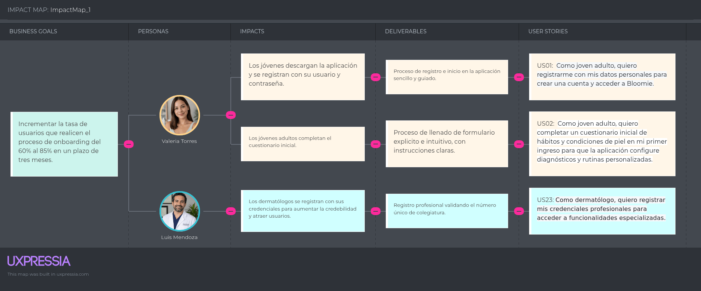

#### 3.2.2. Business Goal 2: 
- Lograr que al menos el 70% de los usuarios que realizan el escaneo facial completen el flujo hasta recibir su rutina personalizada , y que al menos el 50% de los dermatólogos activos utilicen la plataforma para consultar información de pacientes, en un plazo de 4 meses.

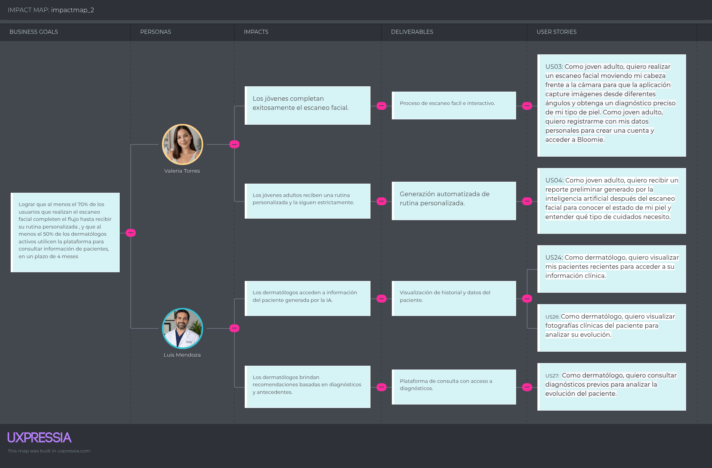

#### 3.2.3. Business Goal 3: 
- Aumentar la tasa de usuarios activos que registran su rutina al menos 3 veces por semana del 30% al 55%, y lograr que el 60% de los dermatólogos gestionen activamente sus consultas en la plataforma, en un periodo de 5 meses.

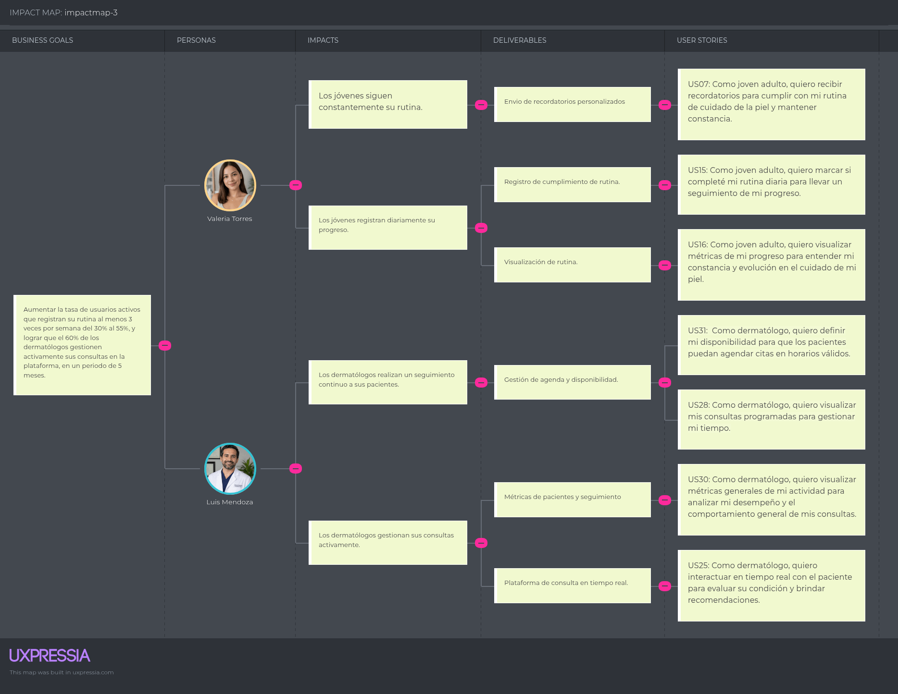

## 3.3. Product Backlog
<table border="1" cellspacing="0" cellpadding="8">

  <tr>
    <th>#Orden</th>
    <th>User story id</th>
    <th>Título</th>
    <th>Descripción</th>
    <th>Story points (1/2/3/5/8)</th>
  </tr>

  <tr>
    <td><strong>01</strong></td>
    <td>US22</td>
    <td>Comprender la propuesta de valor</td>
    <td>Como visitante, quiero comprender qué ofrece Bloomie para evaluar si resuelve mis necesidades.</td>
    <td>3</td>
  </tr>

  <tr>
    <td><strong>02</strong></td>
    <td>US24</td>
    <td>Navegar entre secciones del sitio</td>
    <td>Como visitante, quiero navegar entre las secciones de la landing page para explorar todo el contenido disponible.</td>
    <td>2</td>
  </tr>

  <tr>
    <td><strong>03</strong></td>
    <td>US23</td>
    <td>Explorar planes y precios</td>
    <td>Como visitante, quiero visualizar los planes disponibles y sus precios para elegir la opción que mejor se adapte a mis necesidades.</td>
    <td>3</td>
  </tr>

  <tr>
    <td><strong>04</strong></td>
    <td>US03</td>
    <td>Escaneo facial</td>
    <td>Como joven adulto, quiero realizar un escaneo facial con la cámara para que la aplicación capture mi piel y obtenga un diagnóstico preciso.</td>
    <td>5</td>
  </tr>

  <tr>
    <td><strong>05</strong></td>
    <td>US04</td>
    <td>Diagnóstico preliminar automático</td>
    <td>Como joven adulto, quiero recibir un diagnóstico generado por IA después del escaneo para conocer el estado de mi piel y los cuidados que necesito.</td>
    <td>5</td>
  </tr>

  <tr>
    <td><strong>06</strong></td>
    <td>US05</td>
    <td>Generar rutina personalizada</td>
    <td>Como joven adulto, quiero recibir una rutina personalizada con productos basados en mi diagnóstico de piel para seguir un tratamiento adecuado.</td>
    <td>5</td>
  </tr>

  <tr>
    <td><strong>07</strong></td>
    <td>US06</td>
    <td>Reemplazar producto de la rutina</td>
    <td>Como joven adulto, quiero reemplazar un producto de mi rutina por una alternativa recomendada para adaptar mi tratamiento.</td>
    <td>3</td>
  </tr>

  <tr>
    <td><strong>08</strong></td>
    <td>US07</td>
    <td>Registrar cumplimiento de rutina diaria</td>
    <td>Como joven adulto, quiero marcar si completé mi rutina del día para llevar un seguimiento de mi progreso.</td>
    <td>3</td>
  </tr>

  <tr>
    <td><strong>09</strong></td>
    <td>US12</td>
    <td>Consultar historial de escaneos faciales</td>
    <td>Como joven adulto, quiero consultar mis escaneos faciales anteriores dentro de la sección Skin Scan para revisar mi evolución y los resultados de cada análisis.</td>
    <td>3</td>
  </tr>

  <tr>
    <td><strong>10</strong></td>
    <td>US11</td>
    <td>Visualizar métricas de progreso</td>
    <td>Como joven adulto, quiero visualizar métricas de mi constancia y evolución en el cuidado de mi piel para entender mi progreso.</td>
    <td>3</td>
  </tr>

  <tr>
    <td><strong>11</strong></td>
    <td>US13</td>
    <td>Consultar asistente virtual de skincare</td>
    <td>Como joven adulto, quiero consultar dudas sobre productos, rutinas o ingredientes para recibir orientación inmediata basada en mi perfil de piel.</td>
    <td>5</td>
  </tr>

  <tr>
    <td><strong>12</strong></td>
    <td>US08</td>
    <td>Explorar catálogo de productos</td>
    <td>Como joven adulto, quiero explorar el catálogo de productos y aplicar filtros para encontrar opciones relevantes a mis necesidades.</td>
    <td>5</td>
  </tr>

  <tr>
    <td><strong>13</strong></td>
    <td>US09</td>
    <td>Ver detalle y compatibilidad de producto</td>
    <td>Como joven adulto, quiero ver el detalle de un producto y su compatibilidad con mi piel para tomar decisiones informadas.</td>
    <td>3</td>
  </tr>

  <tr>
    <td><strong>14</strong></td>
    <td>US10</td>
    <td>Guardar producto como favorito</td>
    <td>Como joven adulto, quiero guardar productos en mis favoritos para acceder a ellos fácilmente después.</td>
    <td>2</td>
  </tr>

  <tr>
    <td><strong>15</strong></td>
    <td>US14</td>
    <td>Listar y seleccionar dermatólogos para agendar</td>
    <td>Como joven adulto, quiero visualizar una lista de dermatólogos disponibles con su información relevante para elegir con quién agendar una consulta.</td>
    <td>3</td>
  </tr>

  <tr>
    <td><strong>16</strong></td>
    <td>US34</td>
    <td>Participar en consulta virtual</td>
    <td>Como joven adulto, quiero unirme a mi consulta virtual y enviar fotografías de mi piel para que el dermatólogo pueda evaluarme correctamente.</td>
    <td>5</td>
  </tr>

  <tr>
    <td><strong>17</strong></td>
    <td>US15</td>
    <td>Pagar y confirmar cita dermatológica</td>
    <td>Como joven adulto, quiero realizar el pago de una consulta dermatológica para confirmar mi cita.</td>
    <td>3</td>
  </tr>

  <tr>
    <td><strong>18</strong></td>
    <td>US16</td>
    <td>Cancelar cita dermatológica</td>
    <td>Como joven adulto, quiero cancelar una cita programada para gestionar cambios en mi disponibilidad.</td>
    <td>3</td>
  </tr>

  <tr>
    <td><strong>19</strong></td>
    <td>US02</td>
    <td>Completar perfil de piel</td>
    <td>Como joven adulto, quiero completar un cuestionario inicial sobre mis condiciones de piel en mi primer ingreso para que la aplicación configure mi perfil correctamente.</td>
    <td>3</td>
  </tr>

  <tr>
    <td><strong>20</strong></td>
    <td>US17</td>
    <td>Seleccionar y pagar plan de suscripción</td>
    <td>Como joven adulto, quiero seleccionar un plan de suscripción y completar el pago para acceder a Bloomie.</td>
    <td>3</td>
  </tr>

  <tr>
    <td><strong>21</strong></td>
    <td>US18</td>
    <td>Gestionar suscripción activa</td>
    <td>Como joven adulto, quiero gestionar mi suscripción activa para cambiar de plan o cancelarla según mis necesidades.</td>
    <td>3</td>
  </tr>

  <tr>
    <td><strong>22</strong></td>
    <td>US19</td>
    <td>Editar perfil e información personal</td>
    <td>Como joven adulto, quiero editar mi información personal para mantener mis datos actualizados.</td>
    <td>3</td>
  </tr>

  <tr>
    <td><strong>23</strong></td>
    <td>US20</td>
    <td>Actualizar características de piel</td>
    <td>Como joven adulto, quiero actualizar mis características de piel para recibir recomendaciones más precisas.</td>
    <td>3</td>
  </tr>

  <tr>
    <td><strong>24</strong></td>
    <td>US01</td>
    <td>Registro de cuenta</td>
    <td>Como joven adulto, quiero registrarme con mis datos personales para crear una cuenta y acceder a Bloomie.</td>
    <td>3</td>
  </tr>

  <tr>
    <td><strong>25</strong></td>
    <td>US21</td>
    <td>Cambiar contraseña</td>
    <td>Como joven adulto, quiero cambiar mi contraseña para mantener la seguridad de mi cuenta.</td>
    <td>2</td>
  </tr>

  <tr>
    <td><strong>26</strong></td>
    <td>US25</td>
    <td>Registro de dermatólogo</td>
    <td>Como dermatólogo, quiero registrar mis credenciales profesionales para acceder a las funcionalidades especializadas de Bloomie.</td>
    <td>5</td>
  </tr>

  <tr>
    <td><strong>27</strong></td>
    <td>US26</td>
    <td>Configurar perfil profesional</td>
    <td>Como dermatólogo, quiero configurar mi perfil profesional con mi especialidad y tarifa de consulta para que los pacientes puedan encontrarme y saber qué esperar.</td>
    <td>3</td>
  </tr>

  <tr>
    <td><strong>28</strong></td>
    <td>US27</td>
    <td>Definir disponibilidad de atención</td>
    <td>Como dermatólogo, quiero definir mis horarios de disponibilidad para que los pacientes puedan agendar citas en horarios válidos.</td>
    <td>5</td>
  </tr>

  <tr>
    <td><strong>29</strong></td>
    <td>US28</td>
    <td>Visualizar agenda de consultas</td>
    <td>Como dermatólogo, quiero visualizar mis consultas programadas para gestionar mi tiempo de atención.</td>
    <td>3</td>
  </tr>

  <tr>
    <td><strong>30</strong></td>
    <td>US29</td>
    <td>Realizar consulta virtual en tiempo real</td>
    <td>Como dermatólogo, quiero interactuar en tiempo real con el paciente durante la consulta virtual para evaluar su condición y brindar recomendaciones.</td>
    <td>5</td>
  </tr>

  <tr>
    <td><strong>31</strong></td>
    <td>US30</td>
    <td>Registrar notas y recomendaciones clínicas</td>
    <td>Como dermatólogo, quiero registrar notas clínicas y recomendaciones durante la consulta para dejar un registro del caso atendido.</td>
    <td>3</td>
  </tr>

  <tr>
    <td><strong>32</strong></td>
    <td>US31</td>
    <td>Guardar fotografías clínicas del paciente</td>
    <td>Como dermatólogo, quiero visualizar las fotografías que el paciente envió durante la consulta y guardar las relevantes para documentar el caso clínico.</td>
    <td>3</td>
  </tr>

  <tr>
    <td><strong>33</strong></td>
    <td>US32</td>
    <td>Consultar historial de consultas atendidas</td>
    <td>Como dermatólogo, quiero consultar el historial de mis consultas atendidas para revisar casos previos y sus registros clínicos.</td>
    <td>3</td>
  </tr>

  <tr>
    <td><strong>34</strong></td>
    <td>US33</td>
    <td>Actualizar perfil profesional</td>
    <td>Como dermatólogo, quiero actualizar mi información profesional para mantener mi perfil al día.</td>
    <td>3</td>
  </tr>

  <tr>
    <td><strong>35</strong></td>
    <td>TS01</td>
    <td>Procesar pago de consulta dermatológica</td>
    <td>Como developer, quiero registrar y verificar el pago de una consulta dermatológica mediante una API de pagos para confirmar la cita del usuario.</td>
    <td>5</td>
  </tr>

  <tr>
    <td><strong>36</strong></td>
    <td>TS02</td>
    <td>Procesar pago de compra de plan dermatológico</td>
    <td>Como developer, quiero registrar y verificar el pago de un plan dermatológico mediante una API de pagos para activar el plan adquirido por el usuario.</td>
    <td>5</td>
  </tr>

  <tr>
    <td><strong>37</strong></td>
    <td>TS03</td>
    <td>Consultar estado de una transacción de pago</td>
    <td>Como developer, quiero consultar el estado de una transacción de pago mediante una API de pagos para verificar si una consulta debe confirmarse o un plan debe activarse.</td>
    <td>3</td>
  </tr>

  <tr>
    <td><strong>38</strong></td>
    <td>TS04</td>
    <td>Obtener análisis y respuesta del asistente de IA</td>
    <td>Como developer, quiero enviar una consulta del usuario a una API de inteligencia artificial para obtener orientación sobre productos, ingredientes, rutinas o estado de la piel.</td>
    <td>5</td>
  </tr>

  <tr>
    <td><strong>39</strong></td>
    <td>TS05</td>
    <td>Obtener recomendación de productos dermatológicos</td>
    <td>Como developer, quiero enviar el tipo de piel, necesidades y preferencias del usuario a una API de inteligencia artificial para obtener recomendaciones de productos dermatológicos adecuados.</td>
    <td>5</td>
  </tr>

  <tr>
    <td><strong>40</strong></td>
    <td>TS06</td>
    <td>Generar rutina personalizada de cuidado de piel</td>
    <td>Como developer, quiero enviar información del perfil dermatológico del usuario a una API de inteligencia artificial para generar una rutina personalizada de cuidado de piel.</td>
    <td>5</td>
  </tr>

</table>

**Enlace del product backlog en trello:** [*Ir a trello aquí*](https://trello.com/b/Y2tqaAyd/product-backlog)

# Capítulo IV: Product Design

## 4.1. Style Guidelines

### 4.1.1. General Style Guidelines
#### 4.1.1.1. Branding
Nuestro objetivo como empresa es reflejar una imagen de confort, confianza y 
confidencialidad. Por tanto, la identidad visual para nuestro logo utiliza colores directos, así 
como también un diseño práctico para mayor credibilidad y seriedad al tratarse de la salud.  

#### Logo de la marca

#### 4.1.1.2. Spacing
El sistema de espaciado asegura consistencia visual en la interfaz y mejora la legibilidad, 
accesibilidad y usabilidad en web y móvil. Se establecen reglas claras para la separación entre 
elementos, aplicables en toda la plataforma. 

#### Sistema modular
Se adopta un sistema modular basado en múltiplos de 4 px (4, 8, 12, 16, 24, 32…). Esto 
garantiza uniformidad en márgenes y paddings en todos los componentes. 

1. Distancia mínima entre íconos

Los íconos deben mantener un espaciado mínimo de 10 px entre sí (como se muestra en la 
referencia visual adjunta), para evitar saturación y asegurar claridad.

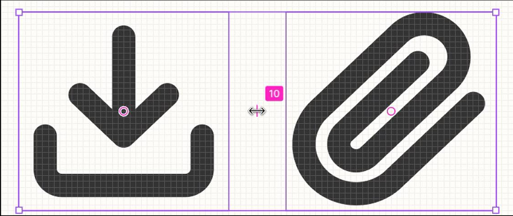

2. Márgenes y paddings estándar 

- Entre secciones principales: 24–32 px en web / 16–20 px en móvil. 
- Entre bloques de texto y botones: mínimo 16px.
- Entre íconos y etiquetas de texto: mínimo 8 px.

3. Tamaños mínimos de elementos interactivos
- Botones: mínimo 44x44px (recomendado por estándares de accesibilidad).
- Íconos no menores a 30x30 px. 
- Logotipo: no reducir a menos de 30 px de alto para evitar pérdida de legibilidad.

4. Espaciado en texto (relacionado a tipografía) 
- Interlineado (line-height): 1.5x el tamaño de la fuente para párrafos. 
- Espaciado entre párrafos: mínimo 16px.

#### 4.1.1.3. Typography
La tipografía oficial de Bloomie es Montserrat, seleccionada por su legibilidad en pantallas 
digitales, su estilo moderno y minimalista.  
Se emplea en distintos pesos y tamaños para jerarquizar el contenido y asegurar una 
experiencia visual consistente en todas las interfaces (web y móvil).

<table>
  <tr>
    <th>Estilo</th>
    <th>Uso principal</th>
    <th>Fuente</th>
    <th>Peso</th>
    <th>Tamaño Desktop</th>
    <th>Tamaño Mobile</th>
    <th>Line-height</th>
    <th>Ejemplo de uso</th>
  </tr>

  <tr>
    <td><b>H1</b></td>
    <td>Títulos principales (ej. <i>Bloomie</i>).</td>
    <td>Montserrat</td>
    <td>Semibold</td>
    <td>62 px</td>
    <td>28 px</td>
    <td>120%</td>
    <td>Pantallas de inicio, títulos de portada</td>
  </tr>

  <tr>
    <td><b>H2</b></td>
    <td>Subtítulos grandes (ej. <i>Your Skincare Journey Starts Here</i>)</td>
    <td>Montserrat</td>
    <td>Semibold</td>
    <td>48 px</td>
    <td>20 px</td>
    <td>120%</td>
    <td>Subtítulos en secciones o mensajes clave</td>
  </tr>

  <tr>
    <td><b>H3</b></td>
    <td>Encabezados menores</td>
    <td>Montserrat</td>
    <td>Semibold</td>
    <td>18 px</td>
    <td>16 px</td>
    <td>120%</td>
    <td>Títulos de tarjetas, secciones intermedias</td>
  </tr>

  <tr>
    <td><b>Body</b></td>
    <td>Texto de párrafo</td>
    <td>Montserrat</td>
    <td>Regular</td>
    <td>16 px</td>
    <td>14 px</td>
    <td>150%</td>
    <td>Textos explicativos, indicaciones generales</td>
  </tr>

  <tr>
    <td><b>Small</b></td>
    <td>Texto auxiliar o notas</td>
    <td>Montserrat</td>
    <td>Regular</td>
    <td>12 px</td>
    <td>12 px</td>
    <td>140%</td>
    <td>Mensajes de ayuda, disclaimers, instrucciones</td>
  </tr>

  <tr>
    <td><b>Button</b></td>
    <td>Acciones principales (Login, Signup)</td>
    <td>Montserrat</td>
    <td>Semibold</td>
    <td>16 px</td>
    <td>13 px</td>
    <td>120%</td>
    <td>Botones de acción, CTAs</td>
  </tr>

  <tr>
    <td><b>Label / Tag</b></td>
    <td>Etiquetas, chips, filtros</td>
    <td>Montserrat</td>
    <td>Medium</td>
    <td>14 px</td>
    <td>12 px</td>
    <td>120%</td>
    <td>Filtros, estados, badges</td>
  </tr>
</table>

#### 4.1.1.4. Tono de comunicación y lenguaje aplicado
El lenguaje de Bloomie es cercano, respetuoso y sereno, alineado con el propósito de 
acompañar al usuario en el cuidado de su piel.

1. Dimensiones definidas: 
- Formal/Casual: Casual. Mensajes sencillos y amigables.
- Respetuoso/Irreverente: Respetuoso. Siempre transmitiendo confianza y empatía.
- Entusiasta/Sereno: Sereno. El tono es calmado, motivador y positivo, evitando dramatizar problemas de la piel.

2. Lineamientos de redacción:
- Usar frases cortas y claras.
- Priorizar mensajes positivos (“You can improve your skin with small steps”) en lugar de negativos.
- Evitar tecnicismos dermatológicos complejos; se debe comunicar en un lenguaje que cualquier usuario entienda.

#### 4.1.1.5. Colores
La paleta de Bloomie está diseñada con tonos cálidos y suaves, pensados para transmitir frescura, bienestar y confianza en el cuidado de la piel. Se emplean colores neutros y acentos rosados para lograr armonía visual y consistencia en todas las interfaces.

1. Fondos
- #FDFFF8

Casos de uso: fondo principal de la aplicación, mantiene un estilo cálido y limpio.

- #CEBEBE

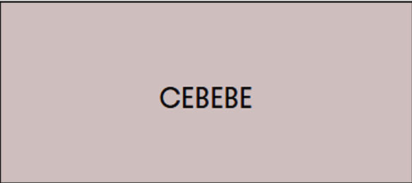

Casos de uso: cuadros con íconos, secciones importantes, bloques secundarios.

2. Textos
- #333333

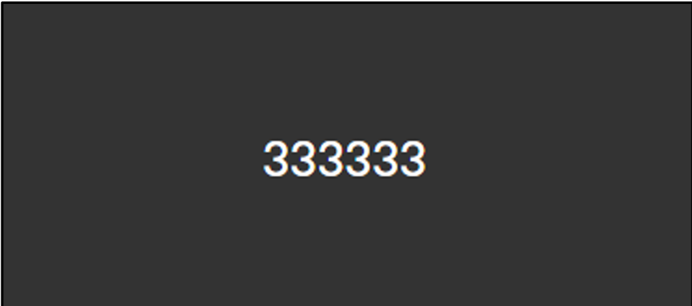

Casos de uso: texto principal y párrafos (legible y elegante, sin llegar a ser negro puro). 

3. Botones y enlaces
- #A26769 

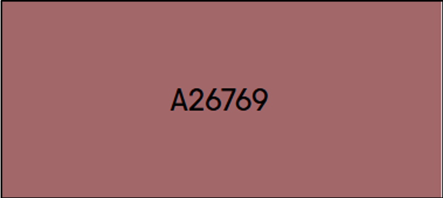

Casos de uso: botones principales (acciones clave), títulos destacados y elementos de énfasis. 

- #333333

Casos de uso: botones principales de acceso (Login, Signup). 

#### Botones
Los botones tienen una fuente Montserrat y un tamaño de 16 px para desktop y 13 px para 
móvil. La estructura es la siguiente:

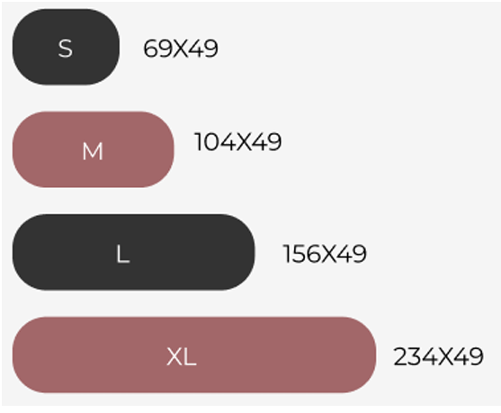

#### Cabecera

Estas son las dos cabeceras usadas en la app web, en el lado izquierda se observa el logo 
con el nombre de la aplicación y en la parte izquierda enlaces para acceso rápido de aspectos 
importantes dentro de la aplicación.

#### Iconografía
Bloomie utiliza un set propio de íconos minimalistas y lineales, diseñados para ser claros, modernos y consistentes. Los íconos cumplen un rol funcional:

- Comunicar acciones de manera inmediata.
- Sugerir interactividad.
- Destacar información importante.

Todos los íconos mantienen coherencia visual con la paleta de colores y la tipografía definida 
en esta guía. 

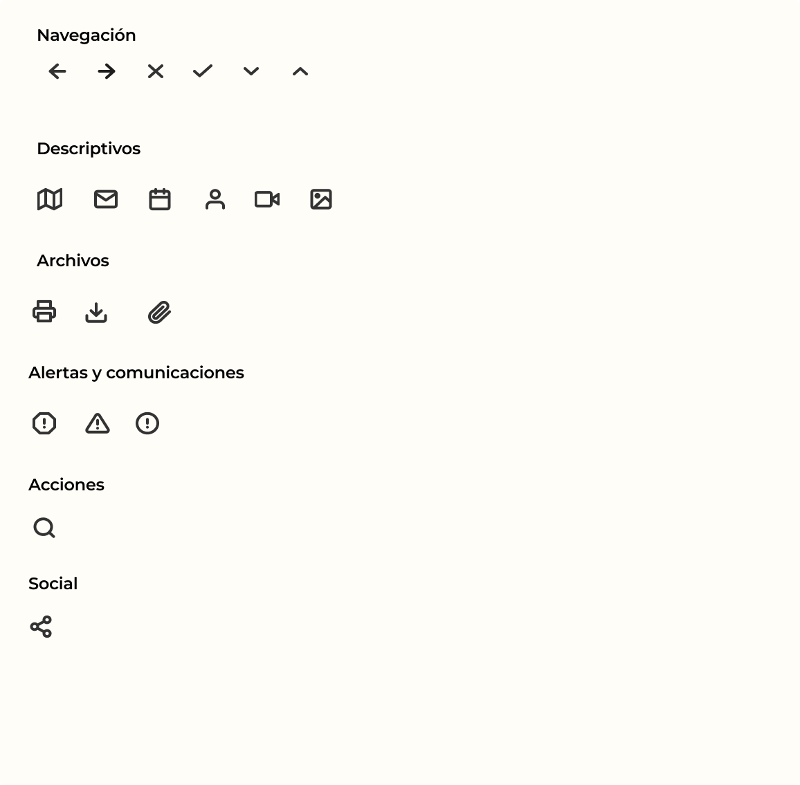

### 4.1.2. Web Style Guidelines

## 4.2. Information Architecture

### 4.2.1. Organization Systems

### 4.2.2. Labeling Systems

El sistema de etiquetado de Bloomie fue diseñado para garantizar claridad, coherencia y 
simplicidad en la comunicación de todos los elementos dentro de la experiencia digital. Las 
etiquetas, títulos y botones fueron redactados en un lenguaje cotidiano y cercano, de modo 
que los usuarios comprendan fácilmente las acciones que pueden realizar, reduciendo la carga 
cognitiva y reforzando la identidad visual de la marca.

##### Labeling System Landing Page

En la interfaz web se utilizan etiquetas sencillas y universales que guían la exploración inicial del usuario: How it works, Results, Features, About Us, Pricing y Log in en el navigation bar del encabezado principal. Estas se acompañan con botones de otro color como "Analyze my skin" redactados con verbos directos que promueven la interacción con el usuario e incite a utilizar una funcionalidad clave de nuestro producto. 
El encabezado principal incluye el apartado de traducción de idiomas con el i18n, complementado con subtítulos que explican brevemente la propuesta de valor de Bloomie y el botón principal de descarga.

navigation bar: 

luego, mantenemos una paleta de colores de contraste entre los blancos con sombreado cafe y variantes. Con ello se genera esa armonía visual.

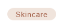

##### Labeling System App para Jóvenes adultos

En la versión móvil, las etiquetas se enfocan en la acción y el beneficio, manteniendo un tono amable		y		motivador. En el dashboard principal se observan las etiquetas: Personalized skincare, Consult a dermatologist,	Product		suggestion,		etc. Dentro de cada módulo, se mantienen etiquetas descriptivas como Mi rutina, Productos recomendados,   Añadir  paso,   Mis  consultas  y  Resultados  de  análisis. El lenguaje empleado es cercano y positivo, en línea con la voz de marca que busca acompañar y educar al usuario en su cuidado personal.

###### Iconografía estándar

En este apartado de considera todos los icons que son completamente intuitivos para el usuario que se adapta a una acción o funcionalidad en específico.

###### Elementos de interacción activa

Son los elementos con los que el joven interactua más seguido, como también lo cumple la navigation bar del móvil.

*navigation bar*

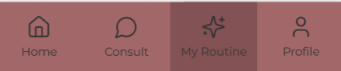

###### Elementos de validación

Icons que aparecen para validar algún tipo de guardado que informe al usuario sobre la evaluación del sistema. 

*icons*

###### Labeling System App para Dermatólogos certificados

En la vista profesional, las etiquetas se adaptan al entorno clínico, priorizando precisión y funcionalidad.
Las secciones principales son Appointments and consultations, My patients, treatment plans and analytics.

De esta manera, se mantiene una coherencia estructural con la versión de usuarios, pero con terminología técnica acorde al perfil profesional.

algunos *icons* de ejemplo:

*icon horario*

</d>

*icon paciente*

### 4.2.3. SEO Tags and Meta Tags

En esta sección se definen los SEO Tags y Meta Tags utilizados en la plataforma Bloomie, tanto para la Landing Page como para la Web Application.

- **Landing Page** 

### Principal 

- **Title:**  
  Bloomie — AI Skin Analysis & Personalized Skincare  

- **Description:**  
  AI-powered skin analysis that detects acne, spots, and texture to create your personalized skincare routine.

- **Keywords:**  
  skincare, AI skin analysis, acne detection, personalized skincare, beauty tech, dermatology AI

- **Author:**  
  Dermacare

### Features

- **Title:**  
  Features — Bloomie  

- **Description:**  
  Discover Bloomie features including AI skin analysis, personalized routines, progress tracking, and dermatologist access.

- **Keywords:**  
  skincare features, AI skincare tools, skin analysis app, personalized routine, beauty technology  

- **Author:**  
Dermacare

### How it Works

- **Title:**  
  How it works — Bloomie  

- **Description:**  
  Learn how Bloomie analyzes your skin using AI and creates a personalized skincare routine in seconds.

- **Keywords:**  
  how AI skincare works, skin analysis process, AI dermatology, skincare steps  

- **Author:**  
Dermacare

###  Pricing

- **Title:**  
  Pricing — Bloomie  

- **Description:**  
  Explore Bloomie pricing plans. Start free and upgrade to advanced AI skincare features.

- **Keywords:**  
  skincare app pricing, AI skincare plans, subscription skincare, beauty app pricing  

- **Author:**  
Dermacare

### Results

- **Title:**  
  Results — Bloomie  

- **Description:**  
  Real results from users who improved their skin using Bloomie personalized routines.

- **Keywords:**  
  skincare results, acne improvement, user testimonials skincare, AI skincare results  

- **Author:**  
 Dermacare  

###  About Us

- **Title:**  
  About us — Bloomie  

- **Description:**  
  Meet the team behind Bloomie and learn about our mission to improve skincare using AI.

- **Keywords:**  
  Dermacare, skincare startup, AI skincare company, about Bloomie  

- **Author:**  
Dermacare
   
- **Web application**

Para la aplicación web, se definen los siguientes meta tags generales:

- **Title:**  
  Dashboard — Bloomie  

- **Description:**  
  Track your skin progress, manage your routine, and get personalized AI skincare recommendations.

- **Keywords:**  
  skincare dashboard, skin tracking app, AI skincare routine, skin health monitoring  

- **Author:**  
Dermacare

### 4.2.4. Searching Systems

### 4.2.5. Navigation Systems

La aplicación Bloomie, en su versión dirigida a jóvenes adultos interesados en el cuidado de la piel, está estructurada bajo un sistema de organización jerárquico, secuencial y parcialmente matricial, con el objetivo de ofrecer una experiencia intuitiva, guiada y flexible. Esta estructura responde directamente a los flujos representados en el sistema, donde el usuario avanza desde procesos iniciales controlados hacia una navegación más libre centrada en sus necesidades.

#### Organización jerárquica

El contenido se organiza siguiendo una estructura jerárquica tipo top-down, claramente reflejada en el flujo principal del sistema.

Nivel 1 – Acceso principal:
Onboarding, Registro de cuenta, Inicio de sesión y Dashboard.
Nivel 2 – Navegación principal (desde Dashboard):
Home, Skin Care, Consultar IA y Perfil.
Nivel 3 – Submódulos y acciones específicas:
En Skin Care: acceso a la rutina personalizada.
En Perfil: configuración de información personal, cambio de foto, skin profile, settings, security y favoritos.
En Consultar IA / funcionalidades clínicas: acceso a consultas, historial, agendamiento y seguimiento.

Esta jerarquía permite que el usuario identifique rápidamente los puntos de entrada principales y acceda progresivamente a funcionalidades más específicas, reduciendo la carga cognitiva y facilitando la exploración del sistema.

#### Organización secuencial

El sistema presenta flujos claramente secuenciales en procesos críticos donde el usuario debe avanzar paso a paso:

###### Registro de usuario:
Registro → Solicitud de datos personales → Lifestyle Questions → Decisión de permitir uso de cámara →
(Sí → Escaneo facial / No → Creación de perfil) → Rutina personalizada generada → Dashboard.
###### Consulta dermatológica:
Consultar dermatólogo → Seleccionar tipo de acción (ver consultas pasadas / agendar nueva / unirse a consulta) →
Selección de fecha → Confirmación → Pago → Ejecución de consulta.

Estos flujos aseguran que el usuario complete correctamente procesos complejos mediante una guía estructurada, minimizando errores y mejorando la usabilidad.

#### Uso de nodos de decisión (decisiones del usuario)

Dentro de los flujos secuenciales se integran puntos de decisión que representan elecciones clave del usuario:

Permitir o no el uso de la cámara (impacta directamente en la personalización).
Aplicación de filtros en búsqueda de productos o tiendas.
Cancelación o continuación de procesos (como citas o consultas).

Estos nodos permiten modelar escenarios alternativos dentro del sistema, asegurando que la experiencia contemple tanto caminos principales como situaciones excepcionales, manteniendo coherencia en la navegación.

#### Organización matricial

El sistema incorpora conexiones transversales entre módulos que permiten al usuario navegar de forma no lineal según su contexto:

Desde el Dashboard se puede acceder tanto a funcionalidades de cuidado (Skin Care) como a consultas médicas o perfil.
Desde los módulos de consulta, el usuario puede alternar entre historial, nuevas citas y comunicación directa.
La exploración de productos y tiendas permite múltiples rutas de acceso mediante búsqueda, filtros y ubicación.

Esta estructura matricial complementa la jerarquía principal, ofreciendo mayor flexibilidad sin romper la lógica del sistema.

#### Categorización del contenido

El contenido se organiza mediante distintos esquemas según el contexto de uso:

###### Por audiencia:
Esta vista está orientada a usuarios finales (jóvenes adultos), diferenciándose claramente de la vista profesional.
Por tópicos:
Las funcionalidades se agrupan en secciones como Skin Care, Consultas, Navegación, Perfil y Búsqueda.
###### Cronológica:
Aplicada en historial de consultas, chats y seguimiento de interacciones pasadas.
###### Alfabética:
Utilizada en listas como productos, dermatólogos o tiendas, facilitando la búsqueda directa.

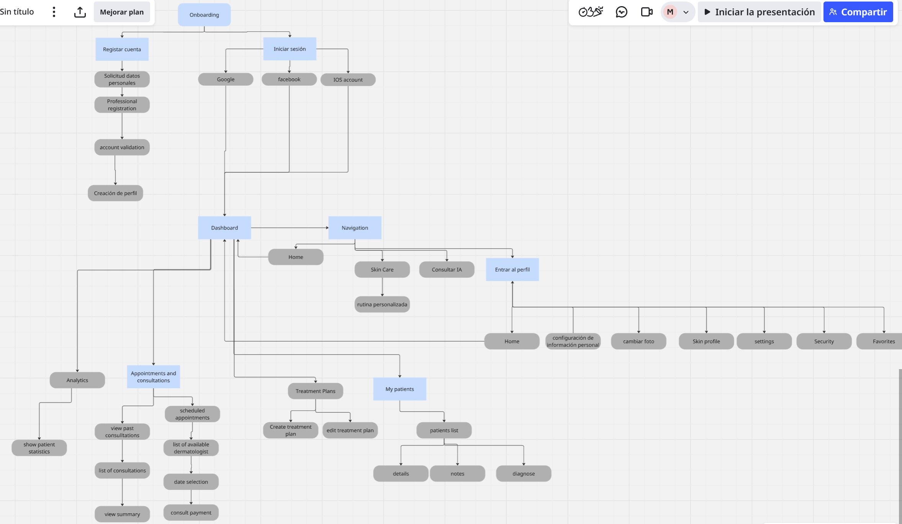

### Segmento 2: Dermatólogos certificados

La aplicación Bloomie, en su versión dirigida a dermatólogos certificados, está estructurada bajo un sistema de organización jerárquico, secuencial y matricial, diseñado para optimizar la gestión clínica, facilitar el acceso a la información de pacientes y asegurar una navegación clara y orientada a tareas profesionales. Esta estructura responde directamente a los flujos representados en el sistema, donde el dermatólogo transita desde procesos de validación profesional hacia un entorno centralizado de trabajo clínico.

##### Organización jerárquica

El contenido se organiza mediante una estructura jerárquica top-down, claramente evidenciada en el flujo del sistema.

Nivel 1 – Acceso principal:
Onboarding, Registro, Inicio de sesión y Dashboard.
Nivel 2 – Módulos principales (desde Dashboard):
Navigation, Home, Skin Care, Consultar IA, Perfil, Analytics, Appointments and Consultations, Treatment Plans y My Patients.
Nivel 3 – Submódulos y acciones específicas:
En Appointments and Consultations:
consultas pasadas, citas agendadas, lista de dermatólogos disponibles, selección de fecha y pago de consulta.
En My Patients:
lista de pacientes, acceso a detalles, notas y diagnóstico.
En Treatment Plans:
creación y edición de planes de tratamiento.
En Analytics:
visualización de estadísticas de pacientes.
En Perfil:
configuración de información personal, cambio de foto, credenciales, seguridad y favoritos.

Esta jerarquía permite organizar las funcionalidades en función de la prioridad clínica, asegurando que las tareas más frecuentes estén accesibles desde el Dashboard y que la información se despliegue progresivamente según el contexto de uso.

##### Organización secuencial

El sistema presenta flujos secuenciales en procesos clave que requieren validación o seguimiento paso a paso:

Registro profesional:
Registro → Solicitud de datos personales → Professional registration → Validación de cuenta → Creación de perfil → Dashboard.
Gestión de consultas:
Appointments and Consultations → Selección de acción (ver consultas pasadas / agendar nueva / citas programadas) →
selección de fecha → confirmación → pago → ejecución de consulta.
Gestión de pacientes:
My Patients → Lista de pacientes → Selección de paciente → acceso a detalles / notas / diagnóstico.

Estos flujos aseguran que el dermatólogo pueda realizar tareas clínicas de forma estructurada, reduciendo errores y garantizando la correcta gestión de la información.

##### Uso de nodos de decisión

Dentro de los flujos se integran puntos de decisión que permiten modelar distintas situaciones dentro del sistema:

Cancelación o continuación de citas o consultas.
Aplicación de filtros en la búsqueda de información (pacientes, consultas).
Selección de acciones dentro de módulos clínicos (por ejemplo, elegir entre ver historial o gestionar nuevas citas).

Estos nodos permiten representar escenarios alternativos dentro de los procesos, asegurando que el sistema sea flexible y responda a diferentes necesidades del profesional sin perder coherencia estructural.

##### Organización matricial

El sistema incorpora conexiones transversales entre módulos, permitiendo al dermatólogo moverse de forma flexible entre distintas funcionalidades:

Desde Appointments and Consultations, se puede acceder a distintas acciones como historial, nuevas citas o gestión de agenda.
Desde My Patients, el dermatólogo puede navegar entre información detallada, notas clínicas y diagnósticos sin salir del contexto del paciente.
Desde el Dashboard, se accede directamente a múltiples módulos según la tarea a realizar, sin necesidad de seguir un único flujo lineal.

Esta organización matricial mejora la eficiencia del trabajo clínico, permitiendo cambios de contexto rápidos y una navegación más dinámica.

##### Categorización del contenido

El contenido se organiza mediante distintos esquemas según el contexto de uso:

Por audiencia:
Esta vista está dirigida exclusivamente a dermatólogos, diferenciándose de la versión para usuarios finales mediante funcionalidades, terminología y estructura orientadas a la práctica clínica.
Por tópicos:
Las funcionalidades se agrupan en módulos como Analytics, Pacientes, Consultas, Tratamientos, Perfil y Navegación.
Cronológica:
Aplicada en consultas pasadas, citas programadas y seguimiento de pacientes, organizando la información según fechas.
Alfabética:
Utilizada en listas de pacientes o registros, facilitando la búsqueda rápida de información específica.

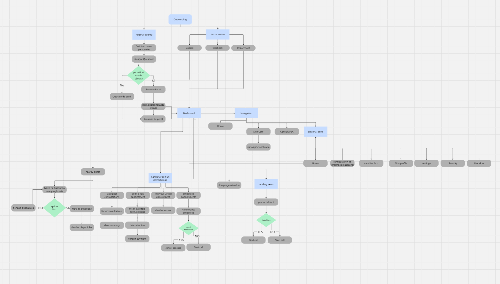

## 4.3. Landing Page UI Design
### 4.3.1. Landing Page Wireframe

### 4.3.2. Landing Page Mock-up

Los mock-ups del Landing Page de Bloomie para la versión Desktop Web Browser materializan visualmente las decisiones de diseño establecidas en el Style Guidelines del proyecto. Cada sección ha sido construida respetando la paleta cromática, tipografía, sistema de espaciado, tono de comunicación y arquitectura de información definidos para el producto. A continuación se presenta el análisis de cada pantalla.

- <strong> Home: </strong> 

1. Descripción visual: La sección de inicio presenta el encabezado principal "Your skin deserves more than a questionnaire" apoyado en tipografía Montserrat Semibold en peso H1 (62 px desktop), donde la palabra clave en cursiva adopta el color de acento de la marca (#A26769, cobre/terracota). A la derecha se despliega una imagen de análisis facial con etiquetas flotantes de diagnóstico (Hydration 82%, Mild acne, Texture: Even, Score of Skin: 87/100). Los botones principales Analyze your skin for free y How it works → respetan las especificaciones del sistema de botones: Montserrat Semibold 16 px, con el CTA principal en fondo oscuro (#333333) y el secundario con borde tenue. En la parte inferior se presentan tres indicadores estadísticos de credibilidad del producto.

2. Design System aplicado:

- Tipografía: Montserrat Semibold 62 px (H1) para el headline; Montserrat Regular 16 px (Body) para el párrafo descriptivo; Montserrat Semibold 16 px (Button) para los CTAs.
- Colores: Fondo #FDFFF8 (fondo principal cálido), texto principal #333333, acento #A26769 en la palabra en cursiva y el badge superior.
- Espaciado: Márgenes horizontales amplios conforme al sistema modular de múltiplos de 4 px; separación entre el texto y los botones mínima de 16 px según las guías.
Botones: Tamaño mínimo de 44×44 px garantizado en ambos CTAs, alineado con estándares de accesibilidad.

3. Heurísticas de Nielsen aplicadas:

- H1 – Visibilidad del estado del sistema: Las etiquetas flotantes del análisis facial (Hydration, Mild acne, Texture, Score) simulan el output en tiempo real del producto, dejando claro al usuario qué puede esperar del servicio desde el primer contacto.
- H6 – Reconocimiento antes que recuerdo: Los indicadores visuales superpuestos sobre la imagen hacen explícitas las capacidades del sistema sin requerir que el usuario navegue o recuerde información previa.
- H8 – Diseño estético y minimalista: La sección presenta únicamente los elementos esenciales para comunicar la propuesta de valor y motivar la conversión, sin elementos decorativos que desvíen la atención.

4. Diseño inclusivo: El contraste entre texto #333333 sobre fondo #FDFFF8 cumple con el estándar WCAG AA de accesibilidad cromática. El uso de dos CTAs diferenciados visualmente (oscuro vs. borde tenue) no depende exclusivamente del color para distinguir la acción principal de la secundaria, sino también del contraste de relleno. Los íconos de soporte tienen un tamaño mínimo de 30×30 px según lo especificado en el sistema de espaciado.

- <strong> Results: </strong> 

1. Descripción visual: La sección presenta el encabezado "Real data. Skins that flourished." en Montserrat Semibold H1, con la palabra en cursiva destacada en #A26769. Debajo aparecen cuatro tarjetas de métricas con íconos emoji, números grandes en tipografía H2 (48 px Semibold) y descripciones en Body Regular. A la derecha se ubican tres tarjetas de testimonios con calificación de 5 estrellas, cita en cursiva, avatar de iniciales, nombre, plan de suscripción y ciudad del usuario.

2. Design System aplicado:

- Tipografía: H1 (62 px) para el titular; H2 (48 px) para los valores numéricos de las métricas; Body Regular (16 px, line-height 150%) para descripciones y citas.
- Colores: Fondo #FDFFF8; tarjetas en blanco con borde sutil; avatares de iniciales con fondo #CEBEBE (color secundario de bloques de la paleta oficial).
- Iconografía: Emojis nativos en rol de íconos funcionales, alineados con el uso de iconografía minimalista que comunica acciones de forma inmediata según el Style Guide.
- Espaciado: Separación entre secciones de 24–32 px (desktop), con padding interno uniforme en cada tarjeta conforme al sistema modular.

3. Heurísticas de Nielsen aplicadas:

- H2 – Correspondencia entre el sistema y el mundo real: Los testimonios incluyen nombre real, tipo de plan (Premium User, Clinical Plan) y ciudad de origen (Mexico City, Bogotá, Lima), haciendo el contenido identificable y creíble para el segmento objetivo latinoamericano.
- H4 – Consistencia y estándares: El sistema de valoración de 5 estrellas es un patrón reconocido universalmente que no requiere aprendizaje adicional por parte del usuario.
- H8 – Diseño estético y minimalista: La división en dos columnas equilibradas (métricas izquierda, testimonios derecha) organiza el contenido sin saturarlo, manteniendo la densidad informativa bajo control.

4. Arquitectura de informaciòn: Esta sección corresponde al nodo Results del Labeling System del Landing Page definido en el Information Architecture. Su posición en el flujo narrativo de la página responde a la progresión lógica: primero el usuario comprende que es el producto y luego recibe evidencia de sus resultados reales antes de conocer cómo funciona y cuánto cuesta.

- <strong> Pricing: </strong> 

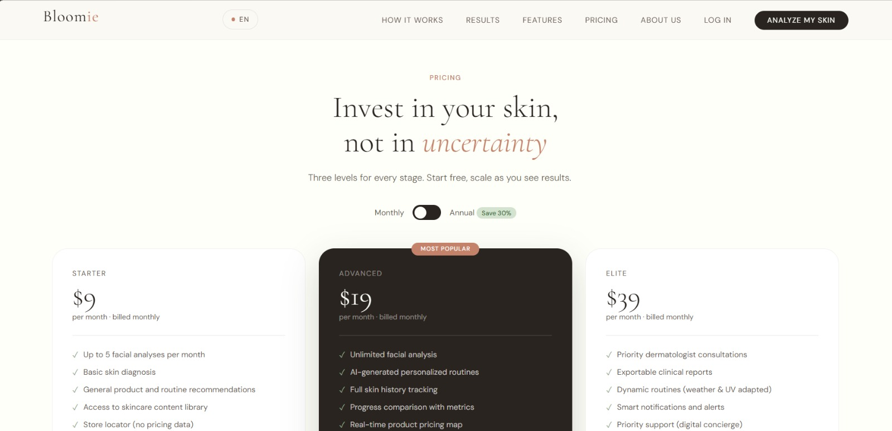

1. Descripción visual: La sección centra el titular "Invest in your skin, not in uncertainty" en Montserrat Semibold H1, con uncertainty en color acento #A26769. Un toggle Monthly/Annual con badge "Save 30%" en verde permite cambiar entre modos de facturación. Se presentan tres tarjetas de planes: Starter ($9/mes), Advanced ($19/mes, marcado como "Most Popular" en fondo oscuro #333333) y Elite ($39/mes). Cada plan detalla su lista de funcionalidades con íconos de check, usando Body Regular 16 px.

2. Design System aplicado:

- Tipografía: H1 (62 px Semibold) para el titular; Small (12 px Regular) para textos auxiliares como "per month · billed monthly"; Button (Semibold 16 px) para los CTAs dentro de cada tarjeta; Label (Medium 14 px) para el badge "MOST POPULAR" y las etiquetas de plan.
- Colores: Plan Advanced con fondo #333333 (color de botones de acceso según el Style Guide) y texto blanco, creando alto contraste y distinción inmediata; planes Starter y Elite sobre fondo blanco con borde sutil sobre #FDFFF8.
- Espaciado: Separación entre tarjetas de 24 px; padding interno de 32 px por tarjeta; distancia entre ítem de lista y siguiente de 16 px mínimo.
- Botones: CTA de cada plan con mínimo 44×44 px, Montserrat Semibold 16 px, con variante oscura en el plan destacado y variante con borde en los laterales.

3. Heurísticas de Nielsen aplicadas:

- H7 – Flexibilidad y eficiencia de uso: El toggle Monthly/Annual permite al usuario comparar precios en ambas modalidades de forma inmediata, sin abandonar la página ni recargarla.
- H3 – Control y libertad del usuario: El plan Starter como punto de entrada de bajo compromiso ("Start free, scale as you see results") reduce la fricción inicial y permite al usuario probar el producto antes de escalar.
- H1 – Visibilidad del estado del sistema: El badge "Save 30%" comunica en tiempo real el beneficio de seleccionar el modo anual, y el badge "Most Popular" orienta visualmente la decisión sin obligar al usuario a comparar manualmente.
- H8 – Diseño estético y minimalista: Las listas de funcionalidades usan íconos de check minimalistas sin fondo adicional, preservando la legibilidad sin añadir ruido visual.

4. Diseño inclusivo: 
El toggle de facturación tiene estado activo/inactivo claramente distinguible por contraste (no solo por color). Los precios están expresados de forma directa y transparente, sin letra pequeña oculta en la vista principal, en alineación con el tono de comunicación honesto y cercano definido en las guías. La distinción del plan destacado se apoya tanto en el contraste cromático (fondo oscuro vs. claro) como en la jerarquía espacial (tarjeta central elevada), garantizando que la diferenciación no dependa únicamente del color.

- <strong> Features: </strong> 

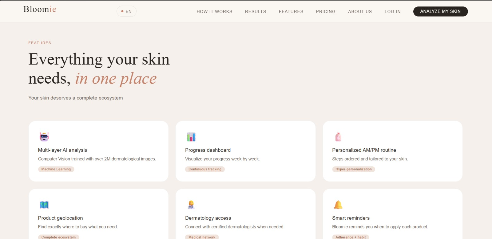

1. Descripción visual: La sección presenta el encabezado "Everything your skin needs, in one place" con subtítulo "Your skin deserves a complete ecosystem" en Montserrat Regular Body. Una cuadrícula de 3×2 tarjetas presenta las seis funcionalidades principales: Multi-layer AI analysis, Progress dashboard, Personalized AM/PM routine, Product geolocation, Dermatology access y Smart reminders. Cada tarjeta contiene un ícono emoji, título en H3 (Montserrat Semibold 18 px), descripción en Body y una etiqueta de categoría con fondo rosado suave.

2. Design System aplicado:

- Tipografía: H2 (48 px Semibold) para el título de sección; H3 (18 px Semibold) para el nombre de cada feature; Body (16 px Regular, line-height 150%) para las descripciones; Label/Tag (Montserrat Medium 14 px) para las etiquetas de categoría.
- Colores: Fondo de sección en tono beige más cálido (variante de #CEBEBE) para diferenciarla del resto; tarjetas en blanco puro para generar separación figura-fondo; etiquetas en tono rosado suave (#A26769 con baja opacidad).
- Espaciado: Grid de 3 columnas con gap de 24 px entre tarjetas (múltiplo del sistema modular); padding interno de 24–32 px por tarjeta.
- Iconografía: Set de emojis con semántica funcional inmediata, en coherencia con el principio de iconografía minimalista de Bloomie que comunica acciones y funciones de forma directa.

3. Heurísticas de Nielsen aplicadas:

- H6 – Reconocimiento antes que recuerdo: Los íconos visuales junto a cada feature permiten identificarla en una fracción de segundo, sin necesidad de leer el texto completo.
- H4 – Consistencia y estándares: Todas las tarjetas siguen la misma estructura interna (ícono, título, descripción, etiqueta), generando predictibilidad y reduciendo la carga cognitiva al explorar la sección.
- H10 – Ayuda y documentación: Las etiquetas de categoría (Machine Learning, Continuous tracking, Hyper-personalization, Medical network, etc.) contextualizan la tecnología para usuarios no técnicos, sin requerir documentación adicional.

4. Arquitectura de informaciòn: Esta sección corresponde al nodo Features del sistema de navegación. Las features están ordenadas progresivamente: de mayor a menor profundidad tecnológica (AI analysis, dashboard, routine, geolocation, dermatology, reminders), respetando el modelo mental del usuario que evalúa el producto de adentro hacia afuera, desde su núcleo diferenciador hasta sus funcionalidades de soporte.

## 4.4. Web Applications UX/UI Design

Esta sección incluye secciones internas donde se presenta y explica la propuesta
visual y de interacción para las aplicaciones que constituyen la experiencia de
usuario con los productos digitales.

### 4.4.1. Web Applications Wireframes

1) **Wireframe 1:** Registro de cuenta

**User Story relacionada:**
US01 - Como joven adulto, quiero registrarme con mis datos personales para
crear una cuenta y acceder a Bloomie.

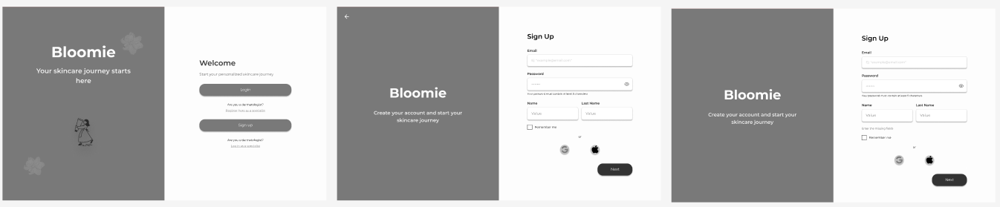

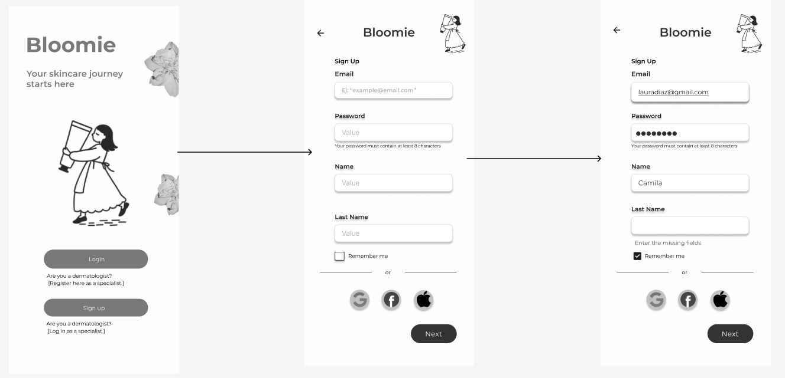

**Principios y elementos de diseño:**
La pantalla aplica jerarquía visual clara, ubicando el nombre y slogan de
Bloomie como elemento principal, seguido de los botones de acceso. Se
mantiene consistencia en tipografía, espaciado y colores alineados con el
sistema de diseño de la aplicación.

**Diseño inclusivo:**
Los campos del formulario cuentan con etiquetas visibles y placeholder
orientativo. Se incluye un indicador de fortaleza de contraseña y opciones
alternativas de registro mediante Google y Apple, reduciendo barreras de
acceso para distintos tipos de usuarios.

**Arquitectura de información:**
El contenido se organiza de forma secuencial y progresiva, guiando al
usuario desde la bienvenida hasta la completación del formulario con
email, contraseña, nombre y apellido.

**Heurísticas de Nielsen aplicadas:**
- **#1 Visibilidad del estado del sistema:** el indicador de fortaleza de
  contraseña informa al usuario en tiempo real sobre el estado de su entrada.
- **#4 Consistencia y estándares:** los botones de Login y Sign Up siguen
  convenciones reconocidas por el usuario.
- **#6 Reconocimiento antes que recuerdo:** los placeholders y etiquetas
  visibles en cada campo reducen la carga cognitiva del usuario.
- **#8 Diseño estético y minimalista:** la pantalla presenta solo la
  información necesaria para completar el registro, sin elementos distractores.

2) **Wireframe 2:** Completar perfil de piel

**User Story relacionada:**
US02 - Como joven adulto, quiero completar un cuestionario inicial sobre mis
condiciones de piel en mi primer ingreso para que la aplicación configure mi
perfil correctamente.

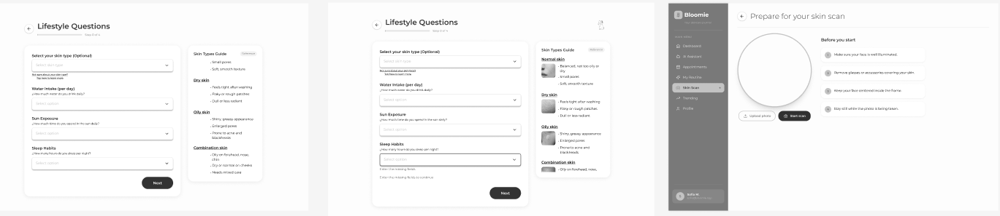

---

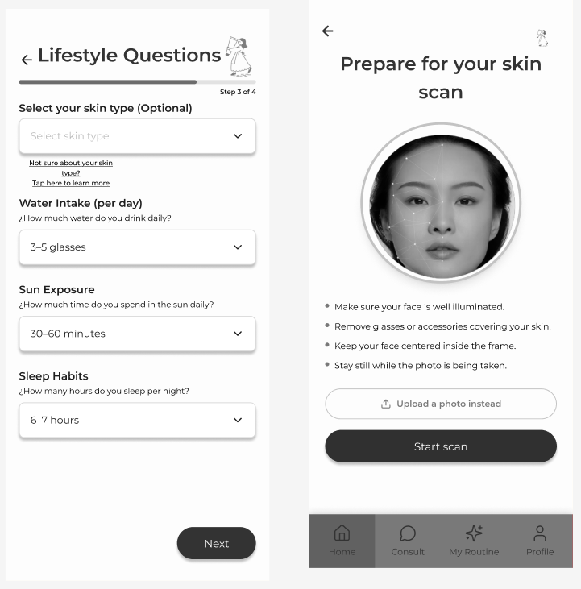

**Principios y elementos de diseño:**
La pantalla aplica una jerarquía visual progresiva mediante un indicador de
pasos en la parte superior, permitiendo al usuario conocer su avance dentro
del cuestionario. Los elementos se organizan con espaciado consistente y
tipografía alineada al sistema de diseño de Bloomie.

**Diseño inclusivo:**
Los campos de selección cuentan con etiquetas descriptivas y una guía de
tipos de piel con imágenes de referencia, facilitando la comprensión para
usuarios sin conocimiento previo sobre skincare. Los mensajes de validación
indican claramente los campos pendientes.

**Arquitectura de información:**
El contenido se organiza en pasos secuenciales, agrupando preguntas
relacionadas sobre tipo de piel, consumo de agua, exposición solar y hábitos
de sueño. Al completar el cuestionario, el sistema redirige al usuario a la
pantalla de preparación para el escaneo facial, donde se presentan las
instrucciones necesarias antes de iniciar el análisis.

**Heurísticas de Nielsen aplicadas:**
- **#1 Visibilidad del estado del sistema:** el indicador de progreso en la
  parte superior informa al usuario en qué paso del cuestionario se encuentra.
- **#6 Reconocimiento antes que recuerdo:** la guía de tipos de piel con
  descripciones visuales ayuda al usuario a identificar su tipo sin necesidad
  de conocimiento previo.
- **#9 Ayuda a los usuarios a reconocer y corregir errores:** los mensajes
  de validación indican claramente los campos requeridos que faltan completar.
- **#8 Diseño estético y minimalista:** cada pantalla presenta únicamente
  las preguntas necesarias, evitando sobrecargar al usuario con información.

3) **Wireframe 3:** Escaneo facial y diagnóstico preliminar

**User Stories relacionadas:**
US03 - Como joven adulto, quiero realizar un escaneo facial con la cámara
para que la aplicación capture mi piel y obtenga un diagnóstico preciso.
US04 - Como joven adulto, quiero recibir un diagnóstico generado por IA
después del escaneo para conocer el estado de mi piel y los cuidados
que necesito.

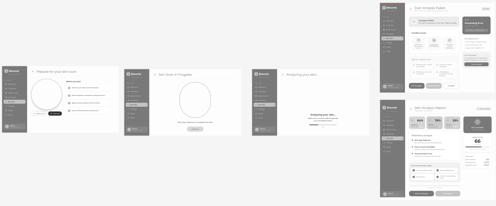

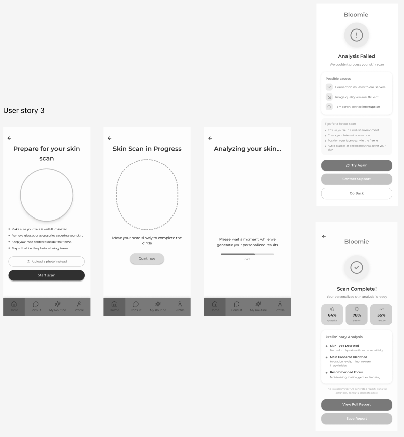

**Principios y elementos de diseño:**
La pantalla aplica una jerarquía visual clara, guiando al usuario desde
la preparación del escaneo hasta la visualización del reporte de análisis.
Se utiliza una barra de progreso durante el procesamiento y scores
visuales (hidratación, brillo, textura) para presentar los resultados
de forma comprensible.

**Diseño inclusivo:**
Las instrucciones previas al escaneo están redactadas en lenguaje simple
y numeradas, facilitando su comprensión. Los resultados del análisis se
presentan mediante porcentajes y etiquetas descriptivas, permitiendo que
cualquier usuario entienda el estado de su piel sin conocimiento técnico.

**Arquitectura de información:**
El flujo se organiza en cuatro etapas secuenciales: preparación, escaneo
en progreso, análisis y reporte final. Cada etapa presenta únicamente la
información relevante para ese momento, evitando sobrecargar al usuario.

**Heurísticas de Nielsen aplicadas:**
- **#1 Visibilidad del estado del sistema:** la barra de progreso durante
  el análisis informa al usuario que el sistema está procesando su escaneo.
- **#4 Consistencia y estándares:** los scores de hidratación, brillo y
  textura siguen un formato visual uniforme y reconocible.
- **#6 Reconocimiento antes que recuerdo:** las instrucciones numeradas
  y los resultados con etiquetas descriptivas reducen la carga cognitiva
  del usuario.
- **#8 Diseño estético y minimalista:** cada pantalla presenta únicamente
  la información necesaria para cada etapa del proceso de escaneo.

4) **Wireframe 4:** Diagnóstico preliminar automático

**User Story relacionada:**
US04 - Como joven adulto, quiero recibir un diagnóstico generado por IA
después del escaneo para conocer el estado de mi piel y los cuidados
que necesito.

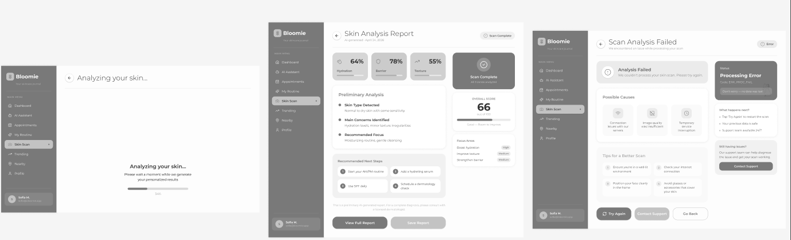

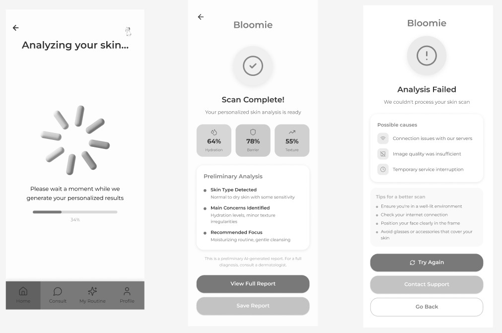

**Principios y elementos de diseño:**
La pantalla presenta los resultados del análisis mediante scores visuales
de hidratación, barrera y textura, acompañados de un score general y áreas
de enfoque con niveles de prioridad (high, medium). Se mantiene consistencia
visual con el resto de la aplicación mediante tipografía y espaciado
alineados al sistema de diseño de Bloomie.

**Diseño inclusivo:**
Los resultados se presentan con etiquetas descriptivas y porcentajes
comprensibles para cualquier usuario, sin requerir conocimiento técnico
dermatológico. En caso de error en el procesamiento, el sistema muestra
una pantalla de fallo con causas posibles, consejos para mejorar el escaneo
y opciones de reintento o contacto con soporte.

**Arquitectura de información:**
El reporte organiza la información en secciones claramente diferenciadas:
scores generales, análisis preliminar, áreas de enfoque y próximos pasos
recomendados. Esto permite al usuario comprender su diagnóstico de forma
progresiva y tomar decisiones informadas sobre su rutina.

**Heurísticas de Nielsen aplicadas:**
- **#1 Visibilidad del estado del sistema:** la barra de progreso durante
  el análisis y el indicador de "Scan Complete" informan al usuario sobre
  el estado del procesamiento.
- **#5 Prevención de errores:** la pantalla de error detalla las posibles
  causas del fallo y ofrece consejos para realizar un mejor escaneo.
- **#9 Ayuda a los usuarios a reconocer y corregir errores:** el mensaje
  de error indica claramente qué ocurrió y presenta opciones concretas como
  Try Again, Contact Support o Go Back.
- **#8 Diseño estético y minimalista:** el reporte presenta únicamente la
  información relevante del diagnóstico, organizada en secciones claras y
  sin elementos distractores.

5) **Wireframe 5:** Generar rutina personalizada

**User Story relacionada:**
US05 - Como joven adulto, quiero recibir una rutina personalizada con
productos basados en mi diagnóstico de piel para seguir un tratamiento
adecuado.

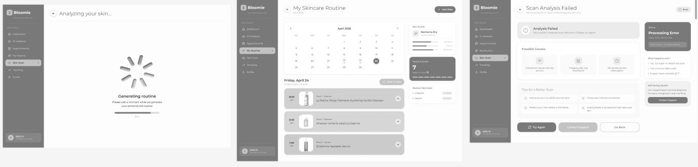

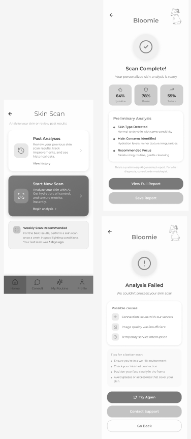

**Principios y elementos de diseño:**
La pantalla presenta una animación de carga durante la generación de la
rutina, seguida de una vista de calendario mensual con los pasos diarios
asignados. Los productos recomendados se muestran en tarjetas con imagen,
nombre y horario, manteniendo consistencia visual con el sistema de diseño
de Bloomie.

**Diseño inclusivo:**
La vista de calendario permite al usuario identificar fácilmente los días
con rutina asignada. Cada paso de la rutina incluye el nombre del producto,
imagen de referencia y horario, facilitando la comprensión para usuarios
con distintos niveles de experiencia en skincare.

**Arquitectura de información:**
El contenido se organiza en dos niveles: una vista mensual que muestra el
resumen de la rutina y una vista diaria que detalla los pasos y productos
específicos para ese día. Esto permite al usuario navegar entre una
perspectiva general y una vista detallada de su tratamiento.

**Heurísticas de Nielsen aplicadas:**
- **#1 Visibilidad del estado del sistema:** la animación de carga con el
  mensaje "Generating routine" informa al usuario que el sistema está
  procesando su rutina personalizada.
- **#4 Consistencia y estándares:** las tarjetas de productos siguen un
  formato uniforme con imagen, nombre y horario en todas las entradas.
- **#7 Flexibilidad y eficiencia de uso:** el botón "Add Step" permite al
  usuario personalizar su rutina agregando pasos adicionales según sus
  necesidades.
- **#8 Diseño estético y minimalista:** la vista diaria presenta únicamente
  los pasos del día seleccionado, evitando sobrecargar al usuario con
  información innecesaria.

6) **Wireframe 6:** Reemplazar producto de la rutina

**User Story relacionada:**
US06 - Como joven adulto, quiero reemplazar un producto de mi rutina por
una alternativa recomendada para adaptar mi tratamiento.

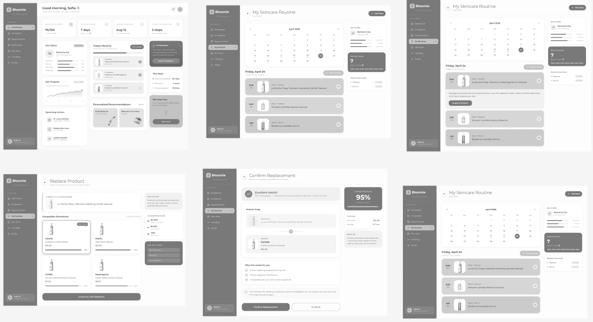

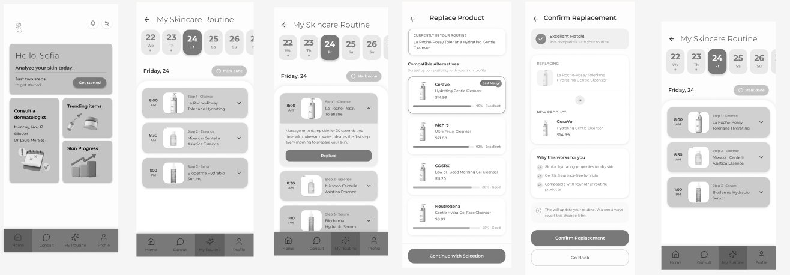

**Principios y elementos de diseño:**
La pantalla presenta las alternativas compatibles en tarjetas con imagen,
nombre, precio y score de compatibilidad, permitiendo una comparación
visual clara entre opciones. La pantalla de confirmación destaca el score
de compatibilidad del producto seleccionado junto con las razones por las
que funciona para el perfil del usuario.

**Diseño inclusivo:**
Cada alternativa incluye una barra de compatibilidad con porcentaje visible,
facilitando la toma de decisiones sin requerir conocimiento técnico. La
pantalla de confirmación explica en lenguaje simple por qué el producto
es adecuado para la piel del usuario.

**Arquitectura de información:**
El flujo se organiza en tres etapas: visualización del producto actual,
selección de alternativa compatible y confirmación del reemplazo. Esto
guía al usuario de forma progresiva hasta completar el cambio en su rutina.

**Heurísticas de Nielsen aplicadas:**
- **#1 Visibilidad del estado del sistema:** el badge "Best Match" en la
  alternativa más compatible orienta al usuario hacia la mejor opción
  disponible.
- **#3 Control y libertad del usuario:** el botón "Go Back" en la pantalla
  de confirmación permite al usuario cancelar el reemplazo si cambia de
  opinión.
- **#6 Reconocimiento antes que recuerdo:** las barras de compatibilidad
  y los scores visibles permiten comparar opciones sin necesidad de recordar
  información previa.
- **#8 Diseño estético y minimalista:** cada pantalla presenta únicamente
  la información relevante para cada etapa del proceso de reemplazo.

7) **Wireframe 7:** Registrar cumplimiento de rutina diaria

**User Story relacionada:**
US07 - Como joven adulto, quiero marcar si completé mi rutina del día para
llevar un seguimiento de mi progreso.

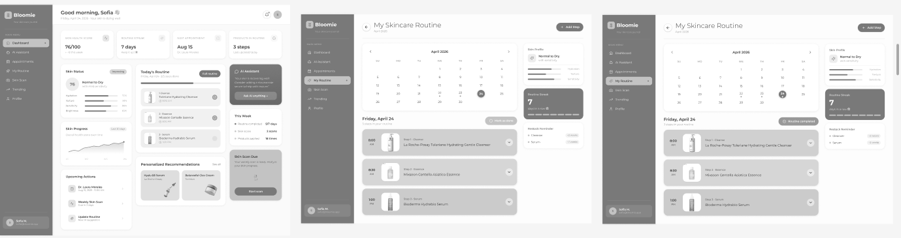

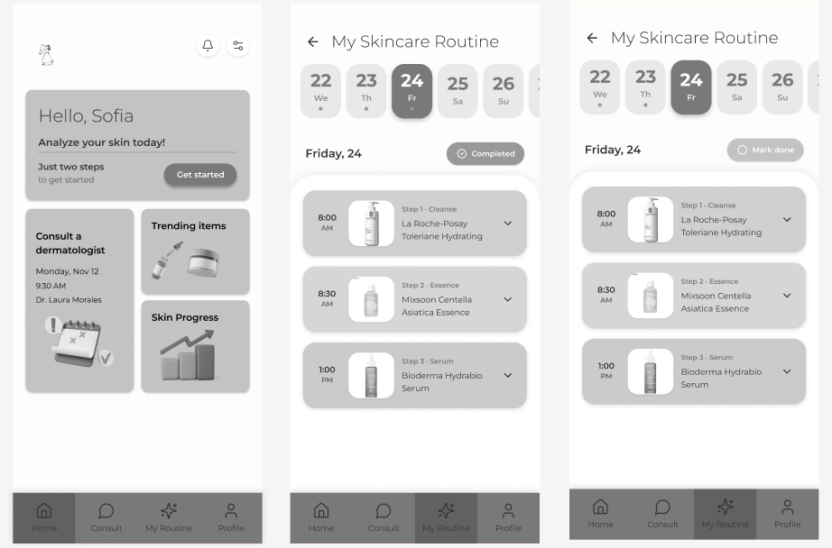

**Principios y elementos de diseño:**
El dashboard principal presenta métricas clave como el skin score, racha
de días, próxima cita y pasos en rutina de forma destacada en la parte
superior. La rutina diaria se muestra con los productos asignados por
horario, y el botón "Mark as done" permite registrar el cumplimiento de
forma rápida y directa.

**Diseño inclusivo:**
Las métricas se presentan con íconos y etiquetas descriptivas, facilitando
la comprensión del progreso sin requerir interpretación técnica. El cambio
visual en el calendario al marcar la rutina como completada refuerza el
feedback al usuario de forma clara e intuitiva.

**Arquitectura de información:**
El contenido se organiza en dos niveles: el dashboard general con un
resumen del progreso semanal, y la vista detallada de la rutina diaria
con los pasos específicos. Al marcar la rutina como completada, el sistema
actualiza el estado visual del día en el calendario y las métricas de
progreso.

**Heurísticas de Nielsen aplicadas:**
- **#1 Visibilidad del estado del sistema:** el calendario actualiza
  visualmente el día marcado como completado, confirmando al usuario que
  su acción fue registrada correctamente.
- **#4 Consistencia y estándares:** el botón "Mark as done" se mantiene
  en la misma posición y con el mismo estilo en todas las vistas de rutina
  diaria.
- **#7 Flexibilidad y eficiencia de uso:** el dashboard permite al usuario
  ver su progreso general y acceder rápidamente a su rutina del día desde
  una sola pantalla.
- **#8 Diseño estético y minimalista:** cada sección presenta únicamente
  la información relevante para ese contexto, evitando sobrecargar al
  usuario con datos innecesarios.

8) **Wireframe 8:** Explorar catálogo de productos

**User Story relacionada:**
US08 - Como joven adulto, quiero explorar el catálogo de productos y
aplicar filtros para encontrar opciones relevantes a mis necesidades.

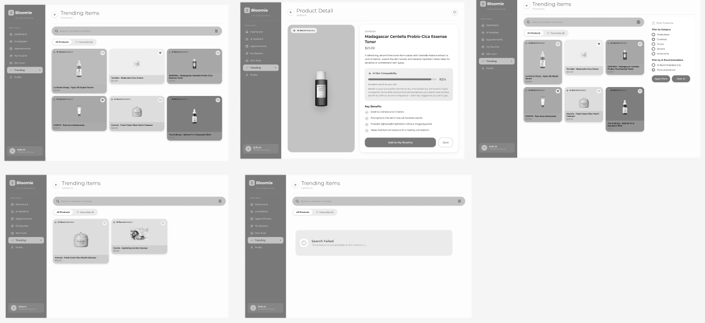

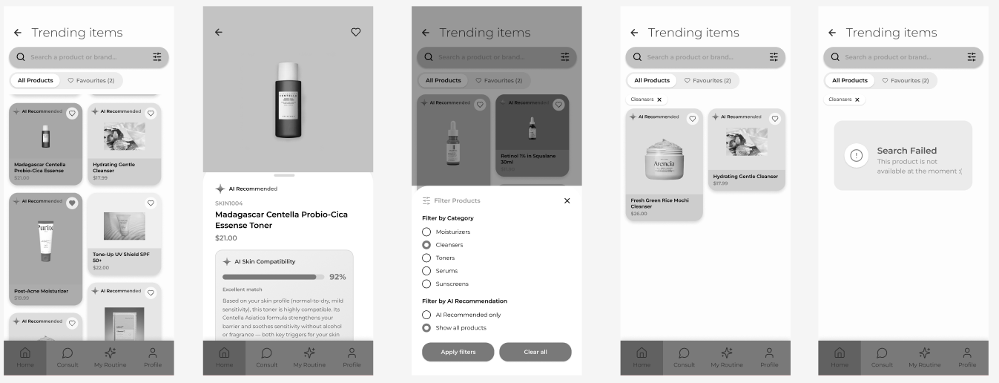

**Principios y elementos de diseño:**
El catálogo presenta los productos en tarjetas con imagen, nombre y precio,
organizadas en una cuadrícula que facilita la exploración visual. Se incluye
un panel de filtros lateral con opciones por categoría y recomendación de IA,
permitiendo reducir los resultados de forma eficiente.

**Diseño inclusivo:**
La barra de búsqueda y los filtros están claramente etiquetados y son
accesibles desde la parte superior de la pantalla. En caso de no encontrar
resultados, el sistema muestra un mensaje de "Search Failed" informando al
usuario que el producto no está disponible en ese momento.

**Arquitectura de información:**
El contenido se organiza mediante pestañas (All Products, Favorites) y
filtros por categoría (cleansers, toners, serums, sunscreen) y recomendación
de IA, permitiendo al usuario navegar el catálogo desde una vista general
hasta encontrar productos específicos según sus necesidades.

**Heurísticas de Nielsen aplicadas:**
- **#1 Visibilidad del estado del sistema:** el badge "AI Recommended" en
  las tarjetas informa al usuario qué productos son sugeridos según su perfil
  de piel.
- **#3 Control y libertad del usuario:** los botones "Clear all" y "Apply
  filters" permiten al usuario gestionar los filtros aplicados con facilidad.
- **#6 Reconocimiento antes que recuerdo:** los filtros visibles en el panel
  lateral permiten al usuario seleccionar categorías sin necesidad de recordar
  las opciones disponibles.
- **#9 Ayuda a los usuarios a reconocer y corregir errores:** el mensaje
  "Search Failed" informa claramente al usuario cuando no hay resultados
  disponibles para su búsqueda.

9) **Wireframe 9:** Ver detalle y compatibilidad de producto

**User Story relacionada:**
US09 - Como joven adulto, quiero ver el detalle de un producto y su
compatibilidad con mi piel para tomar decisiones informadas.

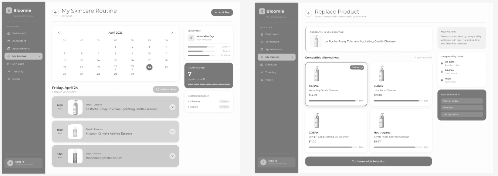

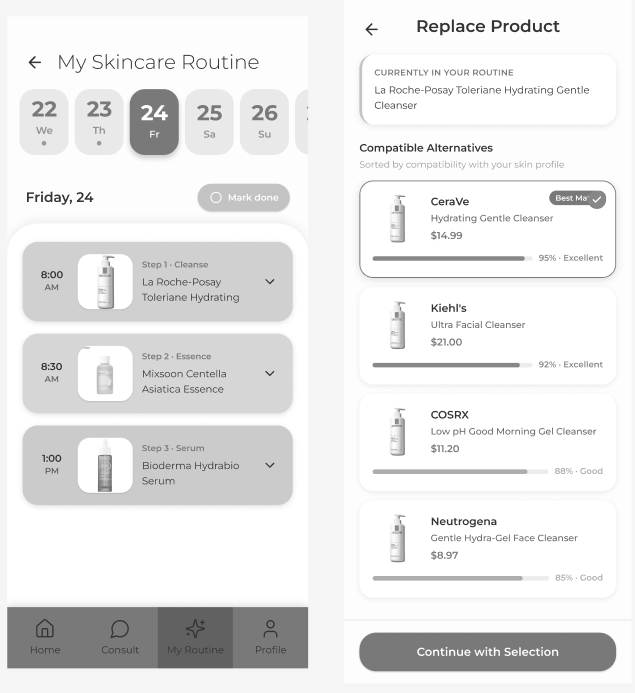

**Principios y elementos de diseño:**
La pantalla presenta las alternativas compatibles en tarjetas con imagen,
nombre, precio y barra de compatibilidad. Se incluye una guía de
compatibilidad lateral que explica los rangos de puntuación y el perfil
de piel del usuario, manteniendo consistencia visual con el sistema de
diseño de Bloomie.

**Diseño inclusivo:**
La guía de compatibilidad con rangos claramente definidos (90-100%
Excellent Match, 80-89% Good Match, menor a 80% Fair Match) permite al
usuario interpretar los resultados sin conocimiento técnico previo. El
badge "Best Match" destaca visualmente la opción más adecuada para el
perfil del usuario.

**Arquitectura de información:**
El contenido se organiza en tres secciones: el producto actual en rutina,
las alternativas compatibles ordenadas por score y el panel lateral con
la guía de compatibilidad y perfil de piel del usuario. Esto permite al
usuario comparar opciones de forma clara y tomar una decisión informada.

**Heurísticas de Nielsen aplicadas:**
- **#1 Visibilidad del estado del sistema:** las barras de compatibilidad
  con porcentaje visible informan al usuario en tiempo real sobre el nivel
  de adecuación de cada producto.
- **#6 Reconocimiento antes que recuerdo:** la guía de compatibilidad
  lateral permite al usuario interpretar los scores sin necesidad de recordar
  los criterios de evaluación.
- **#4 Consistencia y estándares:** todas las tarjetas de producto siguen
  el mismo formato con imagen, nombre, precio y barra de compatibilidad.
- **#8 Diseño estético y minimalista:** la pantalla presenta únicamente
  la información necesaria para comparar y seleccionar un producto
  compatible.

10) **Wireframe 10:** Guardar producto como favorito

**User Story relacionada:**
US10 - Como joven adulto, quiero guardar productos en mis favoritos para
acceder a ellos fácilmente después.

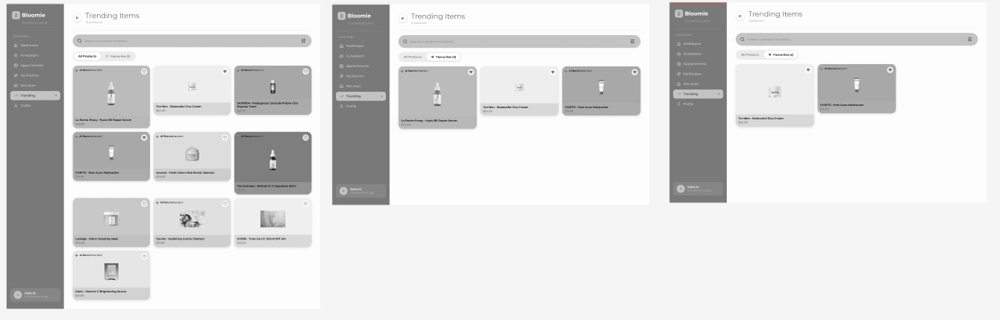

**Principios y elementos de diseño:**
El catálogo presenta los productos en tarjetas con imagen, nombre y precio,
cada una con un ícono de corazón en la esquina superior derecha para
guardar como favorito. La pestaña "Favorites" en la parte superior permite
acceder rápidamente a los productos guardados, diferenciándose visualmente
de la pestaña "All Products".

**Diseño inclusivo:**
El ícono de corazón es un elemento reconocido universalmente para indicar
favoritos, reduciendo la necesidad de instrucciones adicionales. El cambio
visual del ícono al guardar un producto confirma la acción realizada de
forma clara e intuitiva para cualquier tipo de usuario.

**Arquitectura de información:**
El contenido se organiza mediante dos pestañas: "All Products" para
explorar el catálogo completo y "Favorites" para acceder únicamente a los
productos guardados. Esto permite al usuario alternar entre una vista
general y su lista personalizada de forma rápida y sencilla.

**Heurísticas de Nielsen aplicadas:**
- **#1 Visibilidad del estado del sistema:** el cambio visual del ícono de
  corazón al guardar un producto confirma al usuario que la acción fue
  registrada correctamente.
- **#3 Control y libertad del usuario:** el usuario puede guardar y
  eliminar productos de favoritos en cualquier momento desde el catálogo
  o desde la pestaña de favoritos.
- **#4 Consistencia y estándares:** el ícono de corazón se mantiene en
  la misma posición en todas las tarjetas de producto, siguiendo
  convenciones reconocidas por el usuario.
- **#8 Diseño estético y minimalista:** la pestaña de favoritos presenta
  únicamente los productos guardados, sin elementos distractores.

11) **Wireframe 11:** Métricas del progreso

**User Story relacionada:**
US11 - Como joven adulto, quiero visualizar métricas de mi constancia y evolución en el cuidado de mi piel para entender mi progreso.

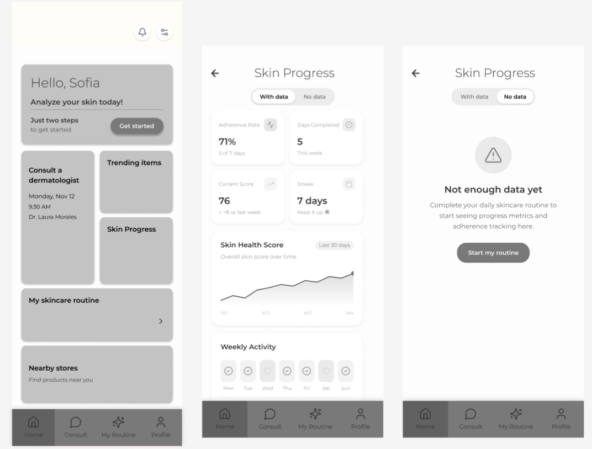

**Principios y elementos de diseño:**
La pantalla de inicio presenta un saludo personalizado ("Hello, Sofia") acompañado de una tarjeta de llamada a la acción para iniciar el análisis de piel. El contenido se organiza en tarjetas modulares que agrupan funcionalidades clave: cita con dermatólogo, productos en tendencia, progreso de piel y rutina de cuidado. La jerarquía visual se establece mediante el tamaño y peso de los elementos, guiando la atención del usuario de arriba hacia abajo de forma natural. Por otro lado, se tiene en cuenta tarjetas compactas  que destacan indicadores clave, como tasa de adherencia. 

**Diseño inclusivo:**
Cada tarjeta incluye etiquetas de texto descriptivas que complementan los elementos visuales, garantizando la comprensión del contenido sin depender únicamente de íconos. La barra de navegación inferior cuenta con íconos acompañados de etiquetas textuales (Home, Consult, My Routine, Profile), reduciendo la ambigüedad para usuarios con menor familiaridad digital. Luego, existen valores númericos acompañados de etiquetas que facilita la lectura. 
**Arquitectura de información:**
La pantalla actúa como hub central de la aplicación. El contenido se prioriza según frecuencia de uso: la rutina activa y la próxima cita aparecen en primer plano, mientras que las secciones secundarias como tiendas cercanas se ubican al final. La navegación global en la parte inferior permite acceder a las secciones principales desde cualquier punto de la app. Luego, el contenido en el siguiente donde se muestra la información sigue una progresión lógica: primero el desempeño, luego, el puntaje global con su tendencia, para finalmente se encuentra la actividad semanal. Ahora,las heurísticas de Nielsen aplicadas: 

- *Visibilidad del estado del sistema*: la tarjeta de cita muestra fecha, hora y nombre del médico, manteniendo al usuario informado sobre sus compromisos activos.
- Reconocimiento antes que recuerdo: las tarjetas con títulos visibles permiten al usuario identificar las secciones disponibles sin necesidad de memorizar rutas de navegación.
- *Flexibilidad y eficiencia de uso*: el botón "Get started" en la tarjeta principal ofrece un acceso directo al flujo de análisis, acelerando la interacción para usuarios recurrentes.
- *Estética y diseño minimalista*: el layout limpio con tarjetas bien delimitadas evita la sobrecarga de información, presentando solo lo esencial en cada bloque.

12) **Wireframe 13:** Consulta al asistente virtual

**User Story relacionada:**
US13 - Como joven adulto, quiero consultar dudas sobre productos, rutinas o ingredientes para recibir orientación inmediata basada en mi perfil de piel.


**Principios y elementos de diseño:**
La interfaz del asistente adopta el patrón de chat conversacional, diferenciando visualmente los mensajes del usuario (burbujas claras, alineadas a la derecha) de las respuestas del asistente (burbujas grises, alineadas a la izquierda). En la parte superior se presentan preguntas frecuentes como chips horizontales deslizables, ofreciendo puntos de entrada rápidos a consultas comunes. El flujo muestra dos estados del chat: uno inicial donde el asistente solicita información sobre el tipo de piel, y uno avanzado donde, ante una consulta fuera de su alcance, redirige al usuario con un dermatólogo.
**Diseño inclusivo:**
El campo de entrada ("Escriba aquí...") está claramente etiquetado y ubicado en la parte inferior de la pantalla, zona de fácil alcance en dispositivos móviles. Las preguntas frecuentes predefinidas reducen la carga cognitiva del usuario al ofrecer opciones concretas sin requerir que redacte sus dudas desde cero. El lenguaje del asistente es simple, directo y empático en ambos estados del flujo.
**Arquitectura de información:**
El contenido se estructura en tres niveles: accesos rápidos mediante preguntas frecuentes en la parte superior, historial de conversación en el área central con scroll, y campo de entrada fijo en la parte inferior. Esta disposición sigue el modelo estándar de interfaces de chat, minimizando la curva de aprendizaje. La redirección al dermatólogo cuando el asistente no puede resolver una consulta actúa como nodo de escape hacia otra sección del sistema.
**Heurísticas de Nielsen aplicadas:**
- *Visibilidad del estado del sistema*: las burbujas de respuesta aparecen progresivamente, mostrando el avance de la conversación y el estado actual del diálogo.
- *Prevención de errores*: las preguntas frecuentes preformuladas orientan al usuario hacia consultas que el asistente puede responder correctamente, reduciendo interacciones fallidas.
- *Ayuda a los usuarios a reconocer y corregir errores*: cuando el asistente no puede responder ("Sorry I can not help you with that"), ofrece una alternativa concreta recomendando agendar una consulta con un dermatólogo.
- *Ayuda y documentación*: las preguntas frecuentes funcionan como guía integrada, orientando al usuario sobre qué tipo de consultas puede realizar sin necesidad de salir de la pantalla.

13) **Wireframe 14:** Selección de dermatólogos para pacientes

**User Story relacionada:**
US14 - Como joven adulto, quiero visualizar una lista de dermatólogos disponibles con su información relevante para elegir con quién agendar una consulta.


**Principios y elementos de diseño:**
Este grupo de wireframes conforma el flujo completo de contratación de una consulta dermatológica, compuesto por cuatro etapas secuenciales. La pantalla de selección presenta a los dermatólogos en tarjetas verticales con información relevante (especialidad, precio, rating y próxima disponibilidad), facilitando la comparación rápida entre profesionales. La pantalla de agendamiento muestra el perfil detallado del médico con estadísticas clave (pacientes, años de experiencia, rating) junto a un calendario semanal y bloques de horario seleccionables. El flujo de pago se desarrolla en tres estados progresivos: selección del método de pago (tarjeta o billetera digital), ingreso de datos del medio elegido, y confirmación de pago exitoso mediante un banner de "Success Payment".
**Diseño inclusivo:**
Cada tarjeta de dermatólogo incluye su especialidad descrita en texto, permitiendo que el usuario tome decisiones informadas sin depender únicamente de nombres o imágenes. Los campos del formulario de pago cuentan con placeholders descriptivos ("Sofia Mendez", "0000 0000 0000 0000", "dd/mm/yyyy") que guían el formato de ingreso esperado. Un mensaje de seguridad ("Your payment info is encrypted and secure") acompañado de un ícono de candado refuerza la confianza del usuario durante el proceso de pago.
Arquitectura de información:
El flujo sigue una progresión lineal y guiada: listado → perfil y agendamiento → método de pago → datos de pago → confirmación. Esta estructura evita que el usuario tome decisiones en paralelo, reduciendo errores y garantizando que cada paso se complete antes de avanzar al siguiente. La flecha de retroceso presente en todas las pantallas permite navegar hacia atrás sin perder el contexto acumulado.
**Heurísticas de Nielsen aplicadas:**
- *Visibilidad del estado del sistema*: el banner "Success Payment" confirma visualmente que la transacción fue completada, cerrando el flujo con un estado claro y reconocible.
- *Coincidencia entre el sistema y el mundo real*: los bloques de horario (08:00–9:00, 10:00–11:00) y el calendario semanal replican el formato que los usuarios ya conocen de agendas y calendarios físicos.
- *Control y libertad del usuario*: la flecha de retroceso en cada pantalla permite al usuario corregir decisiones previas (cambiar de médico, de horario o de método de pago) sin reiniciar el flujo completo.
- *Reconocimiento antes que recuerdo*: los métodos de pago se presentan como opciones visibles con radio buttons, evitando que el usuario recuerde qué opciones están disponibles.
- *Ayuda a los usuarios a reconocer y corregir errores*: los placeholders en los campos del formulario orientan sobre el formato correcto de ingreso, previniendo errores antes de que ocurran.

14) **Wireframe 15:** Pago de consulta dermatológica

**User Story relacionada:**
US15 - Como joven adulto, quiero realizar el pago de una consulta dermatológica para confirmar mi cita.


**Principios y elementos de diseño:**
Este grupo conforma el flujo completo de contratación de una consulta dermatológica en cuatro etapas secuenciales. La pantalla de selección presenta a los dermatólogos en tarjetas verticales con información relevante (especialidad, precio, rating y próxima disponibilidad), facilitando la comparación rápida entre profesionales. La pantalla de agendamiento muestra el perfil detallado del médico con estadísticas clave (pacientes, años de experiencia, rating) junto a un calendario semanal y bloques de horario seleccionables. El flujo de pago avanza en tres estados progresivos: selección del método de pago, ingreso de datos del medio elegido, y confirmación mediante un banner de "Success Payment".
**Diseño inclusivo:**
Cada tarjeta de dermatólogo describe su especialidad en texto plano, permitiendo decisiones informadas sin depender de imágenes. Los campos del formulario de pago incluyen placeholders descriptivos que guían el formato de ingreso esperado. Un mensaje de seguridad ("Your payment info is encrypted and secure") acompañado de un ícono de candado refuerza la confianza del usuario durante la transacción.
Arquitectura de información:
El flujo sigue una progresión lineal y guiada: listado → perfil y agendamiento → método de pago → datos de pago → confirmación. Esta estructura garantiza que cada paso se complete antes de avanzar al siguiente, reduciendo errores de decisión. La flecha de retroceso presente en todas las pantallas permite navegar hacia atrás sin perder el contexto acumulado.
**Heurísticas de Nielsen aplicadas:**

- *Visibilidad del estado del sistema*: el banner "Success Payment" confirma visualmente que la transacción fue completada, cerrando el flujo con un estado claro y reconocible.
- *Coincidencia entre el sistema y el mundo real*: los bloques de horario y el calendario semanal replican el formato que los usuarios ya conocen de agendas físicas o digitales.
- *Control y libertad del usuario*: la flecha de retroceso en cada pantalla permite corregir decisiones previas (cambiar médico, horario o método de pago) sin reiniciar el flujo.
- *Reconocimiento antes que recuerdo*: los métodos de pago se presentan como opciones visibles con radio buttons, evitando que el usuario deba recordar qué alternativas están disponibles.
- *Ayuda a los usuarios a reconocer y corregir errores*: los placeholders en los campos del formulario orientan sobre el formato correcto de ingreso, previniendo errores antes de que ocurran.

15) **Wireframe 16:** Cancelar cita dermatológica

**User Story relacionada:**
US16 - Como joven adulto, quiero cancelar una cita programada para gestionar cambios en mi disponibilidad.


16) **Wireframe 17:** Selección y pago de una suscripción

**User Story relacionada:**
US17 - Como joven adulto, quiero seleccionar un plan de suscripción y completar el pago para acceder a Bloomie.


**Principios y elementos de diseño:**
Este grupo cubre el flujo de suscripción a la plataforma, iniciando con una pantalla de comparación de planes donde se destacan las características incluidas en cada uno. El plan "Advanced" aparece visualmente resaltado con una etiqueta "Most Popular" y su precio mensual en tipografía prominente ($19/month), orientando la decisión del usuario hacia la opción recomendada. El flujo de pago posterior es estructuralmente idéntico al de la consulta dermatológica (selección de método → ingreso de datos → confirmación), garantizando coherencia visual entre los dos flujos transaccionales de la app.
**Diseño inclusivo:**
Las características de cada plan se presentan en listas con íconos de verificación, permitiendo comparar beneficios de forma clara y sin ambigüedad. El indicador "All plans include a 7-day free trial" se ubica en la parte superior como información destacada, asegurando que el usuario conozca este beneficio antes de tomar cualquier decisión. Los campos del formulario de pago mantienen los mismos placeholders y mensajes de seguridad del flujo anterior, reduciendo la curva de aprendizaje.
**Arquitectura de información:**
El flujo se organiza en dos grandes bloques: decisión de plan y ejecución del pago. La pantalla de selección agrupa los planes verticalmente, priorizando el plan recomendado mediante jerarquía visual. Una vez seleccionado el plan, el usuario ingresa al mismo flujo de pago reutilizado de otros contextos de la app, lo que reduce la necesidad de aprender nuevas interacciones.
**Heurísticas de Nielsen aplicadas:**
- *Visibilidad del estado del sistema*: el banner "Success Payment" al final del flujo confirma que la suscripción fue activada correctamente, cerrando el proceso con un estado explícito.
- *Consistencia y estándares*: el flujo de pago reutiliza exactamente la misma estructura de pantallas que el pago de consulta, lo que genera coherencia y familiaridad dentro de la aplicación.
- *Reconocimiento antes que recuerdo*: la lista de beneficios por plan con íconos de verificación permite al usuario comparar opciones directamente en pantalla, sin necesidad de recordar las características de cada plan.
- *Estética y diseño minimalista*: el resaltado visual del plan "Advanced" dirige la atención sin sobrecargar la pantalla, presentando la información esencial de forma jerarquizada y ordenada.
- *Ayuda a los usuarios a reconocer y corregir errores*: los placeholders en los campos del formulario de pago guían el ingreso correcto de datos, previniendo errores antes de ejecutar la transacción.

17) **Wireframe 18:** Gestionar suscripción realizada

**User Story relacionada:**
US18 - Como joven adulto, quiero gestionar mi suscripción activa para cambiar de plan o cancelarla según mis necesidades.


**Principios y elementos de diseño:**
Este grupo cubre el flujo de administración de una suscripción ya activa. La pantalla principal "My Plan" presenta de forma destacada el plan contratado (Plan Advanced, $19/month) con su estado "Active" y la fecha del próximo cobro, seguido de la información del método de pago registrado y las opciones de cambio de plan o cancelación. Cuando el usuario decide actualizar su método de pago, se desencadena el mismo flujo transaccional reutilizado en otros contextos de la app: selección del método → ingreso de datos → confirmación con "Success Payment", garantizando consistencia visual en toda la experiencia.
**Diseño inclusivo:**
La información crítica de facturación (fecha de próximo cobro, últimos dígitos de la tarjeta y vencimiento) se presenta en texto plano y legible, sin depender de colores o íconos para transmitir su significado. El botón "Cancel subscription" se ubica al final de la pantalla con menor jerarquía visual que las demás acciones, reduciendo el riesgo de cancelaciones accidentales sin eliminar la opción.
**Arquitectura de información:**
La pantalla "My Plan" agrupa toda la información de suscripción en un único punto de gestión: estado del plan, método de pago y opciones de cambio o cancelación. Esta concentración evita que el usuario deba navegar entre múltiples secciones para administrar su cuenta. El flujo de actualización de pago se ramifica desde esta pantalla y retorna a ella una vez completada la transacción.

**Heurísticas de Nielsen aplicadas:**
- *Visibilidad del estado del sistema*: la etiqueta "Active" y la fecha de próximo cobro mantienen al usuario informado sobre el estado actual de su suscripción en todo momento.
- *Control y libertad del usuario*: las opciones "Upgrade or downgrade your plan" y "Cancel subscription" ofrecen al usuario control total sobre su suscripción desde una sola pantalla.
- *Consistencia y estándares*: el flujo de actualización de método de pago reutiliza exactamente la misma estructura de pantallas que los demás flujos transaccionales de la app.
- *Ayuda a los usuarios a reconocer y corregir errores*: el resumen del método de pago activo (número parcial y fecha de vencimiento) permite al usuario verificar sus datos antes de iniciar cualquier actualización.

18) **Wireframe 19:** Editar información personal

**User Story relacionada:**
US19 - Como joven adulto, quiero editar mi información personal para mantener mis datos actualizados.


**Principios y elementos de diseño:**
Este grupo abarca la sección de perfil personal y sus ajustes de configuración. La pantalla "Profile" centraliza la información del usuario (nombre, email y foto) junto con accesos directos a subsecciones: Skin Profile, Settings y Favourites. La pantalla de "Settings" presenta tres controles de preferencia (Notifications, Dark Mode y Language) mediante toggles y un selector de idioma con dos opciones (English / Spanish), mostrando tres estados del flujo: configuración inicial activa, configuración modificada y confirmación de guardado ("Changes saved!").
**Diseño inclusivo:**
La opción de idioma (English / Spanish) directamente en los ajustes reconoce la diversidad lingüística de los usuarios y permite adaptar la experiencia sin acceder a configuraciones externas del dispositivo. Los toggles de Notifications y Dark Mode son controles estándar de alta familiaridad en entornos móviles, reduciendo la curva de aprendizaje. El subtítulo descriptivo bajo cada sección del perfil ("Type of skin and habits", "Language and preferences", "Products saved") orienta al usuario sobre el contenido antes de ingresar.
**Arquitectura de información:**
El perfil funciona como hub de configuración personal, organizando las preferencias en tres categorías claramente diferenciadas. La sección Settings agrupa exclusivamente los ajustes del sistema, separándolos del perfil de piel y los favoritos, lo que facilita la navegación por contexto. El flujo de guardado se resuelve en la misma pantalla mediante el cambio del botón "Save Changes" a "Changes saved!", evitando redireccionamientos innecesarios.

**Heurísticas de Nielsen aplicadas:**
- *Visibilidad del estado del sistema*: el botón que cambia a "Changes saved!" confirma inmediatamente que los ajustes fueron guardados, sin necesidad de navegar a otra pantalla.
- *Consistencia y estándares*: el uso de toggles para activar/desactivar opciones sigue los patrones de interacción estándar de interfaces móviles, generando familiaridad inmediata.
 Reconocimiento antes que recuerdo: los subtítulos descriptivos bajo cada sección del perfil permiten al usuario identificar el contenido de cada subsección sin necesidad de ingresar para descubrirlo.
- *Flexibilidad y eficiencia de uso*: la disponibilidad del selector de idioma directamente en Settings permite a usuarios hispanohablantes adaptar la app a su idioma de forma rápida y autónoma.

19) **Wireframe 20:** Actualizar características de piel

**User Story relacionada:**
US20 - Como joven adulto, quiero actualizar mis características de piel para recibir recomendaciones más precisas.


**Principios y elementos de diseño:**
Este conjunto de wireframes representa el flujo de perfil y configuración de la aplicación móvil Bloomie. La pantalla “Profile” concentra la información personal del usuario, incluyendo fotografía, nombre y correo electrónico, además de accesos rápidos a las secciones “Skin Profile”, “Settings” y “Favourites”. La propuesta utiliza una jerarquía visual clara mediante títulos destacados, subtítulos descriptivos y separación por bloques de contenido. En la sección “Settings”, los controles de preferencias se presentan mediante toggles y selectores simples, priorizando la simplicidad visual y la facilidad de interacción. Asimismo, el botón de acción principal (“Save Changes”) mantiene una posición fija y visible para reforzar la claridad de las acciones disponibles.

**Diseño inclusivo:**
La interfaz incorpora principios de accesibilidad y diseño inclusivo mediante controles familiares y fáciles de reconocer, como interruptores tipo toggle y botones de selección de idioma. La posibilidad de cambiar entre English y Spanish permite adaptar la experiencia a distintos perfiles lingüísticos sin depender de configuraciones externas del dispositivo. El uso de etiquetas descriptivas y subtítulos debajo de cada sección facilita la comprensión del contenido para usuarios con distintos niveles de experiencia tecnológica. Además, la estructura visual limpia y minimalista reduce la carga cognitiva y mejora la legibilidad en pantallas móviles.

**Arquitectura de información:**
La organización de la información sigue una estructura jerárquica y modular. La pantalla “Profile” funciona como punto central de acceso a configuraciones personales y preferencias del usuario. Cada subsección cumple una función específica: “Skin Profile” reúne información dermatológica y hábitos, “Settings” concentra preferencias generales de uso y “Favourites” almacena productos guardados. Dentro de “Settings”, las opciones se agrupan según su propósito funcional (notificaciones, apariencia y lenguaje), permitiendo una navegación intuitiva y consistente. El flujo de guardado se resuelve en la misma vista mediante retroalimentación inmediata del botón (“Changes saved!”), evitando interrupciones innecesarias en la experiencia.

**Heurísticas de Nielsen aplicadas:**

- *Visibilidad del estado del sistema*: el cambio del botón de “Save Changes” a “Changes saved!” informa de manera inmediata que la acción fue completada correctamente.
- Consistencia y estándares: los toggles y selectores utilizados siguen patrones comunes en aplicaciones móviles modernas, favoreciendo la familiaridad del usuario.
- *Reconocimiento antes que recuerdo*: las descripciones breves debajo de cada categoría ayudan al usuario a identificar rápidamente el contenido de cada sección sin necesidad de exploración adicional.
- *Control y libertad del usuario*: los usuarios pueden activar o desactivar preferencias libremente antes de confirmar los cambios realizados.
- *Flexibilidad y eficiencia de uso*: el acceso directo a configuraciones importantes, como idioma o modo oscuro, permite personalizar rápidamente la experiencia de uso.

20) <strong> Wireframe 21: </strong> Registro de dermatólogo

  <strong> User Story asociada:   </strong>

US25: Como dermatólogo, quiero registrar mis credenciales profesionales para acceder a las funcionalidades especializadas de Bloomie.

- mobile wireframe:
 


- web wireframe:
 


21) <strong> Wireframe 22: </strong> Configurar perfil profesional

  <strong> User Story asociada:   </strong>

US26: Como dermatólogo, quiero configurar mi perfil profesional con mi especialidad y tarifa de consulta para que los pacientes puedan encontrarme y saber qué esperar.

- mobile wireframe:
 


- web wireframe:
 


 
22)  <strong> Wireframe 22: </strong> Definir disponibilidad de atención

  <strong> User Story asociada:   </strong>

US27: Como dermatólogo, quiero definir mis horarios de disponibilidad para que los pacientes puedan agendar citas en horarios válidos.

- mobile wireframe:
 


- web wireframe:
 


23)  <strong> Wireframe 23: </strong> Visualizar agenda de consultas

  <strong> User Story asociada:   </strong>

US28: Como dermatólogo, quiero visualizar mis consultas programadas para gestionar mi tiempo de atención.

- mobile wireframe:
 


- web wireframe:
 


24)  <strong> Wireframe 24: </strong> Realizar consulta virtual en tiempo real

  <strong> User Story asociada:   </strong>

US29: Como dermatólogo, quiero interactuar en tiempo real con el paciente durante la consulta virtual para evaluar su condición y brindar recomendaciones.

- mobile wireframe:
 


- web wireframe:
 


25)  <strong> Wireframe 25: </strong> Registrar notas y recomendaciones clínicas

  <strong> User Story asociada:   </strong>

US30: Como dermatólogo, quiero registrar notas clínicas y recomendaciones durante la consulta para dejar un registro del caso atendido.

- mobile wireframe:
 


- web wireframe:
 


26)  <strong> Wireframe 26: </strong> Registrar fotografías clínicas

  <strong> User Story asociada:   </strong>

US31: Como dermatólogo, quiero registrar fotografías clínicas del paciente durante la consulta para documentar su evolución.

- mobile wireframe:
 


- web wireframe:
 


27)   <strong> Wireframe 27: </strong> Consultar historial de consultas atendidas
  
  <strong> User Story asociada:   </strong>

US32: Como dermatólogo, quiero consultar el historial de mis consultas atendidas para revisar casos previos y sus registros clínicos.

- mobile wireframe:
 


- web wireframe:
 


### 4.4.2. Web Applications Wireflow Diagrams

1) **Wireflow 1:** Registro de cuenta
- User goal:
  Como joven adulto, quiero registrarme en Bloomie con mis datos personales
  para crear una cuenta y acceder a la aplicación.

**User Story asociada:**
US01 - Como joven adulto, quiero registrarme con mis datos personales para
crear una cuenta y acceder a Bloomie.


El usuario inicia en la pantalla de bienvenida y selecciona la opción de
registro. A continuación, completa el formulario con sus datos personales
(nombre, apellido, email y contraseña). Si los datos son válidos, el sistema
crea la cuenta y redirige al cuestionario inicial de perfil de piel. En caso
de ingresar datos incorrectos o incompletos, el sistema muestra un mensaje
de error indicando el campo correspondiente.

2) **Wireflow 2:** Completar perfil de piel
- User goal:
  Como joven adulto, quiero completar el cuestionario inicial sobre mis
  condiciones de piel para que la aplicación configure mi perfil correctamente.

**User Story asociada:**
US02 - Como joven adulto, quiero completar un cuestionario inicial sobre mis
condiciones de piel en mi primer ingreso para que la aplicación configure mi
perfil correctamente.


Tras completar el registro, el sistema redirige automáticamente al
cuestionario inicial de perfil de piel. El usuario responde preguntas sobre
su tipo de piel y nivel de sensibilidad. Si completa el formulario
correctamente, el sistema guarda el perfil y redirige al proceso de escaneo
facial. En caso de no completar todos los campos requeridos, el sistema
notifica los datos faltantes.

3) **Wireflow 3:** Escaneo facial
- User goal:
  Como joven adulto, quiero realizar un escaneo facial con la cámara para que
  la aplicación capture mi piel y obtenga un diagnóstico preciso.

**User Story asociada:**
US03 - Como joven adulto, quiero realizar un escaneo facial con la cámara
para que la aplicación capture mi piel y obtenga un diagnóstico preciso.


4) **Wireflow 4:** Diagnóstico preliminar automático
- User goal:
  Como joven adulto, quiero recibir un diagnóstico generado por IA después
  del escaneo para conocer el estado de mi piel y los cuidados que necesito.

**User Story asociada:**
US04 - Como joven adulto, quiero recibir un diagnóstico generado por IA
después del escaneo para conocer el estado de mi piel y los cuidados
que necesito.


Una vez completado el escaneo facial, el sistema procesa la imagen mediante
IA y genera un diagnóstico con scores de hidratación, textura, sensibilidad
y brillo. El usuario visualiza el reporte con los resultados de su análisis
de piel. A partir de este diagnóstico, el sistema redirige al usuario hacia
la generación de su rutina personalizada. En caso de ocurrir un error en el
procesamiento, el sistema informa al usuario y permite reintentar el escaneo.

El usuario accede a la sección de escaneo facial y el sistema solicita
permiso para usar la cámara. Si el permiso es concedido, el sistema activa
la cámara y guía al usuario para posicionar correctamente su rostro. Una vez
capturada la imagen, el sistema procesa el escaneo y redirige al diagnóstico
preliminar. Si la captura no se realiza correctamente, el sistema notifica
al usuario y permite reintentar el escaneo.

5) **Wireflow 5:** Generar rutina personalizada
- User goal:
  Como joven adulto, quiero recibir una rutina personalizada con productos
  basados en mi diagnóstico de piel para seguir un tratamiento adecuado.

**User Story asociada:**
US05 - Como joven adulto, quiero recibir una rutina personalizada con
productos basados en mi diagnóstico de piel para seguir un tratamiento
adecuado.


Una vez generado el diagnóstico de piel, el sistema crea automáticamente
una rutina personalizada asignando productos específicos para cada paso
con su horario programado (mañana y noche). El usuario visualiza su rutina
completa con los productos recomendados. Si ocurre un error en la
generación, el sistema notifica al usuario y permite reintentar el proceso.

6) **Wireflow 6:** Reemplazar producto de la rutina
- User goal:
  Como joven adulto, quiero reemplazar un producto de mi rutina por una
  alternativa recomendada para adaptar mi tratamiento.

**User Story asociada:**
US06 - Como joven adulto, quiero reemplazar un producto de mi rutina por
una alternativa recomendada para adaptar mi tratamiento.


El usuario accede a su rutina activa y selecciona el producto que desea
reemplazar. El sistema muestra hasta cuatro alternativas compatibles
ordenadas por score de compatibilidad. El usuario selecciona una alternativa
y confirma el cambio. El sistema actualiza la rutina reemplazando el producto
anterior por el seleccionado y muestra la rutina actualizada al usuario.

7) **Wireflow 7:** Registrar cumplimiento de rutina diaria
- User goal:
  Como joven adulto, quiero marcar si completé mi rutina del día para llevar
  un seguimiento de mi progreso.

**User Story asociada:**
US07 - Como joven adulto, quiero marcar si completé mi rutina del día para
llevar un seguimiento de mi progreso.


El usuario accede a su rutina del día y visualiza los pasos pendientes.
Una vez realizados los pasos, el usuario indica que completó su rutina
del día. El sistema registra el día como completado y actualiza las
métricas de progreso y racha de días consecutivos. En caso de que el
usuario no haya completado la rutina, puede indicarlo y el sistema
registra el día como no completado.

8) **Wireflow 8:** Explorar catálogo de productos
- User goal:
  Como joven adulto, quiero explorar el catálogo de productos y aplicar
  filtros para encontrar opciones relevantes a mis necesidades.

**User Story asociada:**
US08 - Como joven adulto, quiero explorar el catálogo de productos y
aplicar filtros para encontrar opciones relevantes a mis necesidades.


El usuario accede a la sección de catálogo de productos y el sistema
carga la lista de productos disponibles con su categoría y score de
compatibilidad. El usuario puede aplicar filtros por categoría para
reducir los resultados. Si existen productos que cumplen el criterio,
el sistema muestra únicamente los productos filtrados. En caso de no
existir productos para ese filtro, el sistema informa al usuario que
no hay productos disponibles.

9) **Wireflow 9:** Ver detalle y compatibilidad de producto
- User goal:
  Como joven adulto, quiero ver el detalle de un producto y su
  compatibilidad con mi piel para tomar decisiones informadas.

**User Story asociada:**
US09 - Como joven adulto, quiero ver el detalle de un producto y su
compatibilidad con mi piel para tomar decisiones informadas.


El usuario selecciona un producto del catálogo y el sistema carga la
pantalla de detalle mostrando el score de compatibilidad, la explicación
y los beneficios del producto. Si el producto es compatible con el perfil
de piel del usuario, el sistema lo indica claramente junto con sus
beneficios. En caso de que el producto tenga baja compatibilidad, el
sistema notifica al usuario e indica las razones asociadas a su perfil
de piel.

10) **Wireflow 10:** Guardar producto como favorito
- User goal:
  Como joven adulto, quiero guardar productos en mis favoritos para
  acceder a ellos fácilmente después.

**User Story asociada:**
US10 - Como joven adulto, quiero guardar productos en mis favoritos
para acceder a ellos fácilmente después.


El usuario visualiza un producto desde el catálogo y selecciona la opción de guardarlo como favorito. El sistema
agrega el producto a su lista de favoritos y confirma la acción al
usuario. En caso de que el usuario desee eliminarlo, selecciona la
opción de quitar de favoritos y el sistema lo remueve de la lista
actualizando la vista.

11) <strong> Wireflow: </strong> Visualizar métricas de progreso 

 <strong>User Story asociada:  </strong>
US11 - Como joven adulto, quiero visualizar métricas de mi constancia y evolución en el cuidado de mi piel para entender mi progreso.


-<strong> descripción del flujo</strong>
1. El usuario accede al dashboard 
2. Visualiza todas las funcionalidades principales de la propuesta. 
3. Se dirige luego al apartado "skin progress" para luego visualizar las métricas o estadísticas de su progreso de la skin a través de datos como su puntaje actual, los día de racha consecutivos realizando la rutina, los días completados en total y el porcentaje de aciertos.
4.  El usuario podrá presionar cualquier botón de abajo, siendo de preferencia el home para salir. 

13) <strong> Wireflow 12: </strong> consultar asistente virtual de skincare.

 <strong>User Story asociada:  </strong>
US13 - Como joven adulto, quiero consultar dudas sobre productos, rutinas o ingredientes para recibir orientación inmediata basada en mi perfil de piel.

-<strong> descripción del flujo</strong>
1. El usuario ingresa desde el dashboard al aparto que dice "consult",
2.  Se muestra una nueva interfaz donde se añade funcionalidad de escritura y con ello, la integración de una herramienta de Inteligencia Artifical. 
3.  Podrá preguntar por temas sencillos sobre el cuidado de la piel las 24 horas del día.
4. Luego, el usuario decide si continuar con la conversación o pasar nuevamente al dashboard.  

14) <strong> Wireflow 13: </strong> Selección de dermatólogos para pacientes

 <strong>User Story asociada:  </strong>
US14 - Como joven adulto, quiero visualizar una lista de dermatólogos disponibles con su información relevante para elegir con quién agendar una consulta.

-<strong> descripción del flujo</strong>
1. El usuario, ingresa desde el dashboard al apartado "consult a dermatologist". 
2. Se le desplegará una listado con todos los dermatólogos disponibles. 
3. El usuario luego podrá seleccionar el dermatólogo de su preferencia aplicando filtros como precio por consulta.
4.  Finalmente, se registra en el listado de consultas pendientes.
5.  El usuario podrá volver agendar otra cita o volver al dashboard.

15) <strong>Wireflow 14:</strong> Pagar y confirmar cita

 <strong>User Story asociada:  </strong>
US15 - Como joven adulto, quiero realizar el pago de una consulta dermatológica para confirmar mi cita.

-<strong> descripción del flujo</strong>
1. El usuario accede desde el listado de dermatólogos presionando "book appointment" 
2. Visualiza a detalle los horarios disponibles de los dermatólogos. 
3. En el caso que el usuario continue con el proceso de elección de horario, se le desplegará el apartado de "payment method" 
4. Registra sus datos acorde al método de pago que el usuario desee insertar.
5. El sistema valida si esta información es válida para poder procesarla y registrar la consulta.

16) <strong> Wireflow 15: </strong> Cancelar cita dermatológica 

US16: Como joven adulto, quiero cancelar una cita programada para gestionar cambios en mi disponibilidad.

-<strong> descripción del flujo</strong>
1. El usuario acccede desde el apartado "scheduled appointment" 
2. visualiza todas las consultas con dermatólogos ya previamente programadas. 
3. Para cancelar, presiona "cancel appointment". 
4. Luego, verá un apartado donde pregunta los motivos por los cuales el usuario decidió cancelarla.
5.  El sistema verificará si el usuario canceló la cita dentro del plazo de 24 antes que inicie la consulta. 
6. Si el plazo se venció, el usuario no recibirá un reembolso. 

17) <strong> Wireflow 16: </strong> selección y pago de una suscripción

US17: Como joven adulto, quiero seleccionar un plan de suscripción y completar el pago para acceder a Bloomie.

-<strong> descripción del flujo</strong>
1. El usuario accede desde su perfil al apartado "choose your plan". 
2. Luego, visualizará todos los planes disponibles que ofrece nuestra propuesta.
3. De ser que el usuario se decida por un plan, una vez lo seleecione lo llevará al apartado "payment method"
4. Registrará los datos de su forma de pago. 
5. Luego, el sistema validará si los datos ingresados son correctos para procesar el pago y se actualice el plan del usuario. 

18) <strong> Wireflow 17: </strong> Gestionar suscripción realizada 

US18: Como joven adulto, quiero gestionar mi suscripción activa para cambiar de plan o cancelarla según mis necesidades.

-<strong> descripción del flujo</strong>
1. El usuario accede desde su pefil a la sección "My Plan"
2. donde se le muestra datos con respecto a su plan, como su estado o la posibilidad de mejora.
3.  De ser que el usuario desee cambiar su plan, ingresa al apartado "update" donde se le solicitará sus datos con respecto al método de pago.
4. Luego, el sistema validará si la información ingresada es válida para luego poder procesar el pago y actualizar el cambio suscripción que realizó el usuario. 

19) <strong> Wireflow 18: </strong> Editar información personal 

US19: Como joven adulto, quiero editar mi información personal para mantener mis datos actualizados.

-<strong> descripción del flujo</strong>
1. El usuario accede a su perfil
2. Observa  opciones para modificar su información personal, como nombre o correo.
3. De ser que el usuario desee cambiar sus datos ya previamente registrados, una vez los cambie el sistema validará de forma responsive si los datos ingresados son válidos.
4. Se actualiza automáticamente y se notifica al usuario si se realizan los cambios. 

20) <strong> Wireflow 20: </strong> Actualizar características de piel

US20: Como joven adulto, quiero actualizar mis características de piel para recibir recomendaciones más precisas.

-<strong> descripción del flujo</strong>
1. El usuario accede a su perfil 
2.  Visualiza opciones de configuración de usuario. 
3. Se le muestra dentro un apartado extra de los datos personales primarios, como el "skin profile", "settings" y "favorites".
4. Selecciona el skin profile para modificar los datos de su piel previamente registrados. 
5. Luego, confirma el guardado con el botón de confirmación y se actualiza para el sistema.

21) <strong>Wireflow 21:</strong> Registro de dermatólogo
    
- User goal: 
  Como dermatólogo, quiero registrar mis credenciales profesionales.

 <strong>User Story asociada:  </strong>
US25 - Como dermatólogo, quiero registrar mis credenciales profesionales para acceder a las funcionalidades especializadas de Bloomie.


-<strong>Descripción del flujo:</strong>
1. El dermatólogo accede a la pantalla de inicio de Bloomie y selecciona la opción 'Register here as a specialist'. 
2. El sistema redirige al formulario de 'Specialist Sign Up', donde se muestra la etiqueta 'Registering as DERMATOLOGIST'. 
3. El dermatólogo completa el formulario ingresando: nombre (First Name), apellido (Last Name), correo electrónico (Email), especialidad (Specialty), contraseña (Password) y confirmación de contraseña (Confirm Password). 
4. Si la información es válida: el sistema crea la cuenta con rol DERMATOLOGIST y redirige al dermatólogo a su pantalla principal.

22)  <strong>Wireflow 22:</strong> Configurar perfil profesional
    
- User goal: 
  Como dermatólogo, quiero configurar mi perfil profesional.

 <strong>User Story asociada:  </strong>
US26 - Como dermatólogo, quiero configurar mi perfil profesional con mi especialidad y tarifa de consulta para que los pacientes puedan encontrarme y saber qué esperar.


-<strong>Descripción del flujo:</strong>
1. El dermatólogo accede a la sección 'Profile' desde la barra de navegación inferior (móvil) o desde el menú lateral (web). 
2. l sistema muestra la pantalla de perfil con los campos: nombre, email, especialidad (Specialty), años de experiencia (Years of Experience) y tarifa de consulta (Consultation Fee). 
3. El dermatólogo modifica los campos deseados, por ejemplo, actualiza la especialidad a 'Pediatrician Dermatology', los años de experiencia a '11' y la tarifa a '$200'. 
4. Si los datos son válidos: el sistema guarda el perfil y muestra el botón con el mensaje ' Changes saved' (móvil) o 'Saved' (web), confirmando la actualización.

23)  <strong>Wireflow 23:</strong> Definir disponibilidad de atención
    
- User goal: 
  Como dermatólogo, quiero definir mis horarios de disponibilidad.

 <strong>User Story asociada:  </strong>
US27 - Como dermatólogo, quiero definir mis horarios de disponibilidad para que los pacientes puedan agendar citas en horarios válidos.


-<strong>Descripción del flujo:</strong>
1. Desde la pantalla de perfil (Profile), el dermatólogo selecciona la opción 'Availability – Set your working hours'. 
2. El sistema muestra la pantalla de configuración de disponibilidad con tres secciones: Días de trabajo (Working Days), Horario de atención (Working Hours) y Duración de cita (Appointment Duration). 
3. El dermatólogo selecciona los días activos presionando sobre cada día de la semana (Mo, Tu, We, Th, Fr, Sa, Su). Los días seleccionados se resaltan en oscuro. 
4. El dermatólogo define la hora de inicio y fin de atención en los campos 'Start time' y 'End time'. 
5. El dermatólogo selecciona la duración de cita deseada entre las opciones: 15 min, 30 min, 45 min o 60 min. 
6. El dermatólogo presiona el botón 'Save availability'. 
7. El sistema guarda la configuración y muestra el mensaje 'Availability saved!' confirmando el registro exitoso. 

24) <strong>Wireflow 24:</strong> Visualizar agenda de consultas
    
- User goal: 
  Como dermatólogo, quiero visualizar mis consultas programadas

 <strong>User Story asociada:  </strong>
US28 - Como dermatólogo, quiero visualizar mis consultas programadas para gestionar mi tiempo de atención.


-<strong>Descripción del flujo:</strong>
1. El dermatólogo accede a la pantalla principal (Home / Agenda), donde se muestra un resumen del día: nombre, número de consultas del día, cantidad completadas y pendientes. 
2. El dermatólogo presiona el botón 'View agenda'. 
3. El sistema redirige a la pantalla 'My Agenda', que muestra un selector de fechas horizontal en la parte superior. 
4. Se lista el detalle de las consultas del día seleccionado con la siguiente información de cada una: avatar e iniciales del paciente, nombre del paciente, tipo de consulta (Follow-up, New patient, Acne treatment, etc.), hora de inicio y duración. 

25) <strong>Wireflow 25:</strong> Realizar consulta virtual en tiempo real
    
- User goal: 
  Como dermatólogo, quiero interactuar en tiempo real con el paciente durante la consulta virtual.

 <strong>User Story asociada:  </strong>
US29 - Como dermatólogo, quiero interactuar en tiempo real con el paciente durante la consulta virtual para evaluar su condición y brindar recomendaciones.


-<strong>Descripción del flujo:</strong>
1. Desde la pantalla 'My Agenda', el dermatólogo localiza la cita activa y presiona el botón 'Join'. 
2. El sistema habilita la sesión de videollamada. La pantalla muestra el estado 'Consultation Active' en la barra superior, junto con la hora y el nombre del médico. 
3. La sesión muestra el video del paciente y la miniatura del médico, así como controles de: micrófono, cámara, adjuntar archivo, notas clínicas y finalizar llamada. 
4. El dermatólogo interactúa con el paciente en tiempo real durante la consulta. 
5. Al finalizar, el dermatólogo presiona el botón de colgar/finalizar. 
6. El sistema muestra un diálogo de confirmación: '¿End Consultation?' con las opciones 'End Session & Save' y 'Continue Session'. 
7. Si el dermatólogo confirma con 'End Session & Save': el sistema registra el cierre, actualiza el estado de la consulta a COMPLETED y muestra la pantalla 'Session Ended' con el resumen de grabación antes de redirigir al historial. 
8. Si selecciona 'Continue Session': la llamada continúa activa. 

26)  <strong>Wireflow 26:</strong> Registrar notas y recomendaciones clínicas
    
- User goal: 
  Como dermatólogo, quiero registrar notas clínicas y recomendaciones.

 <strong>User Story asociada:  </strong>
US30 - Como dermatólogo, quiero registrar notas clínicas y recomendaciones durante la consulta para dejar un registro del caso atendido.


-<strong>Descripción del flujo:</strong>
1. Durante una consulta virtual activa, el dermatólogo presiona el ícono de 'notas clínicas' en la barra de controles de la videollamada. 
2. El sistema despliega el panel 'Doctor's Notes' con un editor de texto y el indicador 'Auto-saving' activo. 
3. El panel muestra precompletados los datos del paciente (nombre, fecha, hora y nombre del médico). 
4. El dermatólogo ingresa las notas clínicas estructuradas: tipo de piel, nivel de hidratación, control de aceite, textura, diagnóstico y tratamiento recomendado. 
5. El sistema guarda automáticamente las notas (Auto-saving) mientras el médico escribe. 
6. El dermatólogo presiona 'Attach & Send Prescription' para adjuntar el PDF de prescripción, que queda guardado para ambas partes. 
7. El dermatólogo finaliza la sesión. El sistema redirige a la pantalla 'Consultation summary', que muestra el diagnóstico, las recomendaciones de productos y una sección para subir imágenes clínicas. 

27) <strong>Wireflow 27:</strong> Guardar fotografías clínicas del paciente
    
- User goal: 
  Como dermatólogo, quiero visualizar las fotografías que el paciente envia.

 <strong>User Story asociada:  </strong>
US31 - Como dermatólogo, quiero visualizar las fotografías que el paciente envió durante la consulta y guardar las relevantes para documentar el caso clínico.


-<strong>Descripción del flujo:</strong>
1. Durante la consulta virtual activa con un paciente, el dermatólogo accede al panel de chat ('Chat') dentro de la interfaz de la sesión. 
2. El sistema muestra el historial de mensajes entre el médico y el paciente. El médico solicita al paciente que envíe fotografías de la zona afectada. 
3. El paciente envía las fotografías a través del chat. Estas aparecen como imágenes en el hilo de mensajes. 
4. Debajo de cada fotografía aparece el botón 'Save as clinical photo'. 
5. El dermatólogo presiona 'Save as clinical photo' en las imagenes relevantes. 
6. El sistema almacena la fotografía como imagen clínica y muestra el mensaje 'Saved to clinical record' junto a la imagen guardada. 
7. Las fotografías quedan asociadas a esa consulta y disponibles para consultas futuras. 

28)  <strong>Wireflow 28:</strong> Consultar historial de consultas atendidas
    
- User goal: 
  Como dermatólogo, quiero consultar el historial de mis consultas.

 <strong>User Story asociada:  </strong>
US32 - Como dermatólogo, quiero consultar el historial de mis consultas atendidas para revisar casos previos y sus registros clínicos.


-<strong>Descripción del flujo:</strong>
1. Desde la pantalla principal (Home), el dermatólogo presiona la sección 'History' o accede desde la barra de navegación inferior. 
2. El sistema muestra la pantalla 'Past Consultations' con la lista de consultas previas. Cada tarjeta incluye: fecha y hora, nombre del paciente, tipo de consulta (Follow-up, New patient, Acne treatment, etc.) y si tiene fotografías clínicas adjuntas. 
3. El dermatólogo puede usar el buscador superior para filtrar por paciente, tipo de consulta o fecha. 
4. El dermatólogo selecciona una consulta y presiona 'View details'. 
5. El sistema redirige a la pantalla 'Consultation Summary', que muestra: fecha, hora y nombre del paciente, fotografías clínicas (si las hay), diagnóstico, notas clínicas y recomendaciones registradas. 

### 4.4.3. Web Applications Mock-ups

1) **Mock-up 1:** Registro de cuenta

**User Story relacionada:**
US01 - Como joven adulto, quiero registrarme con mis datos personales para
crear una cuenta y acceder a Bloomie.

**Desktop**


**Mobile**


**Principios y elementos de diseño:**
El mock-up aplica la paleta de colores definida en el Design System de
Bloomie, utilizando el color primario #A26769 en los botones de acción y
fondos de pantalla de bienvenida, junto con el fondo claro #FDFFF8 en las
pantallas del formulario. La tipografía Montserrat Semibold se emplea en
títulos y botones, mientras que Montserrat Regular se usa en los campos
del formulario, manteniendo consistencia con la guía de estilos establecida.

**Diseño inclusivo:**
Los campos del formulario cuentan con etiquetas visibles, placeholders
orientativos y un indicador de fortaleza de contraseña. Se incluyen
opciones alternativas de registro mediante Google y Apple, reduciendo
barreras de acceso para distintos tipos de usuarios. El contraste entre
el texto oscuro #333333 y el fondo claro garantiza legibilidad adecuada.

**Arquitectura de información:**
El contenido se organiza de forma secuencial y progresiva, guiando al
usuario desde la pantalla de bienvenida hasta la completación del
formulario con email, contraseña, nombre y apellido. Cada pantalla
presenta únicamente la información necesaria para ese paso del proceso.

**Design System aplicado:**
- Colores: #A26769 (botones y fondos), #FDFFF8 (fondo claro), #333333 (texto)
- Tipografía: Montserrat Semibold 16px (botones), Montserrat Regular 16px (campos)
- Espaciado: mínimo 16px entre elementos interactivos
- Botones: mínimo 44x44px siguiendo estándares de accesibilidad

---

2) **Mock-up 2:** Completar perfil de piel

**User Story relacionada:**
US02 - Como joven adulto, quiero completar un cuestionario inicial sobre mis
condiciones de piel en mi primer ingreso para que la aplicación configure mi
perfil correctamente.

**Desktop**


**Mobile**


**Principios y elementos de diseño:**
El mock-up aplica la paleta de colores del Design System de Bloomie,
utilizando el fondo claro #FDFFF8 en el formulario y el color primario
#A26769 en el botón Next y elementos destacados. La tipografía Montserrat
se emplea en títulos, etiquetas y opciones, manteniendo consistencia visual
con el resto de la aplicación.

**Diseño inclusivo:**
Los campos de selección cuentan con etiquetas descriptivas en español e
inglés y una guía de tipos de piel desplegable con descripciones detalladas
para cada categoría, facilitando la comprensión para usuarios sin
conocimiento previo sobre skincare. La pantalla de preparación para el
escaneo presenta instrucciones numeradas en lenguaje simple.

**Arquitectura de información:**
El contenido se organiza en pasos secuenciales mediante un indicador de
progreso en la parte superior, agrupando preguntas sobre tipo de piel,
consumo de agua, exposición solar y hábitos de sueño. Al completar el
cuestionario, el sistema redirige al usuario a la pantalla de preparación
para el escaneo facial.

**Design System aplicado:**
- Colores: #A26769 (botón Next), #FDFFF8 (fondo), #333333 (texto)
- Tipografía: Montserrat Semibold 18px (títulos), Montserrat Regular 16px (campos)
- Espaciado: mínimo 16px entre campos del formulario
- Botones: mínimo 44x44px siguiendo estándares de accesibilidad

---

3) **Mock-up 3:** Escaneo facial y diagnóstico preliminar

**User Stories relacionadas:**
US03 - Como joven adulto, quiero realizar un escaneo facial con la cámara
para que la aplicación capture mi piel y obtenga un diagnóstico preciso.
US04 - Como joven adulto, quiero recibir un diagnóstico generado por IA
después del escaneo para conocer el estado de mi piel y los cuidados
que necesito.

**Desktop**


**Mobile**


**Principios y elementos de diseño:**
El mock-up aplica la paleta de colores del Design System de Bloomie,
utilizando el color primario #A26769 en la barra lateral de navegación
y botones de acción. Los scores de hidratación, barrera y textura se
presentan con colores diferenciados para facilitar la lectura visual
de los resultados. La tipografía Montserrat se emplea en todos los
elementos manteniendo consistencia con el sistema de diseño.

**Diseño inclusivo:**
Las instrucciones previas al escaneo están numeradas y redactadas en
lenguaje simple. Los resultados del análisis se presentan mediante
porcentajes y etiquetas descriptivas comprensibles para cualquier
usuario. La pantalla de error incluye posibles causas del fallo y
consejos para mejorar el escaneo, con opciones claras de reintento
o contacto con soporte.

**Arquitectura de información:**
El flujo se organiza en cuatro etapas secuenciales: preparación,
escaneo en progreso, análisis y reporte final. El reporte organiza
la información en secciones diferenciadas: scores generales, análisis
preliminar y próximos pasos recomendados.

**Design System aplicado:**
- Colores: #A26769 (navbar y botones), #FDFFF8 (fondo), #333333 (texto)
- Tipografía: Montserrat Semibold 18px (títulos), Montserrat Regular 16px (contenido)
- Espaciado: mínimo 16px entre secciones del reporte
- Botones: mínimo 44x44px siguiendo estándares de accesibilidad

---

4) **Mock-up 4:** Generar rutina personalizada

**User Story relacionada:**
US05 - Como joven adulto, quiero recibir una rutina personalizada con
productos basados en mi diagnóstico de piel para seguir un tratamiento
adecuado.

**Desktop**


**Mobile**


**Principios y elementos de diseño:**
El mock-up aplica la paleta de colores del Design System de Bloomie,
utilizando el color primario #A26769 en la barra lateral y elementos
destacados. Los pasos de la rutina se diferencian mediante colores
suaves (verde, azul, rosa) para cada categoría de producto, facilitando
la identificación visual de cada paso. La barra de progreso durante la
generación de la rutina utiliza el color primario de la marca.

**Diseño inclusivo:**
Cada paso de la rutina incluye imagen del producto, nombre, horario y
categoría, facilitando la comprensión para usuarios con distintos niveles
de experiencia en skincare. La pantalla de error presenta las posibles
causas del fallo con íconos descriptivos y consejos numerados para
resolver el problema, con opciones claras de reintento o contacto con
soporte.

**Arquitectura de información:**
El contenido se organiza en dos niveles: una vista mensual en calendario
que muestra el resumen de la rutina y una vista diaria que detalla los
pasos y productos específicos con su horario. El panel lateral muestra
el perfil de piel, racha de días consecutivos y recordatorios de
reposición de productos.

**Design System aplicado:**
- Colores: #A26769 (navbar y barra de progreso), #FDFFF8 (fondo), #333333 (texto)
- Tipografía: Montserrat Semibold 18px (títulos), Montserrat Regular 16px (contenido)
- Espaciado: mínimo 16px entre tarjetas de productos
- Botones: mínimo 44x44px siguiendo estándares de accesibilidad

---

5) **Mock-up 5:** Generar rutina personalizada - Skin Scan

**User Story relacionada:**
US05 - Como joven adulto, quiero recibir una rutina personalizada con
productos basados en mi diagnóstico de piel para seguir un tratamiento
adecuado.

**Desktop**


**Mobile**


**Principios y elementos de diseño:**
El mock-up aplica la paleta de colores del Design System de Bloomie,
utilizando el color primario #A26769 en la barra lateral y elementos
destacados. La sección Skin Scan presenta opciones claramente
diferenciadas mediante tarjetas con íconos y descripciones, mientras
que la rutina mantiene la codificación de colores por categoría de
producto establecida en el sistema de diseño.

**Diseño inclusivo:**
Las opciones de la sección Skin Scan están redactadas en lenguaje simple
y acompañadas de íconos descriptivos, facilitando la comprensión para
cualquier tipo de usuario. La pantalla de error presenta las posibles
causas con íconos y consejos numerados, con botones claramente
etiquetados para reintentar o contactar soporte.

**Arquitectura de información:**
El contenido de Skin Scan se organiza en tres opciones claramente
diferenciadas: ver análisis pasados, iniciar nuevo escaneo y
recomendación semanal. La rutina mantiene la vista de calendario
con el detalle diario de pasos y productos en el panel principal.

**Design System aplicado:**
- Colores: #A26769 (navbar y elementos destacados), #FDFFF8 (fondo), #333333 (texto)
- Tipografía: Montserrat Semibold 18px (títulos), Montserrat Regular 16px (contenido)
- Espaciado: mínimo 16px entre tarjetas y opciones
- Botones: mínimo 44x44px siguiendo estándares de accesibilidad

---

6) **Mock-up 6:** Reemplazar producto de la rutina

**User Story relacionada:**
US06 - Como joven adulto, quiero reemplazar un producto de mi rutina por
una alternativa recomendada para adaptar mi tratamiento.

**Desktop**


**Mobile**


**Principios y elementos de diseño:**
El mock-up aplica la paleta de colores del Design System de Bloomie,
utilizando el color primario #A26769 en la barra lateral, botones de
acción y elementos destacados. Las alternativas compatibles se presentan
en tarjetas con imagen, nombre, precio y barra de compatibilidad. La
pantalla de confirmación destaca el score de 95% con el color primario
de la marca para reforzar visualmente la decisión del usuario.

**Diseño inclusivo:**
Cada alternativa incluye una barra de compatibilidad con porcentaje
visible y una guía de rangos (90-100% Excellent Match, 80-89% Good Match,
menor a 80% Fair Match), facilitando la toma de decisiones sin requerir
conocimiento técnico. La pantalla de confirmación explica en lenguaje
simple por qué el producto es adecuado para la piel del usuario.

**Arquitectura de información:**
El flujo se organiza en tres etapas: visualización del producto actual
con alternativas compatibles ordenadas por score, confirmación del
reemplazo con detalle del producto seleccionado y vista actualizada de
la rutina con el nuevo producto incorporado.

**Design System aplicado:**
- Colores: #A26769 (navbar, botones y score destacado), #FDFFF8 (fondo), #333333 (texto)
- Tipografía: Montserrat Semibold 18px (títulos), Montserrat Regular 16px (contenido)
- Espaciado: mínimo 16px entre tarjetas de alternativas
- Botones: mínimo 44x44px siguiendo estándares de accesibilidad

---

7) **Mock-up 7:** Registrar cumplimiento de rutina diaria

**User Story relacionada:**
US07 - Como joven adulto, quiero marcar si completé mi rutina del día para
llevar un seguimiento de mi progreso.

**Desktop**


**Mobile**


**Principios y elementos de diseño:**
El mock-up aplica la paleta de colores del Design System de Bloomie,
utilizando el color primario #A26769 en la barra lateral y elementos
destacados. El dashboard presenta métricas clave como skin score, racha
de días, próxima cita y pasos en rutina en tarjetas con íconos,
manteniendo consistencia visual con el sistema de diseño. El botón
"Routine completed" cambia visualmente al registrar el cumplimiento,
reforzando el feedback al usuario.

**Diseño inclusivo:**
Las métricas del dashboard se presentan con íconos y etiquetas
descriptivas, facilitando la comprensión del progreso sin requerir
interpretación técnica. El cambio visual en el calendario y el botón
al marcar la rutina como completada confirma la acción de forma clara
e intuitiva para cualquier tipo de usuario.

**Arquitectura de información:**
El contenido se organiza en dos niveles: el dashboard general con
resumen del progreso semanal, recomendaciones personalizadas y acciones
pendientes, y la vista detallada de la rutina diaria con los pasos
específicos. Al marcar la rutina como completada, el sistema actualiza
el estado visual del día en el calendario.

**Design System aplicado:**
- Colores: #A26769 (navbar y elementos destacados), #FDFFF8 (fondo), #333333 (texto)
- Tipografía: Montserrat Semibold 18px (títulos), Montserrat Regular 16px (contenido)
- Espaciado: mínimo 16px entre tarjetas de métricas y pasos de rutina
- Botones: mínimo 44x44px siguiendo estándares de accesibilidad

---

8) **Mock-up 8:** Explorar catálogo de productos

**User Story relacionada:**
US08 - Como joven adulto, quiero explorar el catálogo de productos y
aplicar filtros para encontrar opciones relevantes a mis necesidades.

**Desktop**


**Mobile**


**Principios y elementos de diseño:**
El mock-up aplica la paleta de colores del Design System de Bloomie,
utilizando fondos suaves diferenciados por categoría de producto en
las tarjetas del catálogo. El panel de filtros lateral presenta opciones
por categoría y recomendación de IA con radio buttons, manteniendo
consistencia visual con el sistema de diseño. La pantalla de detalle
del producto muestra una barra de compatibilidad en color verde para
scores altos.

**Diseño inclusivo:**
El badge "AI Recommended" identifica visualmente los productos sugeridos
según el perfil de piel del usuario. En caso de no encontrar resultados,
el sistema muestra un mensaje "Search Failed" con fondo rosado suave,
informando al usuario de forma clara y no agresiva. Los botones "Apply
Filters" y "Clear all" permiten gestionar los filtros con facilidad.

**Arquitectura de información:**
El contenido se organiza mediante pestañas (All Products, Favorites) y
un panel de filtros lateral por categoría y recomendación de IA. La
pantalla de detalle presenta imagen del producto, descripción, score de
compatibilidad con explicación y beneficios clave, permitiendo al usuario
tomar una decisión informada.

**Design System aplicado:**
- Colores: #A26769 (navbar), #FDFFF8 (fondo), #333333 (texto), verde para scores altos
- Tipografía: Montserrat Semibold 18px (títulos), Montserrat Regular 16px (contenido)
- Espaciado: mínimo 16px entre tarjetas del catálogo
- Botones: mínimo 44x44px siguiendo estándares de accesibilidad

---

9) **Mock-up 9:** Ver detalle y compatibilidad de producto

**User Story relacionada:**
US09 - Como joven adulto, quiero ver el detalle de un producto y su
compatibilidad con mi piel para tomar decisiones informadas.

**Desktop**


**Mobile**


**Principios y elementos de diseño:**
El mock-up aplica la paleta de colores del Design System de Bloomie,
utilizando el color primario #A26769 en el botón principal y barra
lateral. Las barras de compatibilidad utilizan colores diferenciados
según el nivel de adecuación: verde para Excellent Match (90-100%),
amarillo para Good Match (80-89%) y rojo para Fair Match (menor a 80%),
facilitando la lectura visual de los resultados.

**Diseño inclusivo:**
La guía de compatibilidad lateral presenta los rangos con indicadores
de color y etiquetas descriptivas, permitiendo al usuario interpretar
los scores sin conocimiento técnico previo. El badge "Best Match"
destaca visualmente la opción más adecuada. El panel de perfil de piel
muestra las características del usuario (Normal to Dry, Sensitive, Low
Hydration) como referencia para la selección.

**Arquitectura de información:**
El contenido se organiza en tres secciones: el producto actual en
rutina, las alternativas compatibles ordenadas por score y el panel
lateral con la guía de compatibilidad y perfil de piel. La rutina
diaria en la pantalla izquierda mantiene el contexto del usuario
durante el proceso de selección.

**Design System aplicado:**
- Colores: #A26769 (navbar y botón principal), #FDFFF8 (fondo), #333333 (texto)
- Tipografía: Montserrat Semibold 18px (títulos), Montserrat Regular 16px (contenido)
- Espaciado: mínimo 16px entre tarjetas de alternativas
- Botones: mínimo 44x44px siguiendo estándares de accesibilidad

---

10) **Mock-up 10:** Guardar producto como favorito

**User Story relacionada:**
US10 - Como joven adulto, quiero guardar productos en mis favoritos para
acceder a ellos fácilmente después.

**Desktop**


**Mobile**


**Principios y elementos de diseño:**
El mock-up aplica la paleta de colores del Design System de Bloomie,
utilizando fondos suaves diferenciados por categoría de producto en
las tarjetas del catálogo. El ícono de corazón cambia a color primario
#A26769 al guardar un producto como favorito, proporcionando feedback
visual inmediato. La barra de navegación inferior en mobile mantiene
consistencia con el sistema de diseño.

**Diseño inclusivo:**
El ícono de corazón es un elemento universalmente reconocido para
indicar favoritos, reduciendo la necesidad de instrucciones adicionales.
El contador en la pestaña "Favourites" informa al usuario cuántos
productos tiene guardados. Las tarjetas mantienen un tamaño adecuado
para interacción táctil en dispositivos móviles.

**Arquitectura de información:**
El contenido se organiza mediante dos pestañas: "All Products" para
explorar el catálogo completo y "Favourites" para acceder únicamente
a los productos guardados con su contador actualizado. La navegación
inferior en mobile permite acceder rápidamente a las secciones
principales de la aplicación.

**Design System aplicado:**
- Colores: #A26769 (ícono favorito activo y navbar mobile), #FDFFF8 (fondo), #333333 (texto)
- Tipografía: Montserrat Semibold 18px (títulos), Montserrat Regular 16px (contenido)
- Espaciado: mínimo 16px entre tarjetas del catálogo
- Botones: mínimo 44x44px siguiendo estándares de accesibilidad

11)  <strong> Mock-up 11: </strong> Skin progress tracker 

**User Stories relacionadas:**

US11: Como joven adulto, quiero visualizar métricas de mi constancia y evolución en el cuidado de mi piel para entender mi progreso.


**Principios y elementos de diseño:**
Este grupo comprende la pantalla principal del dashboard web y la vista de Skin Progress Tracker. El dashboard centraliza la información más relevante del usuario mediante tarjetas de métricas (Skin Health Score, Routine Streak, Next Appointment, Products in Routine), un gráfico de línea para el progreso de piel, la rutina del día con sus pasos ordenados, y un panel de recomendaciones personalizadas con productos sugeridos. La paleta cromática aplica el Design System definido: fondo en tonos crema (#FAF7F4), sidebar en borgoña oscuro (#6B2D3E), tarjetas en blanco con bordes suaves, y acentos en rose-mauve (#B07080) para indicadores activos y botones de acción. La tipografía es jerárquica: títulos en peso bold para los valores numéricos principales (76/100, 7 days), subtítulos en medium para etiquetas de sección, y texto regular para descripciones secundarias. El Skin Progress Tracker extiende esta lógica visual con un gráfico de área en tono rosado, métricas de adherencia, y una sección de Skin Metrics con barras de progreso codificadas por el mismo esquema de color del sistema.

**Diseño inclusivo:**
El dashboard emplea íconos acompañados siempre de etiquetas de texto, eliminando la ambigüedad para usuarios con menor familiaridad con convenciones digitales. Los valores numéricos de las métricas (76/100, 71%, 7 days) presentan un contraste alto sobre fondo claro, garantizando legibilidad para usuarios con baja visión. El panel de AI Assistant incluye lenguaje conversacional y accesible ("Your skin is recovering well"), evitando terminología clínica que pueda resultar excluyente. En el Skin Progress Tracker, la leyenda del gráfico de actividad semanal distingue visualmente entre "Completed" y "Missed" mediante color y forma simultáneamente, no solo por color, lo que beneficia a usuarios con daltonismo.

**Arquitectura de información:**
El dashboard organiza la información en tres niveles de jerarquía: métricas globales en la franja superior (visión rápida del estado general), módulos de contenido intermedio (rutina del día, estado de piel, progreso, recomendaciones) y acciones pendientes en la sección inferior (Upcoming Actions). El sidebar izquierdo funciona como eje de navegación principal, con la sección activa destacada en rose-mauve y etiquetas claras para cada módulo del sistema (Dashboard, AI Assistant, Appointments, My Routine, Skin Scan, Trending, Profile). El Skin Progress Tracker replica esta jerarquía en formato de vista detallada: métricas en la franja superior, gráfico central como elemento protagonista, y los paneles de Skin Metrics e AI Insight posicionados como información complementaria al lado derecho.

**Design System aplicado:**
La paleta cromática sigue el sistema de diseño establecido: fondo general en crema (#FAF7F4), sidebar en borgoña oscuro (#6B2D3E), tarjetas en blanco con sombra sutil y bordes redondeados de radio uniforme, y acentos en rose-mauve (#B07080) para indicadores activos, etiquetas de estado y botones de acción secundaria. Luego el botón primario "Full routine" aplica el componente de botón principal del sistema en borgoña con texto en blanco y esquinas redondeadas. Siguiendo con los icons, las barras de progreso de Skin Metrics replican el mismo componente de barra del sistema con relleno en rose-mauve sobre fondo gris claro. La iconografía sigue un estilo de línea delgada uniforme en todos los ítems del sidebar y las tarjetas de métricas. 

**Heurísticas de Nielsen aplicadas:**
- *Visibilidad del estado del sistema*: las tarjetas superiores del dashboard muestran en tiempo real el score, el streak y el próximo appointment, manteniendo al usuario constantemente informado de su situación actual.
- *Consistencia y estándares*: el Design System se aplica de manera uniforme entre el dashboard y el Skin Progress Tracker; misma paleta, misma tipografía, mismos componentes de tarjeta, generando coherencia visual entre vistas.
- *Reconocimiento antes que recuerdo*: las secciones del sidebar están siempre visibles y etiquetadas, permitiendo al usuario orientarse y navegar sin memorizar rutas de acceso.
- *Estética y diseño minimalista*: cada tarjeta presenta únicamente el dato principal y su etiqueta, sin información adicional que compita por la atención del usuario, manteniendo la interfaz limpia y enfocada.

13)  <strong> Mock-up 13: </strong> AI Assistant: herramienta de consulta 

**User Stories relacionadas:** 

US13: Como joven adulto, quiero consultar dudas sobre productos, rutinas o ingredientes para recibir orientación inmediata basada en mi perfil de piel.


**Principios y elementos de diseño:**
Este grupo presenta dos estados de la pantalla "Ask me anything!" del asistente de IA dentro de la aplicación móvil. El primer estado muestra el inicio de una conversación con el AI, donde el usuario selecciona una pregunta frecuente y el asistente responde solicitando más información. El segundo estado refleja una conversación avanzada donde el asistente, ante una consulta que supera su alcance, redirige al usuario hacia un dermatólogo. El Design System se aplica en los globos de conversación: los mensajes del usuario aparecen en globos blancos con borde suave alineados a la derecha, mientras que las respuestas del AI se presentan en globos de fondo mauve-rosado #C4A3A3 alineados a la izquierda. La franja inferior de navegación mantiene los íconos y etiquetas del sistema (Home, Consult, My Routine, Profile) con el ítem activo destacado en borgoña. Las FAQ chips en la parte superior emplean el mismo componente de tarjeta redondeada del Design System, con tipografía en gris medio sobre fondo blanco.

**Diseño inclusivo:**
La sección de Frequently Asked Questions al inicio de la pantalla reduce la barrera de entrada para usuarios que no saben cómo formular su consulta, ofreciendo puntos de partida predefinidos y accesibles. El lenguaje del asistente es conversacional, empático y libre de jerga técnica ("Sure I can help you with that!", "Can you tell me more about your skin traits?"), lo que facilita la interacción para usuarios sin conocimiento dermatológico previo. La redirección explícita al dermatólogo ante casos que superan el alcance del AI ("I recommended you to book a consult with a dermatologist") protege al usuario de recibir orientación inadecuada, priorizando su bienestar sobre la retención en la pantalla. El campo de texto inferior ("Escriba aquí...") acepta entrada en español, reconociendo el contexto lingüístico del usuario objetivo.

**Arquitectura de información:**
La pantalla estructura el flujo conversacional en tres zonas: el área de FAQ chips en la parte superior como punto de entrada rápido, la zona central de conversación como espacio principal de interacción, y el campo de input en la parte inferior como zona de acción. Esta disposición sigue el patrón de lectura natural top-down, guiando al usuario desde el contexto inicial hasta la acción. La barra de navegación inferior permanece visible en ambos estados, asegurando que el usuario pueda abandonar la consulta y acceder a otras secciones del sistema en cualquier momento sin perder la orientación general de la app.

**Design System aplicado:**
Los globos de conversación aplican dos variantes del componente de tarjeta del sistema: los mensajes del usuario en blanco con borde gris suave alineados a la derecha, y las respuestas del AI en rose-mauve apagado #C4A3A3 alineadas a la izquierda, ambos con el mismo radio de borde redondeado uniforme definido en el sistema, lo que genera armonía. Las FAQ chips emplean el componente de chip del Design System: fondo blanco, borde gris claro, tipografía en gris medio regular y esquinas redondeadas, coherentes con los chips de selección utilizados en otras pantallas de la app. La barra de navegación inferior replica el componente de bottom navigation bar del sistema con íconos de línea delgada, donde destaca el texto/ícono en blanco, siguiendo el estado activo definido en el Design System. El campo de input inferior sigue el mismo componente de input de texto del sistema.

**Heurísticas de Nielsen aplicadas:**
- *Visibilidad del estado del sistema*: los globos de conversación diferencian claramente quién habla en cada momento mediante alineación, color y orden cronológico, manteniendo al usuario orientado dentro del flujo del diálogo.
- *Ayuda y documentación*: las FAQ chips funcionan como documentación contextual integrada, anticipando las dudas más frecuentes y facilitando el inicio de la consulta sin fricciones.
- *Prevención de errores*: el asistente solicita información adicional ("Can you tell me more about your skin traits?") antes de ofrecer una respuesta, reduciendo la probabilidad de dar orientación incorrecta por falta de contexto.
- *Control y libertad del usuario*: la flecha de retroceso en la parte superior y la barra de navegación inferior permiten al usuario salir de la conversación en cualquier momento sin quedar atrapado en el flujo.

14)  <strong> Mock-up 14: </strong> Consulta y selección de dermatólogo 

**User Stories relacionadas:** 

US14: Como joven adulto, quiero visualizar una lista de dermatólogos disponibles con su información relevante para elegir con quién agendar una consulta.


**Principios y elementos de diseño:**
Este grupo abarca cinco pantallas del flujo de consulta con dermatólogos: el Home de la app, la pantalla "Consult a dermatologist" con opciones de gestión, la lista de especialistas disponibles y dos estados del filtro por precio. El Home aplica el Design System con tarjetas de acceso rápido en rosa empolvado y borgoña, tipografía bold para el saludo principal y componentes de card con bordes redondeados uniformes. La pantalla de selección de dermatólogo presenta cada especialista en una tarjeta con nombre, especialidad, precio por sesión en borgoña/rose destacado, rating con ícono de estrella y disponibilidad de próxima cita, seguido de un botón "Book appointment" en verde-salvia (#7AAE9A) que contrasta intencionalmente con la paleta rosa del sistema para señalizar acción positiva de confirmación. El componente de filtro emerge como un bottom sheet modal con radio buttons, siguiendo los patrones de interacción estándar del Design System para selección única.

**Diseño inclusivo:**
El precio de cada especialista se presenta de forma prominente y en color destacado (borgoña), reconociendo que el costo es un factor decisivo para el segmento de jóvenes adultos con presupuesto limitado. El filtro por precio ofrece rangos predefinidos (Under $30, $30–$35, Over $35) en lugar de un campo numérico abierto, reduciendo la carga cognitiva y facilitando la decisión. La pantalla "Consult a dermatologist" diferencia tres acciones posibles (Join virtual appointment, Book a new appointment, View past consultations) mediante tarjetas separadas con títulos en bold y descripciones en texto regular, asegurando que usuarios con distintos objetivos identifiquen su camino sin ambigüedad. El botón "Join now" en borgoña contrasta adecuadamente sobre el fondo claro de la tarjeta, cumpliendo con los estándares de accesibilidad de contraste para elementos interactivos primarios.

**Arquitectura de información:**
El flujo de este grupo sigue una progresión lógica de tres niveles: acceso desde el Home → selección del tipo de gestión (Consult a dermatologist) → listado y filtrado de especialistas → acción de reserva. Cada pantalla representa un paso discreto en el flujo, con la información estrictamente necesaria para ese momento del recorrido del usuario. El listado de dermatólogos organiza cada ítem con jerarquía interna clara: nombre (mayor peso tipográfico), especialidad y precio (nivel medio), disponibilidad y botón de acción (nivel operativo). El bottom sheet de filtros se superpone sin reemplazar la lista subyacente, permitiendo al usuario anticipar el resultado del filtro y mantener el contexto de dónde está dentro del flujo.

**Design System aplicado:**
Las tarjetas de especialista aplican el componente de card del sistema con fondo azul-grisáceo claro #D6E4E8, borde sin sombra y radio de esquinas uniforme, diferenciándose cromáticamente de las tarjetas de contenido general en blanco para señalizar que son ítems seleccionables dentro de un listado. El precio por sesión se renderiza en borgoña (6B2D3E), donde aplicamos el color de acento primario del sistema para destacar información de decisión crítica. El botón "Book appointment" emplea el componente de botón de acción positiva del Design System con texto en blanco, color reservado en el sistema para acciones de confirmación y avance. El bottom sheet de filtros utiliza el componente modal del sistema con fondo blanco, y el botón "Apply filter" como botón primario en borgoña. La barra de búsqueda superior replica el componente de search input del sistema con ícono de lupa, placeholder en gris claro y borde suave, coherente con los inputs del resto de la app.

**Heurísticas de Nielsen aplicadas:**
- *Visibilidad del estado del sistema*: al aplicar el filtro de precio, las tarjetas que no cumplen el criterio se atenúan visualmente en pantalla, comunicando de inmediato el efecto del filtro antes de cerrar el modal.
- *Correspondencia entre el sistema y el mundo real*: los términos utilizados ("Book appointment", "per session", "Next: Today, 10:00 AM") replican el lenguaje familiar de plataformas de agendamiento médico, reduciendo la curva de aprendizaje.
- *Control y libertad del usuario*: el ícono de cierre (×) en el filtro y la flecha de retroceso en el header permiten salir de cualquier estado intermedio sin consecuencias, garantizando libertad de navegación.
- *Flexibilidad y eficiencia de uso*: el campo de búsqueda por nombre o especialidad en la parte superior de la lista complementa el filtro por precio, ofreciendo dos métodos de acceso al especialista según las preferencias del usuario.

15)  <strong> Mock-up 15: </strong> Reserva de cita y método de pago

**User Stories relacionadas:** 

US15: Como joven adulto, quiero realizar el pago de una consulta dermatológica para confirmar mi cita.


**Principios y elementos de diseño:**
Este grupo abarca cinco pantallas que cubren el flujo completo de reserva y pago: la lista de especialistas, el perfil del dermatólogo con selector de fecha y hora, la selección del método de pago, el formulario de datos de tarjeta y la confirmación de pago exitoso. La pantalla de "Book appointment" presenta las estadísticas del especialista (pacientes, años de experiencia, rating, casos de acné) mediante tarjetas de cifras compactas con tipografía bold, seguidas de una descripción en texto regular y un selector de calendario horizontal con días de la semana. Los slots horarios disponibles se muestran como chips rectangulares con bordes redondeados; el horario seleccionado (08:00–9:00) se destaca en azul-salvia #6FA8A0, diferenciándose del resto en fondo blanco, siguiendo el Design System en su uso de color para indicar estado activo. El flujo de pago emplea una pantalla de selección con radio buttons para Credit/Debit card y Digital Wallets (Apple Pay, Google Pay, Yape), seguida de un formulario de datos con campos de entrada redondeados sobre fondo blanco y el botón "Pay now" en borgoña como acción primaria. La confirmación de pago exitoso se comunica mediante un banner verde en la parte superior ("Success Payment") sin interrumpir el formulario visible, manteniendo coherencia visual con el resto del sistema.

**Diseño inclusivo:**
La inclusión de Yape como opción de pago digital junto a Apple Pay y Google Pay reconoce el contexto del mercado local latinoamericano, donde esta billetera digital tiene alta adopción entre jóvenes adultos, reduciendo la fricción para usuarios que no cuentan con tarjetas de crédito internacionales. El ícono de candado acompañado del texto "Your payment info is encrypted and secure" refuerza la confianza del usuario durante el ingreso de datos sensibles, atendiendo las barreras psicológicas asociadas al pago digital en contextos donde la desconfianza tecnológica es frecuente. El selector de calendario horizontal con días abreviados y fechas numéricas permite una selección rápida sin requerir conocimiento previo del formato, y el botón "Continue" en verde-salvia al final de la pantalla de agendamiento mantiene suficiente contraste sobre su fondo para cumplir estándares de accesibilidad visual.

**Arquitectura de información:**
El flujo sigue una progresión lineal de cinco pasos claramente delimitados: selección de especialista → revisión del perfil y elección de horario → selección del método de pago → ingreso de datos → confirmación. Cada pantalla concentra exclusivamente la información y acción correspondiente a su paso, evitando sobrecarga cognitiva. El perfil del dermatólogo prioriza las métricas de confianza (rating, experiencia, casos) en la parte superior antes de presentar el selector de horario, guiando al usuario a validar su elección antes de comprometerse con una fecha. La barra de navegación inferior permanece visible en todas las pantallas del flujo, permitiendo al usuario abandonar el proceso en cualquier momento sin quedar atrapado en el embudo de reserva.+

**Design System aplicado:**
El selector de calendario horizontal aplica el componente de date picker del sistema: días de la semana con fondo crema replicando el estado activo definido para componentes de selección en el Design System. Los chips de horario disponibles emplean el componente de chip de selección del sistema con borde gris y fondo blanco en estado no seleccionado, y fondo azul-salvia #6FA8A0 con texto en blanco en estado seleccionado (08:00–9:00). Los campos del formulario de pago replican el componente de input del sistema: fondo blanco, borde gris suave, radio de esquinas uniforme y placeholder en gris claro. El botón "Pay now" aplica el componente de botón primario en borgoña con texto en blanco y ancho completo, para incitar la compra por verse como el botón "correcto". El banner "Success Payment" utiliza el componente de alerta positiva del sistema: fondo verde claro, ícono de check en verde-salvia y texto en verde oscuro, lo usamos para diferenciarlo de la paleta para señalizar resultado exitoso.

**Heurísticas de Nielsen aplicadas:**
- *Visibilidad del estado del sistema*: el slot horario seleccionado cambia de color de forma inmediata al ser tocado, comunicando la selección activa sin ambigüedad; el banner verde de "Success Payment" confirma el resultado del pago en la misma pantalla.
- *Prevención de errores*: el formulario de tarjeta presenta placeholders descriptivos en cada campo (formato de fecha dd/mm/yyyy, puntos para CVV) que guían el ingreso correcto de datos antes de que ocurra un error.
- *Correspondencia entre el sistema y el mundo real*: el calendario horizontal con días y fechas replica la lógica de agendamiento familiar para el usuario, y los logos reconocibles de Visa, Apple Pay y Google Pay eliminan la necesidad de leer el texto para identificar las opciones.
- *Estética y diseño minimalista*: el formulario de pago limita los campos al mínimo necesario (nombre, número, fecha, CVV), sin solicitar información adicional que pueda generar fricción o abandono del proceso.

16)  <strong> Mock-up 16: </strong> Citas agendadas y flujo de cancelación

**User Stories relacionadas:** 

US16: Como joven adulto, quiero cancelar una cita programada para gestionar cambios en mi disponibilidad.


**Principios y elementos de diseño:**
Este grupo presenta cuatro pantallas que cubren el flujo de gestión y cancelación de citas: el listado de citas agendadas, el formulario de razón de cancelación, la pantalla de advertencia de política de no reembolso y la confirmación de cancelación exitosa. El listado de citas organiza cada entrada en una tarjeta con el nombre del dermatólogo en bold, fecha, hora y un indicador de estado codificado por color: verde para "In progress" y "Scheduled", rojo para "Canceled". Cada tarjeta incluye acciones contextuales: "Cancel appointment" en botón con borde y "Join now" / "Start call" en botón con fondo verde-salvia para citas activas, mientras que las citas canceladas presentan el botón deshabilitado en rosa pálido con texto "This appointment has been canceled", siguiendo el Design System en su uso de estados visuales diferenciados. El formulario de cancelación emplea radio buttons con opciones predefinidas de razón, un botón "Continue cancellation" en gris mientras no se selecciona una opción y "Keep appointment" como acción secundaria con borde. La pantalla de advertencia introduce un banner rosa de alerta ("Late cancellation — No refund") con ícono de reloj, diferenciado cromáticamente del resto del sistema para señalizar riesgo. La pantalla final de confirmación utiliza un círculo verde con ícono de check como elemento protagonista visual, patrón estándar de confirmación exitosa.

**Diseño inclusivo:**
La política de cancelación se comunica de forma proactiva y en lenguaje claro antes de que el usuario confirme la acción ("Your appointment is within the next 24 hours. As per our policy..."), evitando que el usuario se enfrente a consecuencias inesperadas. Las razones de cancelación predefinidas (schedule conflict, another dermatologist, platform issue, mistaken booking, no longer needed, Other) cubren los escenarios más frecuentes y reducen la carga cognitiva de tener que formular una justificación en texto libre, siendo especialmente inclusivo para usuarios con dificultades de expresión escrita. El botón "Keep appointment" está presente en todas las pantallas intermedias del flujo de cancelación, garantizando que el usuario pueda arrepentirse en cualquier momento sin consecuencias irreversibles. La distinción de estado por color en las tarjetas de cita se refuerza también con texto de estado ("In progress", "Scheduled", "Canceled"), no dependiendo exclusivamente del color para comunicar información crítica.

**Arquitectura de información:**
El flujo de cancelación sigue una progresión de cuatro pasos con escalado progresivo de consecuencias: listado → selección de razón → advertencia de política → confirmación final. Este diseño en escalera permite al usuario detenerse en cualquier punto intermedio y reconsiderar, distribuyendo la información crítica (política de no reembolso) en el momento oportuno del recorrido, no antes ni después. El listado de citas organiza las entradas en orden cronológico implícito, con las citas activas al inicio y las canceladas al final, facilitando la localización de la información más relevante para el usuario en cada momento. La pantalla de confirmación final ofrece dos salidas claras: "Book a new appointment" (acción primaria en borgoña) y "Go home" (acción secundaria en gris), resolviendo el flujo sin dejar al usuario en un estado terminal sin opciones.

**Design System aplicado:**
Las tarjetas de cita aplican el componente de card del sistema con fondo crema rosado suave sin sombra en los bordes. Los indicadores de estado emplean el sistema de colores semánticos del Design System: punto verde para "In progress" y "Scheduled", punto rojo para "Canceled", acompañados siempre de etiqueta de texto para no depender exclusivamente del color, pero marca como el paso "correcto". El botón "Join now" aplica la variante de botón de acción positiva en verde-salvia con texto en blanco, mientras que "Cancel appointment" usa la variante de botón secundario con borde gris y texto oscuro. El botón deshabilitado "This appointment has been canceled" emplea la variante deshabilitada del sistema en rosa pálido con texto en borgoña claro. El banner de advertencia "Late cancellation — No refund" utiliza el componente de alerta de riesgo del sistema: fondo rosa claro, borde en rosa medio, ícono de reloj en borgoña y texto en borgoña oscuro, diferenciado del banner de éxito en verde. El círculo de confirmación final con ícono de check aplica el componente de estado de éxito del sistema con verde en fondo blanco. 

**Heurísticas de Nielsen aplicadas:**
- *Visibilidad del estado del sistema*: los indicadores de estado con color y etiqueta de texto en cada tarjeta de cita comunican de forma inmediata la situación actual de cada consulta sin necesidad de ingresar a la cita para descubrirlo.
- *Prevención de errores*: la pantalla de advertencia de política de no reembolso actúa como barrera informativa antes de la acción irreversible, reduciendo cancelaciones involuntarias o desinformadas.
- *Control y libertad del usuario*: el botón "Keep appointment" presente en todas las pantallas intermedias garantiza una salida segura en cualquier punto del flujo de cancelación.
- *Ayuda a los usuarios a reconocer, diagnosticar y recuperarse de errores*: la pantalla de confirmación final con acceso directo a "Book a new appointment" ofrece una ruta de recuperación inmediata tras la cancelación, reduciendo el impacto negativo de la acción.

17)  <strong> Mock-up 17: </strong> Selección de plan y pago de suscripción

**User Stories relacionadas:** 

US17: Como joven adulto, quiero seleccionar un plan de suscripción y completar el pago para acceder a Bloomie.


**Principios y elementos de diseño:**
Este grupo abarca cinco pantallas que cubren la selección de plan de suscripción y el flujo de pago asociado. La pantalla "Choose your plan" presenta dos planes diferenciados visualmente: el Plan Starter en una tarjeta de fondo crema con lista de beneficios en texto regular y botón "Choose Starter" en borgoña, y el Plan Advanced en una tarjeta de fondo borgoña oscuro con badge "Most Popular" en rose-mauve, precio prominente ($19/month) en tipografía bold de mayor tamaño, y lista extendida de funcionalidades con íconos de check. Esta jerarquía visual guía sutilmente al usuario hacia la opción recomendada sin eliminar la autonomía de elección. El flujo de pago replica el mismo sistema de componentes descrito en el grupo anterior (radio buttons, formulario de tarjeta, botón "Pay now" en borgoña, banner "Success Payment" en verde), manteniendo la coherencia del Design System a través de diferentes contextos de pago dentro de la app.

**Diseño inclusivo:**
La etiqueta "Most Popular" sobre el Plan Advanced comunica la preferencia colectiva sin presionar directamente al usuario, ofreciendo una referencia social que puede orientar la decisión de usuarios indecisos sin eliminar la opción más económica. El subtítulo "All plans include a 7-day free trial" está posicionado de forma destacada bajo el título de la pantalla, asegurando que todos los usuarios vean esta información antes de comprometerse con un plan, reduciendo la barrera de entrada especialmente para usuarios con restricciones económicas. La inclusión de Yape como opción de billetera digital junto a Apple Pay y Google Pay mantiene la accesibilidad de pago para el segmento latinoamericano objetivo, reconociendo la diversidad de infraestructura financiera del mercado local.

**Arquitectura de información:**
La pantalla de selección de plan organiza la información en dos bloques verticales claramente diferenciados, permitiendo una comparación directa de características sin necesidad de navegar entre vistas. Los beneficios de cada plan se listan en orden de valor creciente, colocando las funcionalidades más diferenciadoras del Plan Advanced al final de la lista para incentivar el scroll y el descubrimiento. El flujo de pago posterior replica exactamente la misma estructura que el flujo de pago de citas, reduciendo la curva de aprendizaje para usuarios que ya han completado una transacción anterior en la app y generando coherencia procedimental entre distintos contextos de compra.

**Design System aplicado:**
La tarjeta del Plan Starter aplica el componente de card estándar del sistema con fondo crema #FAF7F4, borde gris suave y lista de beneficios con íconos de check en borgoña.  Los planes están con texto en blanco y el badge "Most Popular" en rose-mauve como etiqueta de estado especial definida en el Design System para señalizar la opción recomendada. El precio "$19/month" aplica la tipografía display bold del sistema en tamaño mayor al estándar, reservada para valores numéricos protagonistas. Los íconos de check en la lista de beneficios del Plan Advanced se renderizan en rose-mauve claro sobre el fondo borgoña, manteniendo el contraste definido en el sistema para texto sobre fondos oscuros. El flujo de pago posterior replica exactamente los mismos componentes descritos anteriormente: radio buttons, inputs de formulario, botón primario "Pay now" en borgoña y banner "Success Payment" en verde, confirmando la reutilización sistemática de componentes del Design System a través de diferentes contextos de compra.

**Heurísticas de Nielsen aplicadas:**
- *Correspondencia entre el sistema y el mundo real*: el precio mensual presentado como "$19/month" en formato familiar y la lista de beneficios en lenguaje cotidiano ("Unlimited facial diagnosis", "Smart chatbot with memory") facilitan la comprensión del valor de cada plan sin requerir conocimiento técnico previo.
- *Consistencia y estándares*: el flujo de pago de suscripción utiliza exactamente los mismos componentes, tipografía y colores que el flujo de pago de citas, generando una experiencia predecible y coherente en todos los contextos transaccionales de la app.
- *Visibilidad del estado del sistema*: el banner "Success Payment" en verde confirma inmediatamente la activación del plan, y el badge "Active" visible posteriormente en el perfil cierra el ciclo de retroalimentación sobre el estado de la suscripción.
- *Flexibilidad y eficiencia de uso*: la disponibilidad del botón "Choose Starter" como opción sin necesidad de scroll permite a usuarios con decisión ya tomada completar el flujo rápidamente, sin forzarlos a revisar el plan superior antes de proceder.

18)  <strong> Mock-up 18: </strong> Gestión del plan activo y actualización de método de pago 

**User Stories relacionadas:** 

US18: Como joven adulto, quiero gestionar mi suscripción activa para cambiar de plan o cancelarla según mis necesidades.


**Principios y elementos de diseño:**
Este grupo presenta cuatro pantallas: la vista "My Plan" con el resumen de la suscripción activa, dos estados de la selección de método de pago para actualización y el formulario de datos de tarjeta con confirmación. La pantalla "My Plan" centraliza la información de suscripción en una tarjeta de fondo borgoña con el nombre del plan, precio y fecha de próxima facturación, seguida de una tarjeta blanca con el método de pago guardado (Visa •••• 4242, vence 08/2028) y un enlace "Update" en borgoña como acción secundaria. La sección "Change Plan" presenta un acceso tipo list-item con ícono de ciclo y texto "Upgrade or downgrade your plan", mientras que "Cancel subscription" aparece como botón con borde en texto borgoña sobre fondo blanco, señalizando una acción destructiva pero disponible. La pantalla de selección de método de pago en este contexto muestra los logos reales de las tarjetas (Visa, Mastercard, American Express) y billeteras (Apple Pay, Google Pay, Yape con sus íconos de marca), a diferencia del flujo de reserva de citas donde los logos aún no estaban completamente renderizados, evidenciando un mayor nivel de fidelidad en este mockup.

**Diseño inclusivo:**
La opción "Cancel subscription" está disponible de forma directa dentro de la app, sin requerir contacto con soporte ni procesos externos, respetando el derecho del usuario a discontinuar el servicio de manera autónoma y sin fricción artificial. El método de pago guardado se muestra parcialmente enmascarado (•••• 4242) para proteger la privacidad del usuario mientras le permite identificar qué tarjeta tiene registrada. La fecha de próxima facturación visible en la tarjeta de plan ("Next billing: June 1, 2026") permite al usuario planificar con anticipación cualquier cambio o cancelación antes de ser cobrado, reduciendo situaciones de cobro inesperado.

**Arquitectura de información:**
La pantalla "My Plan" organiza la información en tres bloques temáticos diferenciados: estado actual de la suscripción (plan + precio + próximo cobro), método de pago guardado con opción de actualización, y gestión del plan (cambio o cancelación). Esta segmentación por contexto facilita que el usuario localice rápidamente la acción que necesita sin procesar información irrelevante. El flujo de actualización de método de pago replica la misma estructura del flujo de pago inicial, garantizando que el usuario navegue en un entorno ya familiar. La acción "Cancel subscription" se ubica al final de la pantalla, fuera de la zona de acciones frecuentes, reduciendo la probabilidad de activación accidental sin ocultarla.

**Design System aplicado:**
La tarjeta de plan activo aplica la variante destacada del componente de card del sistema en borgoña oscuro #6B2D3E con texto en blanco, ícono de rayo en rose-mauve y badge "Active" en blanco semitransparente, replicando el mismo componente de tarjeta de plan utilizado en la pantalla de perfil y en "Choose your plan", demostrando la reutilización sistemática entre vistas. La tarjeta de método de pago posee un enlace "Update" en borgoña como acción secundaria inline, siguiendo el patrón de enlace de texto definido en el sistema para acciones de menor jerarquía. El ítem "Change Plan" aplica el componente de list-item del sistema con ícono de ciclo. El botón "Cancel subscription" emplea la variante de botón destructivo del Design System: borde en borgoña claro, texto en borgoña, fondo blanco, sin relleno sólido para no darle el mismo peso visual que las acciones primarias. En la pantalla de selección de método de pago, los logos reales de Visa, Mastercard, American Express, Apple Pay, Google Pay y Yape se integran como elementos de marca dentro del componente de radio button list, lo que mejora la fidelidad ilustrada para el producto. 

**Heurísticas de Nielsen aplicadas:**
- *Visibilidad del estado del sistema*: la tarjeta de plan activo muestra de forma prominente el nombre del plan, precio, estado ("Active") y próxima fecha de facturación, manteniendo al usuario completamente informado de su situación de suscripción en todo momento.
- *Control y libertad del usuario*: la disponibilidad de "Cancel subscription" de forma directa y sin barreras adicionales respeta la autonomía del usuario y elimina la frustración asociada a procesos de baja complicados.
- *Reconocimiento antes que recuerdo*: los logos de marca de las opciones de pago (Visa, Mastercard, Google Pay) permiten al usuario identificar su método preferido por reconocimiento visual inmediato, sin necesidad de leer el texto asociado.
- *Consistencia y estándares*: la estructura del flujo de actualización de pago es idéntica a la del flujo de pago inicial, reduciendo la curva de aprendizaje y generando una experiencia predecible en todos los contextos transaccionales.

19)  <strong> Mock-up 19: </strong> Perfil de usuario y edición de información personal 

**User Stories relacionadas:** 

US19: Como joven adulto, quiero editar mi información personal para mantener mis datos actualizados.


**Principios y elementos de diseño:**
Este grupo presenta tres estados de la pantalla "Profile": la vista inicial con foto de perfil y datos parcialmente visibles, la vista completa con información personal y accesos a subsecciones, y el estado posterior a la edición con confirmación de cambios guardados. La foto de perfil aparece con un ícono de cámara superpuesto en la esquina inferior derecha sobre un badge borgoña, indicando interactividad para cambio de imagen. El banner de plan activo ("Plan Advanced · Active") se renderiza en la misma tarjeta borgoña del Design System con el precio, fecha de próximo cobro y botón "Manage" integrado. Los campos de "Name" y "Email" son inputs editables con borde gris suave y fondo blanco, seguidos de tres list-items de navegación hacia subsecciones (Skin Profile, Settings, My Plan) con íconos alineados a la izquierda, título en bold, subtítulo descriptivo en gris y chevron a la derecha. El badge "Active" en verde-salvia junto al ítem "My Plan" comunica el estado de la suscripción sin necesidad de acceder a la subsección. La confirmación de edición se presenta mediante el texto "all changes saved!" en borgoña, posicionado inmediatamente bajo el campo editado, sin interrumpir el layout ni redirigir al usuario a otra pantalla.

**Diseño inclusivo:**
Los subtítulos descriptivos bajo cada acceso de subsección ("Type of skin and habits", "Language and preferences", "Advanced · $19/mo — Active") anticipan el contenido de cada sección antes de que el usuario ingrese, reduciendo la necesidad de exploración a ciegas y siendo especialmente útil para usuarios menos familiarizados con la estructura de la app. El botón "Log out" con ícono de salida está posicionado al final de la pantalla, claramente visible pero separado de las acciones de edición, evitando cierres de sesión accidentales. La opción "Change photo" con ícono de cámara superpuesto sobre el avatar sigue un patrón de interacción estándar en apps móviles, generando familiaridad inmediata para usuarios con experiencia previa en redes sociales o aplicaciones similares.

**Arquitectura de información:**
El perfil funciona como hub de gestión personal, organizando la información en tres niveles: identidad visual y datos básicos (foto, nombre, email) en la parte superior, estado de suscripción como información de contexto inmediato, y accesos a subsecciones especializadas (Skin Profile, Settings, My Plan) como navegación secundaria hacia configuraciones detalladas. Esta jerarquía posiciona primero lo más personal e identificatorio y luego las opciones de configuración, siguiendo el orden lógico de relevancia para el usuario. La confirmación "all changes saved!" aparece en línea junto al campo modificado, sin desplazar el contenido ni requerir scroll para visualizarla, manteniendo al usuario orientado espacialmente dentro de la pantalla.

**Design System aplicado:**
El badge de cámara sobre la foto de perfil aplica el componente de badge de acción del sistema en borgoña con ícono en blanco, el mismo componente utilizado para badges de notificación y estado en otras pantallas. Los campos de "Name" y "Email" replican el componente de input de texto del sistema: fondo blanco, borde gris suave. Los list-items de navegación a subsecciones (Skin Profile, Settings, My Plan) aplican el componente de list-item del Design System: ícono de línea alineado a la izquierda en borgoña, título en bold, con separador horizontal entre ítems. El badge "Active" junto al ítem "My Plan" emplea el componente de badge de estado del sistema en verde-salvia con texto en blanco, consistente con los indicadores de estado activo usados en tarjetas de cita y plan. La confirmación "all changes saved!" aplica el color de acento primario borgoña en tipografía small medium, posicionada inline bajo el campo editado sin un componente usado, resolviendo el feedback en el mínimo espacio posible.

**Heurísticas de Nielsen aplicadas:**
- *Visibilidad del estado del sistema*: el mensaje "all changes saved!" en borgoña aparece inmediatamente tras la edición, confirmando el guardado sin requerir ninguna acción adicional del usuario ni navegación a otra pantalla.
- *Reconocimiento antes que recuerdo*: los subtítulos descriptivos bajo cada ítem de subsección eliminan la necesidad de recordar qué contiene cada sección, facilitando la navegación por reconocimiento directo.
- *Consistencia y estándares*: los list-items de navegación con ícono, título, subtítulo y chevron siguen el patrón estándar de listas de configuración en apps móviles iOS y Android, generando familiaridad inmediata.
- *Estética y diseño minimalista*: la pantalla de perfil presenta únicamente los datos y accesos necesarios, sin elementos decorativos adicionales, manteniendo la claridad visual propia del Design System de Bloomie.

20)  <strong> Mock-up 20: </strong> Skin Profile: registro de hábitos y tipo de piel 

**User Stories relacionadas:** 

US20: Como joven adulto, quiero actualizar mis características de piel para recibir recomendaciones más precisas.


**Principios y elementos de diseño:**
Este grupo presenta dos estados de la pantalla "Skin Profile": el formulario vacío y el formulario completado con confirmación de guardado. La pantalla emplea cuatro campos de selección tipo dropdown con el mismo componente de input redondeado del Design System, con borde gris suave, chevron de expansión alineado a la derecha y fondo blanco. Los campos cubren Skin Type (opcional), Water Intake, Sun Exposure y Sleep Habits, cada uno con su etiqueta en bold sobre el campo. En el estado completado, luego, se muestran las opciones dropdowns (Normal skin, 3–5 glasses, 30–60 minutes, 8 hours) con la misma tipografía y alineación que el placeholder, garantizando continuidad visual entre estado vacío y estado lleno. El botón de acción principal cambia de "Save Changes" en borgoña a "Saved!" en verde-salvia al confirmarse el guardado, empleando el mismo patrón de feedback por cambio de estado y color que se observa en otras pantallas del sistema (Skin Profile, ajustes de Settings).

**Diseño inclusivo:**
La etiqueta "(Optional)" junto al campo "Select your skin type" comunica explícitamente que no todos los campos son obligatorios, reduciendo la presión sobre usuarios que desconocen su tipo de piel o que prefieren no especificarlo en esta etapa. El uso de dropdowns con opciones predefinidas en lugar de campos de texto libre elimina errores de ingreso y facilita la interacción para usuarios con menor vocabulario dermatológico, ya que las opciones disponibles actúan como guía implícita sobre los valores válidos para cada campo. Los hábitos seleccionables (ingesta de agua, exposición solar, sueño) están expresados en rangos comprensibles y cotidianos (3–5 glasses, 30–60 minutes, 8 hours) en lugar de unidades técnicas, haciendo el formulario accesible para usuarios sin conocimiento médico previo.

**Arquitectura de información:**
La pantalla organiza los cuatro campos en una secuencia vertical sin agrupaciones intermedias, dado el número reducido de elementos, lo que mantiene la pantalla simple y libre de jerarquías innecesarias. El botón de acción principal se posiciona al final del formulario, siguiendo el patrón convencional de formularios móviles donde la acción de confirmación cierra el proceso de ingreso de datos. La transición del botón de "Save Changes" a "Saved!" resuelve el ciclo de interacción en la misma pantalla sin redirigir al usuario, manteniendo el contexto y permitiendo que el usuario realice ajustes adicionales de forma inmediata si lo considera necesario.

**Design System aplicado:**
Los cuatro campos dropdown aplican el componente de select input del Design System: fondo blanco, borde gris suave, radio de esquinas uniforme, etiqueta en bold sobre el campo, placeholder en gris claro y chevron de expansión en gris medio alineado a la derecha, coherente con los componentes de input de texto y search bar utilizados en el resto de la app. El botón "Save Changes" aplica el componente de botón primario del sistema en borgoña con texto en blanco y ancho completo, idéntico al botón "Pay now" y "Apply filter" de otras pantallas. Tras el guardado, el mismo botón transiciona al estado de confirmación "Saved!" empleando el color verde-salvia #7AAE9A del sistema, reservado para estados de éxito y acciones positivas, replicando el mismo patrón de cambio de estado por color y texto utilizado en los botones de confirmación de Settings y otros formularios de la app.

**Heurísticas de Nielsen aplicadas:**
- *Visibilidad del estado del sistema*: el cambio del botón de "Save Changes" en borgoña a "Saved!" en verde-salvia comunica de forma inmediata e inequívoca que los datos han sido guardados correctamente, cerrando el ciclo de retroalimentación sin requerir navegación adicional.
- *Prevención de errores*: el uso de dropdowns con valores predefinidos elimina la posibilidad de ingresar datos con formato incorrecto o fuera del rango esperado por el sistema, reduciendo drásticamente los errores de entrada.
- *Flexibilidad y eficiencia de uso*: el campo de tipo de piel marcado como "(Optional)" permite a usuarios con prisa completar el formulario con la información disponible sin quedar bloqueados por un campo que no saben cómo responder.
- *Consistencia y estándares*: el mecanismo de confirmación por cambio de estado y color del botón principal es idéntico al utilizado en otras pantallas del sistema (Settings, Skin Profile), generando un patrón de retroalimentación coherente y predecible en toda la aplicación.

20) <strong> Mock-up 20: </strong> Registro de dermatólogo

  <strong> User Story asociada:   </strong>

US25: Como dermatólogo, quiero registrar mis credenciales profesionales para acceder a las funcionalidades especializadas de Bloomie.

- mobile mock-up:
 


- web mock-up:
 


21) <strong> Mock-up 22: </strong> Configurar perfil profesional

  <strong> User Story asociada:   </strong>

US26: Como dermatólogo, quiero configurar mi perfil profesional con mi especialidad y tarifa de consulta para que los pacientes puedan encontrarme y saber qué esperar.

- mobile mock-up:
 


- web mock-up:
 


 
22)  <strong> Mock-up 22: </strong> Definir disponibilidad de atención

  <strong> User Story asociada:   </strong>

US27: Como dermatólogo, quiero definir mis horarios de disponibilidad para que los pacientes puedan agendar citas en horarios válidos.

- mobile mock-up:
 


- web mock-up:
 


23)  <strong> Mock-up 23: </strong> Visualizar agenda de consultas

  <strong> User Story asociada:   </strong>

US28: Como dermatólogo, quiero visualizar mis consultas programadas para gestionar mi tiempo de atención.

- mobile mock-up:
 


- web mock-up:
 


24)  <strong> Mock-up 24: </strong> Realizar consulta virtual en tiempo real

  <strong> User Story asociada:   </strong>

US29: Como dermatólogo, quiero interactuar en tiempo real con el paciente durante la consulta virtual para evaluar su condición y brindar recomendaciones.

- mobile mock-up:
 


- web mock-up:
 


25)  <strong> Mock-up 25: </strong> Registrar notas y recomendaciones clínicas

  <strong> User Story asociada:   </strong>

US30: Como dermatólogo, quiero registrar notas clínicas y recomendaciones durante la consulta para dejar un registro del caso atendido.

- mobile mock-up:
 


- web mock-up:
 


26)  <strong> Mock-up 26: </strong> Registrar fotografías clínicas

  <strong> User Story asociada:   </strong>

US31: Como dermatólogo, quiero registrar fotografías clínicas del paciente durante la consulta para documentar su evolución.

- mobile mock-up:
 


- web mock-up:
 


27)   <strong> Mock-up 27: </strong> Consultar historial de consultas atendidas
  
  <strong> User Story asociada:   </strong>

US32: Como dermatólogo, quiero consultar el historial de mis consultas atendidas para revisar casos previos y sus registros clínicos.

- mobile mock-up:
 


- web mock-up:
 


### 4.4.4. Web Applications User Flow Diagrams

Mock-up: Facial scanning with camera


## 4.5. Web Applications Prototyping

## 4.6. Domain-Driven Software Architecture

### 4.6.1. Design-Level Event Storming

En esta sección se presenta el Design-Level EventStorming realizado para refinar el modelado del dominio de Bloomie a partir del Big Picture EventStorming. En esta etapa, el equipo profundizó en los principales flujos del negocio, identificando comandos, eventos de dominio, políticas, aggregates y bounded contexts con un mayor nivel de detalle.

A partir de este análisis, se definieron los bounded contexts más relevantes de la solución y las relaciones existentes entre ellos, buscando mantener coherencia con el dominio del problema y con la naturaleza de Bloomie como plataforma SaaS orientada a servicios.

Finalmente, se incluyen las capturas elaboradas en la herramienta colaborativa utilizada, las cuales evidencian el trabajo realizado por el equipo durante la sesión.

**Design Level Event Storming - Bloomie**

  

    
  
  

**Bounded Contexts**

Identity & Access Context  

  

    
  
 

 
Skin Analysis Context  

  

    
  
 

 
Product Discovery Context  

  

    
  
 

 
Intelligent Support Context  

  

    
  
 

 
Dermatology Care Context  

  

    
  
 

 
Routine Management Context  

  

    
  
 

 
Payments Context  

  

    
  
 

 
Subscription Context  

  

    
  

### 4.6.2. Software Architecture Context Diagram

 

### 4.6.3. Software Architecture Container Diagrams

 

### 4.6.4. Software Architecture Components Diagrams

 

 
 

## 4.7. Software Object-Oriented Design

### 4.7.1. Class Diagrams

  
  
  
  
  
  

## 4.8. Database Design

### 4.8.1. Database Diagrams

  

# Capítulo V: Product Implementation, Validation & Deployment

## 5.1. Software Configuration Management
### 5.1.1. Software Development Environment Configuration

En esta sección se describen las herramientas y tecnologías utilizadas por el equipo para el desarrollo colaborativo del producto digital, abarcando actividades de gestión de proyecto, diseño UX/UI, desarrollo de software, pruebas, documentación y despliegue. Estas herramientas permiten asegurar consistencia, trazabilidad y eficiencia durante todo el ciclo de vida del proyecto.

A continuación, se presenta la configuración del entorno de desarrollo de Bloomie:

| **Herramienta / Tecnología** | **Propósito en el Proyecto**                                                             | **Tipo**       | **Ruta de Acceso / Descarga**                                  |
| ---------------------------- | ---------------------------------------------------------------------------------------- | -------------- | -------------------------------------------------------------- |
| GitHub                       | Control de versiones, gestión de repositorios y colaboración mediante commits y branches | SaaS           | [https://github.com](https://github.com)                       |
| Trello                       | Gestión de tareas y seguimiento del Sprint Backlog mediante tableros Kanban              | SaaS           | [https://trello.com](https://trello.com)                       |
| Figma                        | Diseño de interfaces UI (wireframes, mockups y prototipos)                               | SaaS           | [https://figma.com](https://figma.com)                         |
| UXPressia                    | Elaboración de artefactos UX como User Personas, Journey Maps y Empathy Maps             | SaaS           | [https://uxpressia.com](https://uxpressia.com)                 |
| Postman                      | Pruebas de endpoints RESTful y validación de servicios backend                           | Desktop / SaaS | [https://www.postman.com](https://www.postman.com)             |
| Visual Studio Code           | Entorno de desarrollo para frontend y backend                                            | Desktop        | [https://code.visualstudio.com](https://code.visualstudio.com) |
| Angular Framework            | Desarrollo de aplicaciones web frontend bajo arquitectura SPA                            | Framework      | [https://angular.io](https://angular.io)                       |
| HTML5, CSS3, JavaScript      | Tecnologías base para estructura, estilos e interacción en frontend                      | Lenguajes      | [https://developer.mozilla.org](https://developer.mozilla.org) |
| MySQL                        | Sistema de gestión de base de datos relacional para persistencia de datos                | DBMS           | [https://www.mysql.com](https://www.mysql.com)                 |
| Vercel                       | Plataforma de despliegue para aplicaciones frontend (Landing Page y Web App)             | SaaS (Cloud)   | [https://vercel.com](https://vercel.com)                       |
| Markdown (GitHub README) | Documentación técnica del proyecto y del informe en formato Markdown | SaaS | [https://www.markdownguide.org](https://www.markdownguide.org) |

El equipo adopta un enfoque basado en herramientas open-source y plataformas SaaS, permitiendo el trabajo colaborativo en tiempo real y el acceso remoto a los recursos del proyecto. GitHub actúa como eje central para la gestión del código fuente, integrándose con Vercel para automatizar el despliegue continuo del frontend. 

Por otro lado, herramientas como Figma y UXPressia facilitan la construcción de artefactos de diseño centrados en el usuario, mientras que Trello permite organizar el trabajo en Sprints siguiendo principios ágiles. Postman se utiliza para validar la comunicación con los servicios RESTful, asegurando el correcto funcionamiento de los endpoints desarrollados.

Esta configuración permite mantener una alineación entre diseño, desarrollo, pruebas y despliegue, asegurando una entrega continua de valor en cada iteración del proyecto Bloomie.

### 5.1.2. Source Code Management

En esta sección se describen las estrategias, herramientas y convenciones utilizadas por el equipo para la gestión del código de Bloomie, asegurando trazabilidad, control de versiones y colaboración efectiva durante el desarrollo del producto digital.

**Repositorios del Proyecto**  
El equipo utiliza GitHub como plataforma principal para el control de versiones, manteniendo repositorios independientes para cada componente de la solución:

- Report:
  https://github.com/Bloomie-app/Bloomie-Report
- Landing Page:
  https://github.com/Bloomie-app/Bloomie-Landing-Page
- Frontend Web Application:
  https://github.com/Bloomie-app/Bloomie-Frontend
- Backend Web Services (RESTful API):
  https://github.com/Bloomie-app/Bloomie-Backend

Estos repositorios permiten gestionar de manera modular los distintos productos del sistema, facilitando el trabajo paralelo y la integración continua.

**Estrategia de Control de Versiones (GitFlow)**

El equipo adopta una estrategia basada en los principios de GitFlow, adaptada a la organización del proyecto académico. Esta estrategia permite mantener estabilidad en la rama principal y facilitar el desarrollo incremental de funcionalidades.

Se utilizan las siguientes ramas:

- **main:**  
  Contiene la versión estable y desplegable del producto.
- **develop:**  
  Rama de integración donde se consolidan los avances de desarrollo antes de ser promovidos a producción.
- **feature branches:**  
  Se utilizan para el desarrollo de funcionalidades o entregables específicos. En este proyecto, las ramas feature están organizadas por capítulos del informe:
    - feature/chapter-01
    - feature/chapter-02
    - feature/chapter-03
    - feature/chapter-04
    - feature/chapter-05

Cada rama feature se desarrolla de forma independiente y posteriormente se integra en la rama develop.

**Convenciones de Nombres de Ramas**

Se establece las siguientes convenciones:

- **feature/*:** para desarrollo de funcionalidades o secciones específicas  
  Ejemplo: feature/chapter-03
- **release/*:** para preparación de versiones estables  
  Ejemplo: release/v1.0.0
- **hotfix/*:** para correcciones urgentes en producción  
  Ejemplo: hotfix/fix-login-error

Estas convenciones permiten identificar rápidamente el propósito de cada rama y mantener una estructura organizada del repositorio.

**Conventional Commits**

Para los mensajes de commit, el equipo adopta el estándar Conventional Commits, lo cual permite mantener consistencia y facilitar la comprensión del historial de cambios.

Se utilizan los siguientes prefijos:

- **feat:** nueva funcionalidad
- **fix:** corrección de errores
- **docs:** cambios en documentación
- **style:** cambios de formato (no funcionales)
- **refactor:** mejoras internas sin cambio de funcionalidad
- **test:** adición o modificación de pruebas

**Semantic Versioning**

El equipo aplica Semantic Versioning 2.0.0 para el versionado de releases, utilizando el formato:

_MAJOR.MINOR.PATCH_  

- **MAJOR:** cambios incompatibles con versiones anteriores
- **MINOR:** nuevas funcionalidades compatibles
- **PATCH:** correcciones de errores

Ejemplo:  
  v1.0.0 : primera versión estable del producto

### 5.1.3. Source Code Style Guide & Conventions

Para el desarrollo de Bloomie, el equipo adoptará convenciones estándar de codificación para mantener un código ordenado, legible y fácil de mantener. Todos los nombres técnicos del proyecto estarán escritos en inglés, incluyendo variables, métodos, clases, archivos, componentes, endpoints y selectores. Esto permitirá mantener una base de código consistente, clara y adecuada para el trabajo colaborativo del equipo.

**General Conventions**

| Elemento            | Convención          | Ejemplo                             |
| ------------------- | ------------------- | ----------------------------------- |
| Variables y métodos | `lowerCamelCase`    | `userEmail`, `createAppointment()`  |
| Clases e interfaces | `UpperCamelCase`    | `UserService`, `AppointmentRequest` |
| Constantes          | `UPPER_SNAKE_CASE`  | `MAX_LOGIN_ATTEMPTS`                |
| Archivos y carpetas | `kebab-case`        | `appointment-form.ts`               |
| Clases CSS          | `kebab-case`        | `.product-card`                     |
| Paquetes Java       | minúsculas          | `com.bloomie.appointment`           |
| Endpoints REST      | plural y minúsculas | `/api/products`                     |

**HTML and CSS**

Para HTML y CSS se seguirán las recomendaciones de HTML Style Guide and Coding Conventions y Google HTML/CSS Style Guide. Se usarán etiquetas en minúsculas, atributos con comillas dobles, indentación consistente y código válido. En CSS se utilizarán clases descriptivas en kebab-case, evitando selectores por ID y nombres visuales como .green-button.

**JavaScript, TypeScript and Angular**

Para JavaScript, TypeScript y Angular se adoptarán las convenciones de Google TypeScript Style Guide y Angular Coding Style Guide. Se usarán nombres descriptivos en inglés, lowerCamelCase para variables y métodos, y UpperCamelCase para clases, interfaces y tipos.

En Angular, los archivos se organizarán por funcionalidad y usarán nombres en kebab-case.

**Java and Spring Boot**

Para Java se seguirá la Google Java Style Guide. Las clases usarán UpperCamelCase, los métodos y variables lowerCamelCase, y las constantes UPPER_SNAKE_CASE.

En Spring Boot se organizará el backend por capas: controller, service, repository, model, dto, config y exception.

**Gherkin**

Para los escenarios BDD se utilizará Gherkin siguiendo una estructura clara con Feature, Scenario, Given, When y Then. Los escenarios se escribirán en inglés y representarán comportamientos específicos del sistema.

### 5.1.4. Software Deployment Configuration

Para la configuración de despliegue de la solución, el equipo ha definido el uso de Vercel como plataforma principal para publicar los productos web del proyecto. En esta etapa, la solución contempla el despliegue de la Landing Page y la Frontend Web Application desde sus respectivos repositorios de GitHub, permitiendo que cada cambio integrado a la rama principal pueda generar una versión publicada de forma automática.

Para el entregable TB1, también se considera el uso de Microsoft Azure App Service para desplegar el servicio simulado de datos basado en JSON Server. Este servicio funciona como una Mock API temporal, permitiendo que la aplicación frontend consuma endpoints en la nube en lugar de depender de un servidor local. De esta manera, se puede validar la integración entre la aplicación web y una ruta pública de API durante la revisión del entregable.

**Productos digitales y plataformas de despliegue**

| Producto digital         | Plataforma de despliegue | Propósito                                                   |
| ------------------------ | ------------------------ | ----------------------------------------------------------- |
| Landing Page             | Vercel                   | Publicar el sitio informativo del producto.                 |
| Frontend Web Application | Vercel                   | Publicar la aplicación web principal.                       |
| Mock API / JSON Server   | Azure App Service        | Exponer temporalmente los endpoints usados por el frontend. |

**Despliegue de Landing Page en Vercel**

El despliegue de la Landing Page se realiza desde el repositorio correspondiente en GitHub. Para ello, se conecta el repositorio con Vercel, se configura la rama principal como rama de producción y se ejecuta el proceso de despliegue automático.

<u>Pasos principales:</u>

1. Subir el proyecto de la Landing Page al repositorio de GitHub.
2. Importar el repositorio desde Vercel.
3. Configurar el comando de construcción, si corresponde.
4. Publicar la aplicación.
5. Validar la URL generada por Vercel.

**Despliegue de Frontend Web Application en Vercel**

La aplicación web frontend también se despliega en Vercel desde su repositorio de GitHub. Esta aplicación consume la API mediante una variable de entorno o archivo de configuración de producción, donde se define la URL base del servicio.

En desarrollo, la aplicación puede consumir JSON Server localmente. Para producción, esta URL se reemplaza por la ruta pública del servicio desplegado en Azure.

De esta forma, el frontend publicado en Vercel puede conectarse a la MockAPI alojada en Azure.

<u>Pasos principales:</u>

1. Subir el proyecto del Frontend Web Application al repositorio de GitHub.
2. Importar el repositorio desde Vercel.
3. Configurar el comando de construcción, si corresponde.
4. Publicar la aplicación.
5. Validar la URL generada por Vercel.

**Despliegue de Mock API con JSON Server en Azure**

Para la TB1, el equipo despliega una Mock API basada en JSON Server utilizando Azure App Service. Esta API contiene los archivos necesarios para simular los endpoints del sistema, como db.json y routes.json.

**Flujo general de despligue (TB1)**

El flujo de despliegue definido por el equipo es el siguiente:

1. Los integrantes desarrollan cambios en ramas de trabajo.
2. Los cambios se integran al repositorio mediante Pull Requests.
3. La rama principal activa el despliegue automático en Vercel o Azure.
4. Vercel publica la Landing Page y la Frontend Web Application.
5. Azure App Service publica la Mock API basada en JSON Server.
6. El equipo valida que el frontend consuma correctamente los endpoints publicados.

**Consideración final**

En esta etapa del proyecto, JSON Server se utiliza únicamente como una solución temporal para simular los Web Services. Para entregas posteriores, esta Mock API podrá ser reemplazada por una RESTful API desarrollada internamente (backend), manteniendo la misma estructura de endpoints para reducir cambios en el frontend.


## 5.2. Landing Page, Services & Applications Implementation

### 5.2.1. Sprint 1

#### 5.2.1.1. Sprint Planning 1
| Campo | Detalle |
|---|---|
| **Sprint #** | Sprint 1 |
| **Sprint Planning Background** | |
| **Date** | 2026-04-13 |
| **Time** | 9:00 p.m. – 11:00 p.m. |
| **Location** | Universidad Peruana de Ciencias Applicadas - Pabellón I |
| **Prepared By** | Contreras Torres, Arturo |
| **Attendees (to planning meeting)** | Asmat Alminco, Martin Alejandro / Contreras Torres, Arturo Valentino / Gallardo Morales, Carla Alejandra / Mechan Montenegro, Luciana Carolina / Ramirez Ruiz, Nickolas |
| **Sprint 1 – 0 Review Summary** | No aplica. Este es el primer sprint del proyecto. No existen reviews previas. |
| **Sprint 1 – 0 Retrospective Summary** | No aplica. Este es el primer sprint del proyecto. No existen retrospectivas previas. |
| **Sprint Goal & User Stories** | |
| **Sprint 1 Goal** | Our focus is on presenting Bloomie's value proposition to potential users through a fully deployed landing page. We believe it delivers clarity and confidence to young adults seeking reliable skincare solutions. This will be confirmed when the Landing Page is publicly accessible via a deployed web link with responsive design across devices, and the software architecture diagrams, including the C4 Model Context, Container and Component levels, along with the Domain-Driven Design artifacts and Database Entity-Relationship diagrams, are fully documented in the project report.|
| **Sprint 1 Velocity** | 10 |
| **Sum of Story Points** | 8 |

#### 5.2.1.2. Aspect Leaders and Collaborators

En esta sección el equipo elaboró la Leadership-and-Collaboration Matrix (LACX), la cual indica por cada aspecto dentro del alcance del Sprint 1 quién es el líder y quiénes son colaboradores. Los aspectos corresponden tanto a las secciones funcionales de la Landing Page como a la documentación del informe desarrollados durante este sprint.

| Team Member (Last Name, First Name) | GitHub Username | Hero / Propuesta de valor L/C | How it Works L/C | Features / Funcionalidades L/C | Pricing / Planes L/C | Navigation & Footer L/C | Documentación del Informe L/C |
|---|---|---|---|---|---|---|-------------------------------|
| Contreras Torres, Arturo Valentino | Arturouu | C | L | C | C | C | L                             |
| Mechan Montenegro, Luciana Carolina | luuu6 | C | C | C | C | L | C                             |
| Gallardo Morales, Carla Alejandra | Carlsss28 | L | C | C | C | C | C                             |
| Ramirez Ruiz, Nickolas | Bynickram02 | C | C | C | L | C | C                             |
| Asmat Alminco, Martin Alejandro | Alemarr2 | C | C | L | C | C | C                             |

---
#### 5.2.1.3. Sprint Backlog 1

El Sprint 1 tuvo como objetivo implementar y desplegar la Landing Page de Bloomie con todas sus secciones informativas. A continuación se presenta el board de seguimiento utilizado durante el sprint, junto con la tabla de control de estado de las tareas.

[Sprint-Backlog-1](https://trello.com/b/PA2Tjn3g/sprint-1-bloomie)

URL del board: https://trello.com/b/PA2Tjn3g/sprint-1-bloomie

#### 5.2.1.3. Sprint Backlog 1

El Sprint 1 tuvo como objetivo establecer las bases del proyecto Bloomie en su totalidad: desde la documentación inicial (Lean UX, entrevistas, needfinding, especificación de requisitos y diseño UX/UI), pasando por la arquitectura del software (C4 Model, Event Storming, diagramas de base de datos), hasta la implementación y despliegue de la Landing Page. A continuación se presenta el board de seguimiento utilizado durante el sprint, junto con la tabla de control de estado de las tareas.

**URL del board:** https://trello.com/b/PA2Tjn3g/sprint-1-bloomie

<table border="1" cellspacing="0" cellpadding="8">
  <tr>
    <th colspan="2">User Story</th>
    <th colspan="6">Work-Item / Task</th>
  </tr>
  <tr>
    <th>Id</th>
    <th>Title</th>
    <th>Id</th>
    <th>Title</th>
    <th>Description</th>
    <th>Estimation (Hours)</th>
    <th>Assigned To</th>
    <th>Status</th>
  </tr>

  <!-- US22 -->
  <tr>
    <td rowspan="2">US22</td>
    <td rowspan="2">Comprender la propuesta de valor</td>
    <td>T-01</td>
    <td>Implementar sección Hero</td>
    <td>Diseñar e implementar la sección Hero con headline, subheadline y CTA principal de la landing page.</td>
    <td>4</td>
    <td>Gallardo, Carla</td>
    <td>Done</td>
  </tr>
  <tr>
    <td>T-02</td>
    <td>Implementar sección de beneficios</td>
    <td>Implementar la sección de beneficios con íconos y textos descriptivos alineados a la propuesta de valor de Bloomie.</td>
    <td>3</td>
    <td>Mechan, Luciana</td>
    <td>Done</td>
  </tr>

  <!-- US24 -->
  <tr>
    <td rowspan="2">US24</td>
    <td rowspan="2">Navegar entre secciones del sitio</td>
    <td>T-03</td>
    <td>Implementar navbar con scroll suave</td>
    <td>Implementar navbar fijo con scroll suave hacia cada sección y logo de Bloomie.</td>
    <td>3</td>
    <td>Mechan, Luciana</td>
    <td>Done</td>
  </tr>
  <tr>
    <td>T-04</td>
    <td>Implementar footer</td>
    <td>Implementar footer con links de navegación, redes sociales y copyright.</td>
    <td>2</td>
    <td>Gallardo, Carla</td>
    <td>Done</td>
  </tr>

  <!-- US23 -->
  <tr>
    <td rowspan="2">US23</td>
    <td rowspan="2">Explorar planes y precios</td>
    <td>T-05</td>
    <td>Implementar sección de pricing</td>
    <td>Diseñar e implementar la sección de pricing con tabla comparativa de los planes disponibles.</td>
    <td>4</td>
    <td>Ramirez, Nickolas</td>
    <td>Done</td>
  </tr>
  <tr>
    <td>T-06</td>
    <td>Agregar CTA por plan</td>
    <td>Agregar botón CTA por cada plan con enlace hacia el registro o suscripción.</td>
    <td>2</td>
    <td>Asmat, Martin</td>
    <td>Done</td>
  </tr>

  <!-- Tasks generales sin US — Landing Page -->
  <tr>
    <td rowspan="4">-</td>
    <td rowspan="4">Implementación general de la Landing Page</td>
    <td>T-07</td>
    <td>Implementar sección "Cómo funciona"</td>
    <td>Implementar sección con pasos ilustrados del flujo de uso: registro, escaneo facial y generación de rutina personalizada.</td>
    <td>4</td>
    <td>Contreras, Arturo</td>
    <td>Done</td>
  </tr>
  <tr>
    <td>T-08</td>
    <td>Agregar animaciones de desplazamiento</td>
    <td>Agregar animaciones y transiciones de desplazamiento a la sección "Cómo funciona" para mejorar la experiencia visual.</td>
    <td>2</td>
    <td>Ramirez, Nickolas</td>
    <td>Done</td>
  </tr>
  <tr>
    <td>T-09</td>
    <td>Implementar sección de funcionalidades</td>
    <td>Implementar sección de features con cards: análisis IA, rutinas personalizadas, seguimiento de progreso y consultas dermatológicas.</td>
    <td>4</td>
    <td>Asmat, Martin</td>
    <td>Done</td>
  </tr>
  <tr>
    <td>T-10</td>
    <td>Aplicar estilos responsivos</td>
    <td>Aplicar estilos responsivos a toda la landing page para garantizar correcta visualización en distintos tamaños de pantalla.</td>
    <td>2</td>
    <td>Contreras, Arturo</td>
    <td>Done</td>
  </tr>

  <!-- Tasks generales sin US — Arquitectura -->
  <tr>
    <td rowspan="5">-</td>
    <td rowspan="5">Arquitectura y diseño del sistema</td>
    <td>T-11</td>
    <td>Elaborar Context Diagram C4</td>
    <td>Diseñar el diagrama de contexto del sistema bajo el modelo C4, identificando actores externos y sistemas relacionados.</td>
    <td>3</td>
    <td>Contreras. Artuto</td>
    <td>Done</td>
  </tr>
  <tr>
    <td>T-12</td>
    <td>Elaborar Container Diagram C4</td>
    <td>Diseñar el diagrama de contenedores del sistema bajo el modelo C4, especificando los principales componentes de despliegue.</td>
    <td>4</td>
    <td>Mechan, Luciana</td>
    <td>Done</td>
  </tr>
  <tr>
    <td>T-13</td>
    <td>Elaborar Component Diagrams C4</td>
    <td>Diseñar los diagramas de componentes por bounded context bajo el modelo C4.</td>
    <td>4</td>
    <td>Mechan, Luciana</td>
    <td>Done</td>
  </tr>
  <tr>
    <td>T-14</td>
    <td>Elaborar Design-Level Event Storming</td>
    <td>Elaborar el Event Storming a nivel de diseño identificando bounded contexts, aggregates, commands y domain events.</td>
    <td>5</td>
    <td>Contreras, Arturo</td>
    <td>Done</td>
  </tr>
  <tr>
    <td>T-15</td>
    <td>Elaborar diagrama Entidad-Relación</td>
    <td>Diseñar el diagrama entidad-relación de la base de datos identificando entidades, atributos y relaciones del dominio.</td>
    <td>4</td>
    <td>Gallardo, Carla</td>
    <td>Done</td>
  </tr>

  <!-- Tasks generales sin US — Diseño UX/UI -->
  <tr>
    <td rowspan="3">-</td>
    <td rowspan="3">Diseño UX/UI</td>
    <td>T-16</td>
    <td>Elaborar wireframes de la Landing Page</td>
    <td>Diseñar los wireframes de todas las secciones de la landing page en Figma.</td>
    <td>3</td>
    <td>Gallardo, Carla</td>
    <td>Done</td>
  </tr>
  <tr>
    <td>T-17</td>
    <td>Elaborar mockups de la Landing Page</td>
    <td>Elaborar los mockups de alta fidelidad de la landing page aplicando el sistema visual de Bloomie.</td>
    <td>3</td>
    <td>Ramirez, Nickolas</td>
    <td>Done</td>
  </tr>
  <tr>
    <td>T-18</td>
    <td>Elaborar wireframes y mockups de la Web App</td>
    <td>Diseñar wireframes, wireflow diagrams, mockups y user flow diagrams de la aplicación web en Figma.</td>
    <td>5</td>
    <td>Asmat, Martin</td>
    <td>Done</td>
  </tr>

  <!-- Tasks generales sin US — Configuración y despliegue -->
  <tr>
    <td rowspan="3">-</td>
    <td rowspan="3">Configuración y despliegue</td>
    <td>T-19</td>
    <td>Configurar repositorio y GitFlow</td>
    <td>Definir la estructura del repositorio en GitHub y configurar el flujo de ramas GitFlow para el equipo.</td>
    <td>2</td>
    <td>Contreras, Arturo</td>
    <td>Done</td>
  </tr>
  <tr>
    <td>T-20</td>
    <td>Definir guía de estilos de código</td>
    <td>Documentar las convenciones y guía de estilos de código adoptadas por el equipo para el proyecto.</td>
    <td>2</td>
    <td>Mechan, Luciana</td>
    <td>Done</td>
  </tr>
  <tr>
    <td>T-21</td>
    <td>Desplegar Landing Page en Vercel</td>
    <td>Configurar el servicio de hosting en Vercel e integrar el repositorio para el despliegue automático de la landing page.</td>
    <td>3</td>
    <td>Ramirez, Nickolas</td>
    <td>Done</td>
  </tr>

</table>

#### 5.2.1.4. Development Evidence for Sprint Review

Durante el Sprint 1 se desarrollaron los fundamentos del proyecto Bloomie abarcando la documentación inicial de los capítulos I al IV, incluyendo el Lean UX Process, análisis de requisitos, needfinding, especificación de historias de usuario, product backlog, diseño UX/UI, arquitectura del software y diagramas de base de datos. Adicionalmente, se implementó y desplegó la Landing Page con todas sus secciones informativas. A continuación se presentan los commits más representativos de este sprint organizados por repositorio y rama.

| Repository | Branch | Commit Id | Commit Message | Commit Message Body | Committed on (Date) |
|---|---|---|---|---|---|
| upc-pre-202610-1asi0729-11881-dermacare/bloomie-report | main | b2f1c9a | chore: initial project setup | Initialize repository structure with README and base folder organization | 11/04/2026 |
| upc-pre-202610-1asi0729-11881-dermacare/bloomie-report | feature/chapter-1 | 3e8d21f | docs: add startup profile and team members | Add startup description, value proposition and team member profiles | 12/04/2026 |
| upc-pre-202610-1asi0729-11881-dermacare/bloomie-report | feature/chapter-1 | 7c4a05b | docs: add lean ux process | Add Lean UX Problem Statements, Assumptions, Hypothesis Statements and Canvas | 13/04/2026 |
| upc-pre-202610-1asi0729-11881-dermacare/bloomie-report | feature/chapter-2 | 9f3b78e | docs: add competitive analysis and strategies | Add competitor analysis table and differentiation strategies for Bloomie | 13/04/2026 |
| upc-pre-202610-1asi0729-11881-dermacare/bloomie-report | feature/chapter-2 | d51a2c4 | docs: add interview design and records | Add interview guidelines and register of interviews for both user segments | 14/04/2026 |
| upc-pre-202610-1asi0729-11881-dermacare/bloomie-report | feature/chapter-2 | 4b9e36d | docs: add needfinding artifacts | Add User Personas, User Task Matrix, User Journey Mapping and Empathy Mapping | 15/04/2026 |
| upc-pre-202610-1asi0729-11881-dermacare/bloomie-report | feature/chapter-2 | 1a7f54c | docs: add big picture event storming and ubiquitous language | Add Big Picture Event Storming diagram and domain glossary for Bloomie | 15/04/2026 |
| upc-pre-202610-1asi0729-11881-dermacare/bloomie-report | feature/chapter-3 | 8d2e91b | docs: add impact mapping and user stories | Add Impact Mapping diagram and full User Stories table with acceptance criteria | 16/04/2026 |
| upc-pre-202610-1asi0729-11881-dermacare/bloomie-report | feature/chapter-3 | 6c5f03a | docs: add product backlog | Add prioritized Product Backlog table with story points for all user and technical stories | 17/04/2026 |
| upc-pre-202610-1asi0729-11881-dermacare/bloomie-report | feature/chapter-4-ux-design | 2e8b47f | docs: add style guidelines and information architecture | Add general and web style guidelines, organization, labeling, SEO and navigation systems | 17/04/2026 |
| upc-pre-202610-1asi0729-11881-dermacare/bloomie-report | feature/chapter-4-ux-design | 5f1d83c | docs: add landing page wireframes and mockups | Add wireframes and high-fidelity mockups for all landing page sections | 18/04/2026 |
| upc-pre-202610-1asi0729-11881-dermacare/bloomie-report | feature/chapter-4-ux-design | 0a3c69e | docs: add web application wireframes and wireflows | Add wireframes, wireflow diagrams and user flow diagrams for the web application | 19/04/2026 |
| upc-pre-202610-1asi0729-11881-dermacare/bloomie-report | feature/chapter-4-architecture | 7b6e14d | docs: add domain-driven software architecture | Add Design-Level Event Storming and C4 Model diagrams: context, container and component levels | 20/04/2026 |
| upc-pre-202610-1asi0729-11881-dermacare/bloomie-report | feature/chapter-4-architecture | 3d9a52f | docs: add class diagrams and database design | Add object-oriented class diagrams and entity-relationship database diagram | 21/04/2026 |
| upc-pre-202610-1asi0729-11881-dermacare/bloomie-report | feature/chapter-5 | c4f7b1e | docs: add software configuration management | Add development environment config, source code management, style guide and deployment configuration | 22/04/2026 |
| upc-pre-202610-1asi0729-11881-dermacare/bloomie-report | feature/chapter-5 | e82d30a | docs: add sprint planning and sprint backlog 1 | Add Sprint Planning 1 table, Aspect Leaders and Sprint Backlog 1 with all work items | 23/04/2026 |
| upc-pre-202610-1asi0729-11881-dermacare/bloomie-website | feature/project-structure | 9a312d0 | feat: initial project structure for landing page | Initialize base project structure with folders, global styles and routing configuration | 19/04/2026 |
| upc-pre-202610-1asi0729-11881-dermacare/bloomie-website | feature/index-landing | b135200 | feat(index): implement landing homepage with i18n support | Implement main landing homepage structure with internationalization support | 20/04/2026 |
| upc-pre-202610-1asi0729-11881-dermacare/bloomie-website | feature/features-section | 7f7bc54 | feat(features): add features layout | Implement features section with cards for AI analysis, routines, progress tracking and dermatologist consultations | 21/04/2026 |
| upc-pre-202610-1asi0729-11881-dermacare/bloomie-website | feature/about-section | d953d8d | feat(about): add about section | Implement about section describing Bloomie's mission and skincare approach | 21/04/2026 |
| upc-pre-202610-1asi0729-11881-dermacare/bloomie-website | feature/about-section | 04501dc | feat(about): add members photo | Add team members photos to the about section | 22/04/2026 |
| upc-pre-202610-1asi0729-11881-dermacare/bloomie-website | feature/how-it-works-section | 666fbc0 | feat(how-it-works): add how it works section | Implement how-it-works section with illustrated steps: registration, facial scan and personalized routine | 22/04/2026 |
| upc-pre-202610-1asi0729-11881-dermacare/bloomie-website | feature/pricing-section | ee81438 | feat(pricing): add pricing section | Implement pricing section with plan comparison table and CTA buttons per plan | 23/04/2026 |
| upc-pre-202610-1asi0729-11881-dermacare/bloomie-website | feature/results-section | 1438a50 | feat(results): add results section | Implement results section showcasing skin improvement outcomes and user testimonials | 23/04/2026 |

#### 5.2.1.5. Execution Evidence for Sprint Review
En esta sección se detallan los procesos realizados para el despliegue de la solución durante el Sprint 1.La prioridad principal del sprint fue poner en producción la versión inicial de la Landing Page, lo que permite modelar de forma más adecuada cómo nuestros segmentos objetivos esperan que se visualice de forma profesional.

La landing page fue desarrollada en visual studio code con aplicación de javascript, CSS y HTML. Partimos de esta sintaxis por la gran variedad de apoyo que tienen como lenguajes debido a su robustez.

Desarrollo de la landing (Editor de código)

   

Para el despliegue, se utilizó vercel, aprovechando su versatilidad como servicio gratuito para un despliegue seguro y rápido. El proceso consistió en los siguientes pasos estratégicos:

Luego, para el seguimiento de trabajo de cada integrante, utilizamos Github repository como herramienta de repositorio en la nube para un correcto manejo de flujo en el trabajo. Para ello, cada usuario debió revisar conceptos sobre GitFlow.

  

  Vista Principal de la landing page
  

 

Apartado de suscripciones del modelo de negocio definido

Se puede acceder a nuestra lading page ya deployada a través del siguiente enlace: https://bloomie-landing-page.vercel.app/index.html

#### 5.2.1.6. Services Documentation Evidence for Sprint Review

En este Sprint se definieron y documentaron los endpoints necesarios para la gestión del perfil de usuario dentro de la aplicación. Aunque los servicios aún no se encuentran desplegados en un entorno productivo, se ha desarrollado su especificación utilizando OpenAPI, permitiendo validar la estructura de las solicitudes y respuestas, así como su integración futura con el frontend.

| Endpoint       | Método | Acción            | Descripción               | URL documentación   |
| -------------- | ------ | ----------------- | ------------------------- | ------------------- |
| /profile       | GET    | Obtener perfil    | Retorna datos del usuario | localhost:3000/docs |
| /profile       | PUT    | Actualizar perfil | Actualiza nombre y correo | localhost:3000/docs |
| /profile/photo | PATCH  | Cambiar foto      | Actualiza avatar          | localhost:3000/docs |

#### 5.2.1.7. Software Deployment Evidence for Sprint Review

Conocimiento sobre vercel y como integrarlo: Se tuvo que indagar cómo utilizar vercel de forma adecuada para poder así agilizar procesos de front end.
Activación del Servicio: Se importó el formato nativo de html de modo que el vercel lo traduzca y por tanto, lo pueda desplegar.

#### 5.2.1.8. Team Collaboration Insights during Sprint

Durante el Sprint 1, el equipo mantuvo un flujo de trabajo altamente colaborativo y organizado, aplicando estrictamente la estrategia de control de versiones GitFlow. Para asegurar la calidad y revisión por pares, todo el desarrollo de la arquitectura, investigación de UX/UI y codificación de la Landing Page se trabajó en ramas independientes (feature branches). La integración del trabajo se realizó exclusivamente mediante Pull Requests hacia la rama develop, lo que fomentó la comunicación y revisión conjunta antes de consolidar los avances.

A continuación, se presentan los analíticos extraídos de GitHub (Insights) que evidencian la participación equitativa y constante de todos los miembros del equipo (Aspect Leaders y Collaborators) tanto en el repositorio principal de documentación como en el de la Landing Page.

##### Resumen de actividad del Sprint

<img src="assets/img/resumen.png" alt="resumen" width="400"/

### 5.2.2. Sprint 2

#### 5.2.2.1. Sprint Planning 2
#### 5.2.2.2. Aspect Leaders and Collaborators
#### 5.2.2.3. Sprint Backlog 2
#### 5.2.2.4. Development Evidence for Sprint Review
#### 5.2.2.5. Execution Evidence for Sprint Review
#### 5.2.2.6. Services Documentation Evidence for Sprint Review
#### 5.2.2.7. Software Deployment Evidence for Sprint Review
#### 5.2.2.8. Team Collaboration Insights during Sprint

# Conclusiones
## Conclusiones y recomendaciones
## Video About-the-Team

# Bibliografía

- Cámara de Comercio de Lima. (2024). Sector cosméticos e higiene personal facturaría más de S/ 9 000 millones en 2024. COPECOH–CCL. https://lacamara.pe/sector-cosmeticos-e-higiene-personal-facturaria-mas-de-s-9-000-millones-en-2024/

- Carrasco Freitas, M. (2025, septiembre 10). EsSalud admite demoras de hasta 155 días en atenciones, pero destaca que superó el millón de citas este 2025. Infobae. https://www.infobae.com/peru/2025/09/11/essalud-admite-demoras-de-hasta-155-dias-en-atenciones-pero-destaca-que-supero-el-millon-de-citas-este-2025/

- Instituto de Economía y Desarrollo Empresarial – Cámara de Comercio de Lima, & ICEX España. (2024). El mercado de cosmética e higiene personal en Perú 2024: Resumen ejecutivo. ICEX. https://www.icex.es/content/dam/icex/centros/peru/documentos/2024/estudio-mercado-mercado-cosmetica-higiene-personal-peru-2024.pdf

- Instituto Nacional de Estadística e Informática. (2023). Se incrementa búsqueda de atención en salud de mujeres y hombres. https://m.inei.gob.pe/prensa/noticias/se-incrementa-busqueda-de-atencion-en-salud-de-mujeres-y-hombres-14549/

- Instituto Nacional de Estadística e Informática. (2024). Aumentó la población usuaria de Internet en todos los grupos de edad en el primer trimestre de 2024. https://m.inei.gob.pe/prensa/noticias/aumento-la-poblacion-usuaria-de-internet-en-todos-los-grupos-de-edad-en-el-primer-trimestre-de-2024-15248/

- Instituto Nacional de Estadística e Informática. (2025, marzo 20). Más del 90,0 % de la población del país cuenta con algún seguro de salud. Gobierno del Perú. https://www.gob.pe/institucion/inei/noticias/1129447-mas-del-90-0-de-la-poblacion-del-pais-cuenta-con-algun-seguro-de-salud

- Instituto Nacional de Estadística e Informática. (2025, junio 23). 38,1% de la población con algún problema de salud acudió a un establecimiento en busca de atención. Gobierno del Perú. https://www.gob.pe/institucion/inei/noticias/1192559-38-1-de-la-poblacion-con-algun-problema-de-salud-acudio-a-un-establecimiento-en-busca-de-atencion

- Ministerio de Trabajo y Promoción del Empleo. (2024). Informe trimestral del mercado laboral: Situación del empleo, primer trimestre 2024. https://cdn.www.gob.pe/uploads/document/file/6653196/5783668-ite-2024-t1.pdf

- Statista. (2023). Frecuencia de utilización de las redes sociales en Perú en 2023. https://es.statista.com/estadisticas/1412986/uso-de-redes-sociales-por-frecuencia-en-peru/
# Anexos